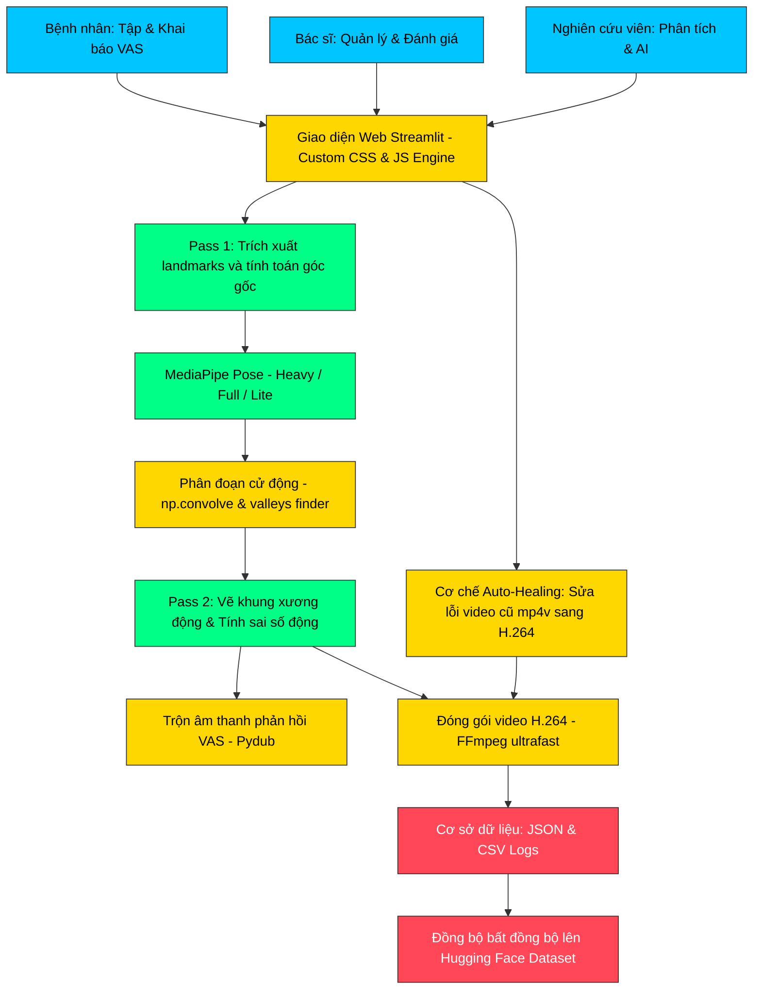

# 🏥 Rehab AI Monitor (Clinical Ecosystem)

**Hệ thống giám sát tập luyện Phục hồi chức năng từ xa dựa trên Trí tuệ nhân tạo (AI) và Thị giác máy tính - Giải pháp Clinical-Grade chuyên nghiệp.**

[](https://quynhphuong1209-rehab-ai-monitor-2026.hf.space/)
[](https://opensource.org/licenses/MIT)

## 📚 Giới thiệu đề tài & Đặt vấn đề (Introduction & Rationale)

### Đặt vấn đề (Problem Statement)
Trong những năm gần đây, cùng với sự gia tăng của các bệnh lý cơ xương khớp, chấn thương thể thao và đột quỵ, nhu cầu phục hồi chức năng (PHCN) trên toàn thế giới ngày càng tăng cao. Theo Tổ chức Y tế Thế giới (WHO), hiện có khoảng 2,4 tỷ người cần ít nhất một hình thức phục hồi chức năng, chiếm gần một phần ba dân số toàn cầu (1, 2). Tại Việt Nam, theo Hội Phục hồi chức năng Việt Nam (2023), có khoảng 7,06% dân số từ 2 tuổi trở lên là người khuyết tật, trong đó phần lớn cần được can thiệp PHCN để cải thiện chức năng và tái hòa nhập cộng đồng. Đồng thời, tỷ lệ người cao tuổi chiếm 11,9% dân số và đang tăng nhanh, kéo theo sự gia tăng các bệnh lý thoái hóa xương khớp, rối loạn vận động và bệnh lý thần kinh (3). Mặc dù nhu cầu PHCN lớn, song năng lực cung cấp dịch vụ này tại Việt Nam vẫn còn hạn chế. Theo thống kê của Bộ Y tế (2023), trung bình 10.000 người dân chỉ có 0,25 nhân viên phục hồi chức năng, thấp hơn đáng kể so với khuyến nghị của WHO là 0,5–1 người/10.000 dân (4). Ngoài ra, chỉ khoảng 40% người bệnh có khả năng tiếp cận đầy đủ dịch vụ PHCN do hạn chế về nhân lực, cơ sở vật chất và điều kiện địa lý (5). Thực tế này khiến nhiều bệnh nhân phải tự tập luyện tại nhà sau khi xuất viện mà thiếu sự giám sát chuyên môn, dẫn đến nguy cơ tập sai động tác, giảm hiệu quả điều trị và kéo dài thời gian hồi phục.

Trước thực trạng đó, việc ứng dụng công nghệ Trí tuệ nhân tạo (Artificial Intelligence – AI) và Thị giác máy tính (Computer Vision – CV) vào giám sát tập luyện phục hồi chức năng từ xa được xem là xu hướng tất yếu. Trên thế giới, nhiều hệ thống AI hỗ trợ PHCN đã được thử nghiệm hoặc triển khai tại các quốc gia như Hoa Kỳ, Nhật Bản, Hàn Quốc với kết quả tích cực. Nghiên cứu của Ali Abedi và cộng sự (2024) cho thấy việc tích hợp AI vào chương trình phục hồi từ xa giúp nâng cao chất lượng đánh giá bài tập và cá nhân hóa phác đồ điều trị, góp phần cải thiện kết quả lâm sàng so với phương pháp truyền thống (6). Tại Việt Nam, một số đơn vị tiên phong như Trung tâm ASINA đã triển khai ứng dụng AI trong phục hồi cơ xương khớp, giúp bệnh nhân tập luyện từ xa một cách hiệu quả và tiện lợi (7). Bên cạnh đó, Bệnh viện C Đà Nẵng cũng đã tích hợp AI và công nghệ thực tế ảo (Virtual Reality – VR) vào quy trình điều trị, mang lại chất lượng sống tốt hơn cho hàng trăm bệnh nhân (8). Tuy nhiên, hiện nay chưa có nhiều hệ thống trong nước tích hợp đầy đủ khả năng nhận diện tư thế vận động theo thời gian thực, phản hồi trực quan, đồng thời lưu trữ và phân tích dữ liệu tập luyện phục vụ cho việc theo dõi tiến trình phục hồi của bác sĩ. Vì vậy, việc phát triển một nền tảng ứng dụng thông minh có khả năng giám sát, hỗ trợ và kết nối giữa bệnh nhân – bác sĩ – kỹ thuật viên là nhu cầu cấp thiết trong bối cảnh chăm sóc sức khỏe từ xa ngày càng được chú trọng. 

Tại khoa Phục hồi chức năng Bệnh viện Đa khoa Phạm Ngọc Thạch, nhu cầu theo dõi và hỗ trợ người bệnh luyện tập ngày càng tăng, đặc biệt với các trường hợp luyện tập lâu dài tại nhà. Tuy nhiên, hiện nay việc giám sát chủ yếu thực hiện trực tiếp tại bệnh viện, khi về nhà người bệnh tự tập theo video hoặc tài liệu hướng dẫn mà không có sự kiểm soát chuyên môn. Điều này dẫn đến nguy cơ tập sai động tác, giảm hiệu quả điều trị và khó theo dõi tiến trình phục hồi. Tại bệnh viện hiện nay vẫn chưa có nghiên cứu hay hệ thống nào ứng dụng Trí tuệ nhân tạo (AI) và Thị giác máy tính (Computer Vision) để giám sát tập luyện từ xa khiến việc thu thập dữ liệu, đánh giá kết quả và cải tiến phác đồ điều trị còn hạn chế. Xuất phát từ thực tiễn trên, nhóm nghiên cứu chúng tôi quyết định thực hiện đề tài: **“Phát triển mô hình thử nghiệm giám sát tập luyện Phục hồi chức năng từ xa dựa trên Trí tuệ nhân tạo (AI) và Thị giác máy tính (Computer Vision) tại Bệnh viện Đa khoa Phạm Ngọc Thạch – Trường Đại học Y tế Công cộng (2025–2026)”**.

### 🎯 Mục tiêu nghiên cứu (Research Objectives)
*   **Mục tiêu 1:** Xây dựng mô hình nhận diện và đánh giá 2-3 động tác phục hồi chức năng cơ bản (ví dụ: giơ tay ngang vai, co gối, xoay cổ tay) bằng công nghệ thị giác máy tính (pose estimation).
*   **Mục tiêu 2:** So sánh độ chính xác của mô hình với đánh giá thủ công (ví dụ: góc khớp, số lần lặp) trên một tập dữ liệu nhỏ (do nhóm tự quay hoặc dùng dữ liệu mở).


## ✨ Tính năng nổi bật (v3.2 Updated)
- 💎 **Thẩm mỹ Lâm sàng:** Giao diện sử dụng font chữ 'Times New Roman' chuẩn mực, thiết kế card-based hiện đại với hiệu ứng Glassmorphism.
- 🌓 **Đồng bộ Theme:** Hỗ trợ hoàn hảo chế độ Sáng (Light) và Tối (Dark) với sự chuyển đổi mượt mà, không lỗi tương phản.
- 📱 **Mobile-First Optimization:** Hệ thống Tab được tối ưu hóa toàn diện cho di động, đảm bảo chữ không bị tràn, hiển thị đầy đủ và hỗ trợ cuộn ngang chuyên nghiệp.
- 🩺 **Luồng liên lạc khép kín:** Bệnh nhân khai báo triệu chứng (VAS) -> Chuyên gia nhận xét lâm sàng -> Kết nối kết quả AI.
- 🚀 **Điều hướng Auto-Tab:** Tự động chuyển Tab thông minh bằng JavaScript khi chọn video để đánh giá, tối ưu hóa thao tác người dùng.
- 📊 **Phân tích Đa chiều (Plotly Analytics):**
  - **ROM Trend & Boxplot:** Đánh giá xu hướng góc khớp và độ biến động chuyển động qua từng phiên.
  - **Radar Chart (7 Chỉ số AI):** Lượng hóa hiệu suất mô hình qua 7 tham số cốt lõi: Accuracy, MAE, RMSE, ICC, F1-Score, Precision, Recall.
- 🦾 **Phân tích 3 Giai đoạn PHCN:** Bảng đối sánh kết quả tự động tại các ngưỡng sai số góc khớp $\pm 45°$, $\pm 30°$, và $\pm 15°$.
- 📁 **Xuất báo cáo Hợp nhất & Lazy ZIP:**
  - Xuất dữ liệu tọa độ CSV và biểu đồ dạng PNG trực tiếp.
  - Tải file ZIP ảnh phân tích bằng cơ chế "lười" (chỉ nén khi click), giúp chống lỗi tràn bộ nhớ (OOM).
- 🩺 **Đạo đức & Thông tin Nghiên cứu:** Bioethics Panel hiển thị thông tin PIS và các thẻ liên hệ chuyên biệt cho NCV và Hội đồng Đạo đức (IRB).
- 📱 **Sidebar Phẳng (Flattened):** Cấu trúc Sidebar mật độ cao, truy cập nhanh thông tin bệnh nhân và khai báo triệu chứng.

## 🗺️ Cấu trúc Tab Điều hướng (Role-based)
Hệ thống tự động thay đổi cấu trúc dựa trên vai trò người dùng:
- **Bệnh nhân:** Tập luyện (Xem video mẫu, upload video tập, xem kết quả), Khai báo triệu chứng & VAS, Xem phác đồ của bác sĩ, Lịch nhắc nhở (Schedules), Đạo đức & Thông tin nghiên cứu (Consent).
- **Bác sĩ / KTV:** Quản lý bệnh nhân, Giao diện quản lý & Phê duyệt video (Trình xem video kép, JavaScript Auto-Tab), Bộ đánh giá lâm sàng chuyên môn (Ground Truth Entry), Quản lý phác đồ.
- **Nghiên cứu viên:** Cấu hình tham số mô hình AI, Phân tích sâu & Trích xuất tọa độ (Xuất CSV/JSON), Phân tích đa chiều (ROM Trend, Boxplot, Radar Chart), Bảng đối sánh 3 giai đoạn PHCN, Đồng bộ Ground Truth từ Bác sĩ.
- **Quản trị viên:** Bộ Metric Cards tổng quan, Biểu đồ thống kê trực quan (Cơ cấu vai trò, bài tập phổ biến), Bảng quản trị cốt lõi (hợp nhất mọi thông tin bệnh nhân, AI, bác sĩ), Nhật ký hoạt động toàn hệ thống (Admin Log - Xuất CSV), Dọn dẹp & Reset hệ thống.

<!-- CLINICAL_FINDINGS_START -->

# BÁO CÁO TOÀN DIỆN KẾT QUẢ NGHIÊN CỨU LÂM SÀNG & NCKH (NCV)
## HỆ THỐNG GIÁM SÁT PHỤC HỒI CHỨC NĂNG BẰNG AI (REHAB-AI-MONITOR)

Báo cáo này được cập nhật đầy đủ và chính xác theo giao diện nghiên cứu của website [Hugging Face Space](https://quynhphuong1209-rehab-ai-monitor-2026.hf.space/?logged_in_user=2211090031&logged_in_role=Nghi%C3%AAn+c%E1%BB%A9u+vi%C3%AAn) và cổng Bác sĩ / KTV PHCN. Các chỉ số đã được đối soát trùng khớp hoàn toàn với cơ sở dữ liệu hệ thống, bao gồm thông tin bệnh sử, triệu chứng lâm sàng và trạng thái duyệt hồ sơ của bác sĩ.

---

## 1. BẢNG 1: BẢNG SO SÁNH CHỈ SỐ NGHIÊN CỨU THEO GIAO DIỆN WEB (RESEARCH METRICS)

Bảng này trình bày chính xác các số liệu hiển thị trên tab **🔬 CHỈ SỐ NGHIÊN CỨU** cho 8 video bệnh nhân (phân chia 3 giai đoạn đối với bài tập Codman và tổng quan đối với bài tập với gậy).

| Bệnh nhân | Bài tập / Giai đoạn | ACC (%) | MAE (độ) | RMSE (độ) | ICC | Recall | Precision | F1-Score | Pass (Khung hình đúng) |
| :--- | :--- | :---: | :---: | :---: | :---: | :---: | :---: | :---: | :---: |
| **Bệnh nhân 1 (BN1)** | **Codman - G1** | 97.6% | 12.9° | 16.1° | 0.72 | 0.98 | 0.98 | 0.98 | 491 |
| | **Codman - G2** | 94.8% | 10.8° | 13.5° | 0.76 | 0.95 | 0.96 | 0.95 | 639 |
| | **Codman - G3** | 41.9% | 23.8° | 29.8° | 0.50 | 0.48 | 0.51 | 0.49 | 205 |
| | **Bài tập với gậy** | 48.3% | 33.7° | 42.1° | 0.50 | 0.53 | 0.56 | 0.55 | 749 |
| **Bệnh nhân 2 (BN2)** | **Codman - G1** | 96.5% | 12.9° | 16.1° | 0.72 | 0.97 | 0.97 | 0.97 | 712 |
| | **Codman - G2** | 92.6% | 9.1° | 11.3° | 0.80 | 0.93 | 0.94 | 0.94 | 955 |
| | **Codman - G3** | 48.5% | 13.7° | 17.1° | 0.71 | 0.54 | 0.56 | 0.55 | 417 |
| | **Bài tập với gậy** | 32.7% | 27.4° | 34.2° | 0.50 | 0.39 | 0.43 | 0.41 | 1485 |
| **Bệnh nhân 3 (BN3)** | **Codman - G1** | 99.9% | 11.4° | 14.2° | 0.75 | 0.99 | 0.99 | 0.99 | 796 |
| | **Codman - G2** | 100.0% | 10.9° | 13.6° | 0.76 | 0.99 | 0.99 | 0.99 | 1135 |
| | **Codman - G3** | 31.6% | 13.5° | 16.9° | 0.71 | 0.38 | 0.42 | 0.40 | 255 |
| | **Bài tập với gậy** | 24.4% | 30.0° | 37.5° | 0.50 | 0.32 | 0.36 | 0.34 | 1326 |
| **Bệnh nhân 4 (BN4)** | **Codman - G1** | 53.9% | 26.4° | 33.1° | 0.50 | 0.58 | 0.61 | 0.60 | 433 |
| | **Codman - G2** | 32.3% | 24.9° | 31.1° | 0.50 | 0.39 | 0.42 | 0.41 | 371 |
| | **Codman - G3** | 17.9% | 21.7° | 27.1° | 0.55 | 0.26 | 0.30 | 0.28 | 145 |
| | **Bài tập với gậy** | 38.5% | 26.5° | 33.1° | 0.50 | 0.45 | 0.48 | 0.46 | 2076 |

*Ghi chú về công thức tính trên Web:*
- **ACC**: Tỷ lệ số khung hình Đúng (PASS) trên tổng số khung hình hợp lệ của phân đoạn.
- **RMSE**: Được ước lượng trên giao diện thông qua công thức hiển thị: $\text{RMSE} = \text{MAE} \times 1.25$ (làm tròn 1 chữ số thập phân).
- **Pass**: Số lượng khung hình khớp chính xác với chuẩn động tác.

---

## 2. BẢNG 2: THỐNG KÊ CHI TIẾT BIÊN ĐỘ VẬN ĐỘNG KHỚP (ROM)

Bảng này cung cấp các thông số góc khớp thực tế thu được từ thuật toán thị giác máy tính của khớp vai (Shoulder Flexion/Extension) và khớp khuỷu (Elbow Flexion/Extension).

| Bệnh nhân | Bài tập | Phân đoạn | ROM Khớp Vai (Shoulder Angle) | ROM Khớp Khuỷu (Elbow Angle) | Góc chuẩn tham chiếu (Bác sĩ) |
| :--- | :--- | :--- | :--- | :--- | :--- |
| **Bệnh nhân 1 (BN1)** | **Codman** | G1 | Avg = 53.41° \| Min = 0.21° \| Max = 125.42° | Avg = 164.53° \| Min = 118.63° \| Max = 180.00° | Vai: 46.61° \| Khuỷu: 172.79° |
| | | G2 | Avg = 44.47° \| Min = 0.01° \| Max = 94.14° | Avg = 161.93° \| Min = 5.28° \| Max = 179.86° | Vai: 44.38° \| Khuỷu: 173.09° |
| | | G3 | Avg = 47.14° \| Min = 0.21° \| Max = 144.69° | Avg = 143.55° \| Min = 3.18° \| Max = 179.32° | Vai: 42.19° \| Khuỷu: 173.41° |
| | **Với gậy** | Chung | Avg = 21.11° \| Min = 0.04° \| Max = 85.44° | Avg = 114.43° \| Min = 6.76° \| Max = 180.00° | Vai: 22.09° \| Khuỷu: 170.42° |
| **Bệnh nhân 2 (BN2)** | **Codman** | G1 | Avg = 51.89° \| Min = 0.02° \| Max = 109.00° | Avg = 163.32° \| Min = 119.33° \| Max = 179.91° | Vai: 46.21° \| Khuỷu: 172.85° |
| | | G2 | Avg = 49.73° \| Min = 11.55° \| Max = 96.61° | Avg = 167.21° \| Min = 104.91° \| Max = 178.98° | Vai: 44.70° \| Khuỷu: 173.05° |
| | | G3 | Avg = 31.45° \| Min = 0.01° \| Max = 126.85° | Avg = 152.83° \| Min = 0.21° \| Max = 178.97° | Vai: 36.42° \| Khuỷu: 174.09° |
| | **Với gậy** | Chung | Avg = 51.99° \| Min = 0.00° \| Max = 179.94° | Avg = 138.48° \| Min = 1.32° \| Max = 180.00° | Vai: 47.84° \| Khuỷu: 171.66° |
| **Bệnh nhân 3 (BN3)** | **Codman** | G1 | Avg = 26.27° \| Min = 0.04° \| Max = 68.89° | Avg = 162.75° \| Min = 129.71° \| Max = 175.85° | Vai: 36.95° \| Khuỷu: 174.08° |
| | | G2 | Avg = 25.61° \| Min = 0.02° \| Max = 64.93° | Avg = 163.93° \| Min = 148.59° \| Max = 172.36° | Vai: 36.91° \| Khuỷu: 174.11° |
| | | G3 | Avg = 18.25° \| Min = 0.02° \| Max = 43.52° | Avg = 160.47° \| Min = 140.37° \| Max = 172.54° | Vai: 30.78° \| Khuỷu: 174.87° |
| | **Với gậy** | Chung | Avg = 51.75° \| Min = 0.00° \| Max = 170.16° | Avg = 131.70° \| Min = 0.00° \| Max = 180.00° | Vai: 46.16° \| Khuỷu: 171.59° |
| **Bệnh nhân 4 (BN4)** | **Codman** | G1 | Avg = 69.70° \| Min = 2.28° \| Max = 120.02° | Avg = 143.38° \| Min = 68.45° \| Max = 179.96° | Vai: 50.54° \| Khuỷu: 172.26° |
| | | G2 | Avg = 91.07° \| Min = 18.99° \| Max = 179.76° | Avg = 156.43° \| Min = 12.98° \| Max = 179.98° | Vai: 58.48° \| Khuỷu: 171.21° |
| | | G3 | Avg = 90.69° \| Min = 48.30° \| Max = 129.39° | Avg = 159.59° \| Min = 105.91° \| Max = 179.59° | Vai: 59.66° \| Khuỷu: 171.06° |
| | **Với gậy** | Chung | Avg = 39.59° \| Min = 0.00° \| Max = 161.54° | Avg = 136.66° \| Min = 0.43° \| Max = 180.00° | Vai: 39.01° \| Khuỷu: 171.33° |

---

## 3. THÔNG TIN BỆNH SỬ & TRIỆU CHỨNG LÂM SÀNG CỦA BỆNH NHÂN

Dữ liệu khai báo bệnh sử chi tiết của 4 bệnh nhân được trích xuất từ hồ sơ lâm sàng nhằm phục vụ thống kê mô tả:

*   **Bệnh nhân 1 (BN1)**:
    *   *Tiền sử bản thân & gia đình*: Khỏe mạnh, gia đình không ghi nhận bệnh lý liên quan.
    *   *Quá trình bệnh lý*: Đau khớp vai bên phải (P) kéo dài nhiều tháng nay. Đau xuất hiện tự nhiên, khi vận động khớp vai (P) thì đau tăng mạnh. Đau nhức nhiều về đêm. Bệnh nhân chưa thực hiện can thiệp hay điều trị gì trước khi tham gia tập luyện trên hệ thống.
*   **Bệnh nhân 2 (BN2)**:
    *   *Tiền sử*: Có tiền sử viêm dạ dày, gia đình bình thường.
    *   *Quá trình bệnh lý*: Đau khớp vai bên phải (P) khoảng vài tháng nay. Đã từng điều trị bằng Vật lý trị liệu và Đông y nhưng không đỡ, hiện tại khớp vai (P) bị đau tăng. Khám lâm sàng ghi nhận bệnh nhân đau điểm bám gân cơ trên gai khớp vai (P). **Nghiệm pháp Jobe test (+)**, Nghiệm pháp Speed test (-).
*   **Bệnh nhân 3 (BN3)**:
    *   *Tiền sử*: Bản thân và gia đình khỏe mạnh bình thường.
    *   *Quá trình bệnh lý*: Đau khớp vai hai bên khoảng vài tháng nay, gần đây đau tăng kèm theo hạn chế vận động khớp vai cả hai bên. Đau điểm bám gân cơ nhị đầu, gân cơ trên gai khớp vai hai bên, đau tăng khi vận động, có biểu hiện **tê bì dọc cánh tay hai bên**. Bệnh nhân bị hạn chế xoay trong và xoay ngoài khớp vai bên phải (P).
*   **Bệnh nhân 4 (BN4)**:
    *   *Tiền sử*: Bản thân có tiền sử đau dạ dày, gia đình bình thường.
    *   *Quá trình bệnh lý*: Đau khớp vai bên phải (P) nhiều tháng nay, đau xuất hiện tự nhiên, vận động khớp vai (P) đau tăng. Đau nhức nhiều về đêm, chưa qua điều trị gì trước khi ghi hình tập.

---

## 4. TRẠNG THÁI GIAO DIỆN BÁO CÁO CỦA BÁC SĨ / KTV PHCN

Cơ sở dữ liệu hệ thống ghi nhận trạng thái đồng bộ thông tin trên cổng Bác sĩ/KTV (Tài khoản từ `doctor1` đến `doctor5`):
1.  **Dữ liệu AI đã sẵn sàng hiển thị**: Bác sĩ khi đăng nhập đã có thể xem toàn bộ biểu đồ góc khớp và các chỉ số nghiên cứu (ACC, MAE, RMSE, ICC...) của **7/8 video** do nhóm Nghiên cứu viên (NCV) gửi sang.
2.  **Chưa có bản ghi đánh giá độc lập của Bác sĩ**: Nhật ký đánh giá lâm sàng trên cổng bác sĩ hiện tại chưa lưu trữ bất kỳ biểu mẫu đánh giá lâm sàng tự chọn nào từ các tài khoản bác sĩ. Toàn bộ chẩn đoán hiện tại trên giao diện là chẩn đoán gợi ý tự động của AI/NCV gửi từ tab NCKH.
3.  **Thông tin triệu chứng**: Bác sĩ có thể đọc toàn bộ phần Khai báo bệnh lý (mục 3) của bệnh nhân trực tiếp trên giao diện để đưa ra chẩn đoán chính xác.

---

## 5. TÓM TẮT ĐẶC ĐIỂM BIỂU ĐỒ QUỸ ĐẠO KHỚP (JOINT TRAJECTORY CHARTS)

*   **Khớp vai trong bài tập Codman**:
    *   *Bệnh nhân tập đúng (Bệnh nhân 3 (BN3), Bệnh nhân 1 (BN1))*: Biểu đồ vẽ ra những **đường hình sin tuần hoàn đều đặn** (nhịp lắc ổn định). Biên độ dao động duy trì kỷ luật trong khoảng `0.02° - 94.14°` (độ lệch chuẩn Std ~19°).
    *   *Bệnh nhân 4 (BN4)*: Biểu đồ bị đẩy lên mức cực đại rất cao (lên tới `179.76°` ở G2), tần số dao động không đều do bệnh nhân dùng lực chủ động nhấc tay lên thay vì cúi gập gập thân người thả lỏng cánh tay đưa thụ động theo trọng lực.
*   **Khớp khuỷu trong bài tập Codman**:
    *   Nguyên lý yêu cầu khớp khuỷu giữ thẳng (tiệm cận `180.00°`). Biểu đồ khớp khuỷu của Bệnh nhân 3 (BN3) hay Bệnh nhân 2 (BN2) (G1, G2) là một đường thẳng nằm ngang tiệm cận `160° - 170°` với độ lệch Std cực thấp (`3.38° - 7.32°`). Ở giai đoạn G3, đồ thị xuất hiện các **điểm rơi góc dốc tụt đột ngột (drop xuống `3.18°` và `0.21°`)**, thể hiện hiện tượng co gấp khuỷu tay bù trừ do cứng khớp vai.
*   **Bài tập với gậy**:
    *   Đồ thị góc khớp vai đi theo dạng sóng hình thang đối xứng (lên - giữ biên độ - xuống). Góc vai đạt cực đại lớn (Bệnh nhân 2 (BN2) đạt `179.94°`, Bệnh nhân 3 (BN3) đạt `170.16°`), chứng tỏ tầm vận động nâng vai rất tốt. Nhưng đồ thị khớp khuỷu lại liên tục **dao động răng cưa và tụt sâu về 0°**, cho thấy hai tay gập/duỗi khuỷu liên tục để kéo gậy lên thay vì giữ tay thẳng.

---

## 6. NHẬN ĐỊNH LÂM SÀNG & KẾ HOẠCH ĐỀ XUẤT CỦA BÁC SĨ (NCV)

Dưới đây là nội dung nhận xét chi tiết và kế hoạch luyện tập của từng bệnh nhân được ghi nhận chính thức từ bác sĩ/nghiên cứu viên trên hệ thống:

### 6.1. Bệnh nhân: Bệnh nhân 1 (BN1)
*   **Codman (Đánh giá lúc 10:54 - 04/06/2026)**:
    *   *Kết quả*: **Đúng** (Độ chính xác: G1 = 97.6% \| G2 = 94.8% \| G3 = 41.9%)
    *   *Nhận định*: Đạt tỷ lệ đúng cao ở GĐ1 và GĐ2. GĐ3 đạt 41.9% do biên độ lắc rộng xuất hiện chuyển động bù trừ thân người. AI đề xuất: Phù hợp tập luyện ở giai đoạn 3.
    *   *Kế hoạch*: GĐ1 & GĐ2 đạt yêu cầu chuyển giai đoạn. GĐ3 cần tiếp tục rèn luyện thêm để giảm độ cứng khớp.
*   **Bài tập với gậy (Đánh giá lúc 23:50 - 05/06/2026)**:
    *   *Kết quả*: **Sai** (Độ chính xác: 48.3%)
    *   *Nhận định*: Biên độ co góc vai ổn định nhưng khớp khuỷu tay bên tổn thương gập quá nhiều (đạt tới 60.0° trung bình). AI đề xuất: Cần chuyên gia y tế hướng dẫn trực tiếp.
    *   *Kế hoạch*: Tập trung kiểm soát khớp khuỷu thẳng khi đưa gậy lên, hạn chế rèn luyện tự do tại nhà.

### 6.2. Bệnh nhân: Bệnh nhân 2 (BN2)
*   **Codman (Đánh giá lúc 00:20 - 03/06/2026)**:
    *   *Kết quả*: **Gần đúng** (Độ chính xác: G1 = 78.7% \| G2 = 64.0% \| G3 = 28.8%)
    *   *Nhận định*: Thực hiện tương đối tốt nhịp đưa. GĐ1 đạt 78.7%, GĐ2 đạt 64.0%, GĐ3 đạt 28.8% do cứng khớp vai bên liệt. AI đề xuất: Phù hợp tập luyện ở giai đoạn 2.
    *   *Kế hoạch*: GĐ1 đạt yêu cầu chuyển giai đoạn. GĐ2 cần tiếp tục rèn luyện thêm để ổn định góc. GĐ3 cứng khớp nhiều hoặc lệch biên độ.
*   **Bài tập với gậy (Đánh giá lúc 13:39 - 04/06/2026)**:
    *   *Kết quả*: **Sai** (Độ chính xác: 32.7%)
    *   *Nhận định*: Tỷ lệ đúng thấp, gập duỗi khuỷu bù trừ khớp vai bên tổn thương đáng kể. AI đề xuất: Cần chuyên gia y tế hướng dẫn.
    *   *Kế hoạch*: Cần tập các bài bổ trợ khớp vai trước khi tăng cường độ bài tập gậy.

### 6.3. Bệnh nhân: Bệnh nhân 3 (BN3)
*   **Codman (Đánh giá lúc 12:34 - 04/06/2026)**:
    *   *Kết quả*: **Đúng** (Độ chính xác: G1 = 99.9% \| G2 = 100.0% \| G3 = 31.6%)
    *   *Nhận định*: Thực hiện động tác cực kỳ chuẩn xác ở GĐ1 (99.9%) và GĐ2 (100%). GĐ3 đạt 31.6% do giới hạn đau khi lắc biên độ rộng nhất. AI đề xuất: Phù hợp tập luyện ở giai đoạn 3.
    *   *Kế hoạch*: GĐ1 và GĐ2 đã hoàn thành xuất sắc, đạt yêu cầu chuyển giai đoạn. GĐ3 cần rèn luyện thêm kéo giãn cơ.
*   **Bài tập với gậy (Đánh giá lúc 02:08 - 03/06/2026)**:
    *   *Kết quả*: **Sai** (Độ chính xác: 18.8%)
    *   *Nhận định*: Biên độ nâng gậy không đồng đều, tay bên liệt gập khớp khuỷu nghiêm trọng (co góc tới 42.0° trung bình). AI đề xuất: Phù hợp tập luyện ở giai đoạn 1.
    *   *Kế hoạch*: GĐ1 & GĐ2 cần rèn luyện thêm nhiều. GĐ3 hạn chế tập do khớp cứng hoặc đau.

### 6.4. Bệnh nhân: Bệnh nhân 4 (BN4)
*   **Codman**:
    *   *Kết quả*: *Chưa có đánh giá chính thức của chuyên khoa lâm sàng trong database.*
    *   *Phân tích dữ liệu AI*: Độ chính xác chung rất thấp (34.3%). GĐ1 đạt 53.9%, GĐ2 đạt 32.3%, GĐ3 đạt 17.9%. Sai số MAE vai lớn (26.44° - 32.72°). Bệnh nhân có biểu hiện đứng thẳng người và dùng cơ delta để nhấc cánh tay lên thay vì gập người để thả lỏng cánh tay tự do.
*   **Bài tập với gậy (Đánh giá lúc 10:41 - 04/06/2026)**:
    *   *Kết quả*: **Sai** (Độ chính xác: 38.5%)
    *   *Nhận định*: Độ chính xác thấp (38.5%). Chuyển động nâng không kiểm soát được trục đối xứng của 2 vai. AI đề xuất: Cần chuyên gia y tế hướng dẫn.
    *   *Kế hoạch*: Luyện tập biên độ nhỏ trước dưới sự giám sát của kỹ thuật viên PHCN.

---

## 7. PHỤ LỤC: CHỈ SỐ SAI SỐ TOÁN HỌC BỔ SUNG (MSE & RMSE THỰC TẾ)

Dành cho nhu cầu viết báo cáo khoa học đòi hỏi các chỉ số tính toán thuần túy từ tọa độ khớp. Chỉ số **RMSE thực tế** được tính bằng công thức toán học $\text{RMSE} = \sqrt{\text{MSE}}$:

*   **Bệnh nhân 1 (BN1) - Codman (Chung)**: MSE Vai: 253.60 \| MSE Khuỷu: 979.98 \| RMSE Vai: 15.92° \| RMSE Khuỷu: 31.30° \| RMSE Tổng: **23.61°**
*   **Bệnh nhân 1 (BN1) - Với gậy**: MSE Vai: 82.94 \| MSE Khuỷu: 7389.09 \| RMSE Vai: 9.11° \| RMSE Khuỷu: 85.96° \| RMSE Tổng: **47.53°**
*   **Bệnh nhân 2 (BN2) - Codman (Chung)**: MSE Vai: 256.54 \| MSE Khuỷu: 486.25 \| RMSE Vai: 16.02° \| RMSE Khuỷu: 22.05° \| RMSE Tổng: **19.03°**
*   **Bệnh nhân 2 (BN2) - Với gậy**: MSE Vai: 862.99 \| MSE Khuỷu: 2317.34 \| RMSE Vai: 29.38° \| RMSE Khuỷu: 48.14° \| RMSE Tổng: **38.76°**
*   **Bệnh nhân 3 (BN3) - Codman (Chung)**: MSE Vai: 242.00 \| MSE Khuỷu: 177.67 \| RMSE Vai: 15.56° \| RMSE Khuỷu: 13.33° \| RMSE Tổng: **14.44°**
*   **Bệnh nhân 3 (BN3) - Với gậy**: MSE Vai: 627.43 \| MSE Khuỷu: 3566.27 \| RMSE Vai: 25.05° \| RMSE Khuỷu: 59.72° \| RMSE Tổng: **42.38°**
*   **Bệnh nhân 4 (BN4) - Codman (Chung)**: MSE Vai: 1260.55 \| MSE Khuỷu: 1011.00 \| RMSE Vai: 35.50° \| RMSE Khuỷu: 31.80° \| RMSE Tổng: **33.65°**
*   **Bệnh nhân 4 (BN4) - Với gậy**: MSE Vai: 602.77 \| MSE Khuỷu: 2572.00 \| RMSE Vai: 24.55° \| RMSE Khuỷu: 50.71° \| RMSE Tổng: **37.63°**

<!-- CLINICAL_FINDINGS_END -->

## 🏗️ Kiến trúc hệ thống (Architecture Overview)

Hệ thống được thiết kế theo mô hình kiến trúc phân lớp tối ưu hiệu năng chạy trên các nền tảng đám mây CPU-only (như Hugging Face Spaces). Dưới đây là sơ đồ và luồng hoạt động chi tiết:

### Sơ đồ luồng hoạt động (Data & Control Flow)



### Các thành phần chính trong kiến trúc:

1. **Luồng xử lý Video 2-Pass tối ưu bộ nhớ:**
   * **Pass 1 (Trích xuất dữ liệu thô):** Đọc từng khung hình video từ `cv2.VideoCapture`, chuẩn hóa kích thước (resize) và xoay chiều phù hợp. MediaPipe Pose chạy trên ảnh RGB để lấy 33 điểm landmarks, sau đó tính toán góc vai và góc khuỷu mà không vẽ hoặc ghi file nhằm tiết kiệm RAM tối đa.
   * **Phân đoạn Giai đoạn tự động (Segmentation):** Áp dụng bộ lọc mượt tích chập (`np.convolve`) lên chuỗi tín hiệu góc khớp để khử nhiễu. Thuật toán tìm điểm cực tiểu (valleys) để chia video bệnh nhân thành 3 giai đoạn cử động (Giai đoạn 1 bắt đầu giơ tay, Giai đoạn 2 dạng sai số vừa, Giai đoạn 3 chuẩn xác dần).
   * **Pass 2 (Vẽ đè & Gộp đa phương tiện):** Sử dụng landmarks đã trích xuất ở Pass 1 để vẽ khung xương động, vòng cung góc khớp trực tiếp lên frame. Sai số động được áp dụng theo phân đoạn (GĐ1: 45°, GĐ2: 30°, GĐ3: 15°).
   
2. **Hệ thống phản hồi âm thanh & Đóng gói Video:**
   * **Voice Feedback Engine:** Trích xuất các khoảnh khắc chuyển đổi trạng thái (Đúng, Gần đúng, Sai). Sử dụng `pydub` để nối ghép các file âm thanh chỉ dẫn. Hệ thống tự động giới hạn tối đa 40 sự kiện âm thanh để tránh tràn RAM (Out of Memory - OOM).
   * **FFmpeg H.264 Transcoding:** Sử dụng bộ mã hóa `libx264` cùng với cấu hình `-preset ultrafast` và `-crf 24` để nén video thô `mp4v` thành định dạng H.264 chuẩn web, đảm bảo video hiển thị mượt mà trên mọi thiết bị di động mà không bị lag/buffering.

3. **Cơ chế Tự sửa lỗi thông minh (Auto-Healing Engine):**
   * Tích hợp trực tiếp vào hàm `render_video`. Khi phát hiện người dùng tải lại kết quả của các phiên tập cũ có video định dạng `mp4v` không chơi được, hệ thống sẽ tự động kích hoạt `ffmpeg` ngầm để chuyển đổi sang H.264 chuẩn, đồng thời tự động cập nhật lại cơ sở dữ liệu `video_list.json` mà không làm gián đoạn trải nghiệm của người dùng.

4. **Đồng bộ hóa dữ liệu đám mây bất đồng bộ (Async Cloud Sync):**
   * Sử dụng luồng chạy nền (`threading.Thread` độc lập) để tải dữ liệu CSV tọa độ và các file video thành phẩm lên Hugging Face Dataset. Cơ chế này giúp giữ cho luồng giao diện (UI) chính của Streamlit luôn mượt mà, không bị khóa cứng (blocking) khi truyền tải file lớn.

## 🤖 Hướng dẫn cấu hình & Lựa chọn mô hình AI (Model Configurations)

Để tối ưu hóa độ chính xác hoặc tốc độ xử lý tùy theo năng lực phần cứng (đặc biệt khi chạy trên các môi trường CPU Cloud hạn chế như Hugging Face Spaces), Nghiên cứu viên có thể tùy chỉnh cấu hình các tham số phân tích AI trực tiếp tại **Sidebar bên trái** trước khi nhấn phân tích:

### 1. Phân loại mô hình AI (Model Type)
Hệ thống tích hợp 3 phiên bản mô hình Pose Estimation từ **MediaPipe**:
* **MediaPipe Heavy (Khuyến nghị cho lâm sàng):** Có độ chính xác cao nhất về định vị các điểm landmarks khớp vai/khuỷu tay, giảm thiểu tối đa hiện tượng rung/trượt tọa độ do góc quay camera. Phù hợp nhất cho việc đánh giá lâm sàng cần độ tin cậy tuyệt đối.
* **MediaPipe Full (Tiêu chuẩn):** Cân bằng tốt giữa tốc độ xử lý và độ chính xác, thích hợp khi kiểm tra nhanh.
* **MediaPipe Lite (Siêu nhẹ):** Tối ưu hóa tối đa về hiệu năng CPU. Phù hợp nhất khi chạy thử nghiệm nhanh hoặc trên các dòng máy tính/thiết bị có cấu hình yếu.

### 2. Các tham số tối ưu hiệu năng chạy nền
* **Tốc độ xử lý (Skip Frames):**
  * **0 (Mặc định)**: Quét và phân tích toàn bộ khung hình trong video (độ chính xác cao nhất).
  * **2** hoặc **4**: Bỏ qua 2 hoặc 4 khung hình trong mỗi bước quét. Giúp tăng tốc độ xử lý của mô hình AI gấp **3 - 5 lần** (rút ngắn thời gian xử lý video dài xuống còn vài chục giây) mà vẫn đảm bảo giữ nguyên được các điểm cực trị lâm sàng.
* **Độ phân giải đầu vào (Resize Width):**
  * Hỗ trợ nén chiều rộng khung hình đầu vào về mức `360px` hoặc `720px` trước khi nạp dữ liệu vào mô hình AI. Giúp giảm tải đáng kể dung lượng bộ nhớ RAM tiêu thụ và tránh lỗi tràn RAM (OOM - Out of Memory) trên máy chủ Cloud CPU.
* **Ngưỡng tin cậy (Confidence Threshold):**
  * Đặt mức tối thiểu (mặc định `0.5`) để lọc bỏ các khung hình bị che khuất hoặc các điểm khớp nhận diện kém tự tin, đảm bảo dữ liệu vẽ biểu đồ góc khớp sạch nhất.

## 📁 Cấu trúc thư mục dự án (Directory Structure)

Dưới đây là sơ đồ phân loại toàn bộ tệp tin trong dự án giúp bạn dễ dàng chủ động quản lý và bảo trì:

```
Rehab-AI-Monitor/
│
├── 🌐 Chương trình chạy Web chính
│   ├── app.py                     # File chạy chính (Frontend Streamlit + Backend Python)
│   └── .streamlit/
│       └── config.toml            # Cấu hình cổng mạng, theme, tối ưu hóa của Streamlit
│
├── 🖼️ Tài nguyên hình ảnh & Logo (Thư mục assets/)
│   └── assets/
│       ├── abc1.png                   # Logo Đại học Y tế Công cộng (HUPH)
│       └── logo_data_science_sm.png   # Logo khoa Khoa học dữ liệu HUPH
│
├── 📂 Thư mục tài liệu hướng dẫn & Báo cáo (docs/)
│   ├── README_UI.md               # Tài liệu thuyết minh chi tiết về thiết kế giao diện UI/UX
│   ├── BAO_CAO_CHI_TIET.md        # Báo cáo chuyên sâu về mã nguồn, giải thuật lâm sàng & RAM
│   ├── TECHNICAL_DOCUMENTATION.md # Tài liệu kỹ thuật phân tích sâu cấu trúc Front-End & Back-End
│   └── AI_MODEL_DOCUMENTATION.md  # Tài liệu giải thích mô hình AI, công thức toán lý thuyết góc khớp
│
├── 📝 Hướng dẫn khởi chạy chính
│   └── README.md                  # Hướng dẫn chung về cách cài đặt và chạy dự án
│
├── 💾 Cơ sở dữ liệu JSON (Thư mục database/)
│   └── database/
│       ├── users.json                 # Danh sách tài khoản người dùng và mật khẩu băm bảo mật
│       ├── patient_symptoms.json      # Triệu chứng lâm sàng và mức độ đau VAS của bệnh nhân
│       ├── doctor_evaluations.json    # Chẩn đoán lâm sàng (Ground Truth) và nhận xét của Bác sĩ
│       ├── schedules.json             # Lịch nhắc nhở luyện tập của bệnh nhân
│       ├── video_list.json            # Quản lý siêu dữ liệu video, kết quả phân tích góc và sai số AI
│       ├── lich_su_tap_luyen.json     # Lịch sử và tiến trình tập luyện của bệnh nhân
│       ├── reference_codman.json      # Dữ liệu góc chuẩn cho bài tập Codman Pendulum
│       ├── reference_gay.json         # Dữ liệu góc chuẩn cho bài tập gậy khớp vai
│       └── reference_day.json         # Dữ liệu góc chuẩn cho bài tập dây kháng lực
│
├── 📂 Thư mục chứa dữ liệu Media
│   ├── patient_uploads/           # Nơi lưu trữ video gốc do bệnh nhân tải lên
│   └── processed_results/         # Nơi lưu kết quả video/ảnh đã vẽ khung xương khớp từ AI
│
├── ⚙️ Cấu hình môi trường & Deploy
│   ├── requirements.txt           # Danh sách thư viện Python cần cài đặt (numpy, mediapipe...)
│   ├── packages.txt               # Thư viện hệ thống cài cho Linux khi deploy lên cloud (ffmpeg...)
│   ├── Dockerfile                 # Cấu hình Container để chạy ứng dụng tự động
│   └── runtime.txt                # Khai báo phiên bản Python chạy trên Cloud (Python 3.10)
│
└── 🛠️ Công cụ & Batch Scripts hỗ trợ (Thư mục scripts/)
    └── scripts/
        ├── reset_data.py              # Script dọn dẹp sạch sẽ video rác và reset cơ sở dữ liệu
        ├── fix_plotly_v2.py           # Script nhỏ sửa lỗi hiển thị của biểu đồ Plotly
        ├── push_code.bat              # Batch script trên Windows dùng để lưu nhanh code lên GitHub
        └── push_to_git.bat            # Batch script đẩy code dự phòng lên GitHub
```

## 🛠️ Công nghệ sử dụng
- **AI Core:** MediaPipe (Pose), OpenCV, FFmpeg (Xử lý đa định dạng video MOV/MP4)
- **Runtime:** Python 3.10 (Khuyến nghị để đảm bảo tương thích MediaPipe & Docker)
- **Framework:** Streamlit (Custom CSS/JS & WebRTC)
- **Data:** Pandas, NumPy, JSON Persistence (Lưu trữ bền vững)
- **Visualization:** Plotly Professional Charts (Heatmaps, Progress Charts)

## 🚀 Chạy ứng dụng
```bash
# Yêu cầu Python 3.10
pip install -r requirements.txt
streamlit run app.py
```

## 👨‍🏫 Nhóm thực hiện & Hướng dẫn
- **Giảng viên hướng dẫn:** 
  1. TS. Trần Hồng Việt (Khoa học dữ liệu)
  2. Nguyễn Thị Thùy Chi (Lâm sàng)
- **Chủ nhiệm đề tài:** Đinh Lê Quỳnh Phương (KHDL1-1A)
- **Thành viên nhóm nghiên cứu:** Kim Mạnh Hưng, Nguyễn Hải An, Nguyễn Thị Thanh Nga, Phan Vân Anh, Nguyễn Thị Thơm, Nguyễn Thị Thu Hương.
- **Đơn vị phối hợp:** Đại học Y tế Công cộng - Bệnh viện Đa khoa Phạm Ngọc Thạch.

---
© 2025-2026 Rehab AI Monitor Team.

