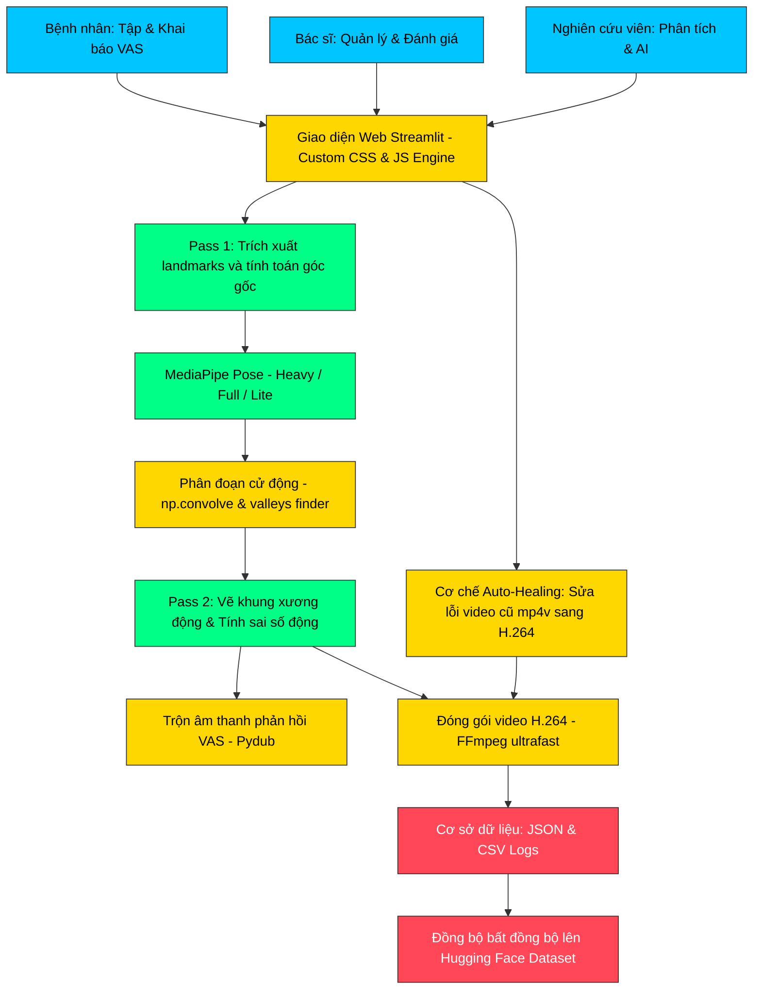

<!-- LOCAL_WEB_SNAPSHOT_START -->

## Cập nhật local web mới nhất (22/06/2026)

Bản React/FastAPI local hiện là giao diện web chính. Frontend nằm trong `web/`, backend API nằm ở `backend/main.py`, dữ liệu runtime lấy từ `database/*.json`. Web không đọc JSON trực tiếp; `web/src/api.ts` gọi FastAPI tại `http://127.0.0.1:8001`, backend đồng bộ `latest_video_bundle.json`, `video_list.json`, `doctor_evaluations.json` và các hồ sơ liên quan trước khi trả payload cho dashboard. `app.py` vẫn được giữ cho bản Streamlit legacy/Hugging Face Space.

### Số lượng dữ liệu local hiện tại

| Nhóm dữ liệu | Số lượng | File nguồn chính |
| --- | ---: | --- |
| Video trong dashboard | 14 | `database/video_list.json` |
| Video AI xong / bundle mới nhất | 8 | `database/latest_video_bundle.json` |
| Phiếu đánh giá tổng | 77 | `database/doctor_evaluations.json` |
| Phiếu NCV/AI tự động từ `video_list` | 14 | `source = video_list_ai_researcher` |
| Phiếu cũ/nhập tay giữ lại | 63 | `doctor_evaluations.json` |
| Người dùng | 25 | `database/users.json` |
| Bản ghi dữ liệu NCKH | 8 | `database/research_data.json` |
| Khai báo triệu chứng | 8 | `database/patient_symptoms.json` |
| Lịch sử tập luyện | 73 | `database/lich_su_tap_luyen.json` |
| Lịch nhắc | 0 | `database/schedules.json` |

Phân bố tài khoản hiện tại: **14 Nghiên cứu viên**, **5 Bác sĩ/KTV PHCN**, **4 Bệnh nhân**, **2 Quản trị viên**. Tài khoản test NCV: `2211090031 / ncv123@`; QTV mới: `admin / admin123@`; QTV Đinh Lê Quỳnh Phương vẫn giữ mật khẩu riêng `bong0912@`.

### Tổng hợp mới nhất theo bệnh nhân

| Bệnh nhân | Video | Video AI mới | Accuracy TB | Đúng | Gần đúng | Sai | Unknown | Tổng frame có metric | Kết quả NCV/AI tự động |
| --- | ---: | ---: | ---: | ---: | ---: | ---: | ---: | ---: | --- |
| BN04 | 4 | 2 | 64.50% | 4235 | 1001 | 1118 | 0 | 6354 | Đúng 2, Gần đúng 1, Sai 1 |
| BN01 | 3 | 2 | 82.94% | 8999 | 1974 | 3235 | 774 | 14982 | Đúng 2, Gần đúng 1 |
| BN02 | 4 | 2 | 75.22% | 9084 | 3058 | 1651 | 0 | 20767 | Đúng 2, Gần đúng 1, Sai 1 |
| BN03 | 3 | 2 | 82.87% | 5384 | 766 | 2025 | 4098 | 12273 | Đúng 2, Sai 1 |

### 8 video/kết quả AI mới nhất đang hiển thị trên web

| Bệnh nhân | Video | Bài tập | Kết quả | Accuracy | Frames | MAE | F1 | Precision | Recall | Thời gian kết quả |
| --- | --- | --- | --- | ---: | --- | ---: | ---: | ---: | ---: | --- |
| BN01 | `BN01 - Bài tập với gậy.mp4` | Bài tập với gậy | Gần đúng | 54.00% | Đúng 5951, Gần đúng 1947, Sai 3112, Unknown 764, Tổng 11774 | 25.56° | 0.702 | 0.657 | 0.541 | 10:05 - 22/06/2026 |
| BN03 | `BN03 - Bài tập với gậy.mp4` | Bài tập với gậy | Sai | 48.60% | Đúng 2644, Gần đúng 766, Sai 2025, Unknown 4098, Tổng 9533 | 23.20° | 0.655 | 0.566 | 0.486 | 10:05 - 22/06/2026 |
| BN02 | `BN02 - Bài tập với gậy.mp4` | Bài tập với gậy | Gần đúng | 55.90% | Đúng 5071, Gần đúng 2382, Sai 1616, Unknown 0, Tổng 9069 | 22.33° | 0.717 | 0.758 | 0.559 | 10:05 - 22/06/2026 |
| BN03 | `BN03 - Codman.mp4` | Codman | Đúng | 100.00% | Đúng 2740, Gần đúng 0, Sai 0, Unknown 0, Tổng 2740 | 2.88° | 1.000 | 1.000 | 1.000 | 11:34 - 22/06/2026 |
| BN02 | `BN02 - Codman.mp4` | Codman | Đúng | 96.65% | Đúng 2540, Gần đúng 53, Sai 35, Unknown 0, Tổng 2628 | 3.97° | 0.983 | 0.986 | 0.967 | 11:34 - 22/06/2026 |
| BN04 | `BN04 - Bài tập với gậy.mp4` | Bài tập với gậy | Gần đúng | 53.30% | Đúng 1914, Gần đúng 815, Sai 862, Unknown 0, Tổng 3591 | 22.59° | 0.695 | 0.689 | 0.533 | 11:34 - 22/06/2026 |
| BN01 | `BN01 - Codman.mp4` | Codman | Đúng | 95.31% | Đúng 3048, Gần đúng 27, Sai 123, Unknown 10, Tổng 3208 | 4.36° | 0.976 | 0.961 | 0.953 | 11:34 - 22/06/2026 |
| BN04 | `BN04 - Codman.mp4` | Codman | Đúng | 84.00% | Đúng 2321, Gần đúng 186, Sai 256, Unknown 0, Tổng 2763 | 9.88° | 0.913 | 0.901 | 0.840 | 11:34 - 22/06/2026 |

### Kết quả biểu đồ/frame mới nhất

Các biểu đồ trên web lấy từ payload chi tiết video (`GET /videos/{identifier}/detail`) và metrics đã lưu trong `video_list.json`/artifact. Nhóm biểu đồ React UI hiện có: góc khớp theo frame, phân bố PASS/NEAR/FAIL/UNKNOWN, histogram góc vai/khuỷu, boxplot, radar chỉ số nghiên cứu, bảng chỉ số NCV/AI và biểu đồ tổng quan theo vai trò.

Tổng hợp 8 video mới nhất dùng cho biểu đồ phân bố kết quả:

| PASS | NEAR | FAIL | UNKNOWN | Tổng frame |
| ---: | ---: | ---: | ---: | ---: |
| 26229 | 6176 | 8029 | 4872 | 45306 |

Tỷ lệ trên tổng frame mới nhất:

| Nhóm | Tỷ lệ |
| --- | ---: |
| PASS | 57.89% |
| NEAR | 13.63% |
| FAIL | 17.72% |
| UNKNOWN | 10.75% |

### Vận hành local React/FastAPI

```powershell
# Terminal 1: backend/API
cd D:\Downloads\Rehab-AI-Monitor-UI-new
D:\miniconda3\python.exe -m uvicorn backend.main:app --host 127.0.0.1 --port 8001

# Terminal 2: frontend/web
cd D:\Downloads\Rehab-AI-Monitor-UI-new\web
npm install
npm run dev -- --host 127.0.0.1 --port 5174
```

Mở web tại `http://127.0.0.1:5174`. API docs ở `http://127.0.0.1:8001/docs`.

### Vận hành bằng Docker sau tái cấu trúc

```powershell
cd D:\Downloads\Rehab-AI-Monitor-UI-new
docker compose up --build
```

Docker Compose mount trực tiếp `database/`, `patient_uploads/`, `processed_results/` và các JSON root vào container, nên dữ liệu local vẫn giữ nguyên như khi chạy bằng terminal. Frontend chạy ở `http://127.0.0.1:5174`, backend chạy ở `http://127.0.0.1:8001`.

<!-- LOCAL_WEB_SNAPSHOT_END -->

# 🏥 Rehab AI Monitor (Clinical Ecosystem)

**Hệ thống giám sát tập luyện Phục hồi chức năng từ xa dựa trên Trí tuệ nhân tạo (AI) và Thị giác máy tính - Giải pháp Clinical-Grade chuyên nghiệp.**

[](https://huggingface.co/spaces/quynhphuong1209/Rehab-AI-Monitor-UI-new)
[](https://opensource.org/licenses/MIT)

## 📚 Giới thiệu đề tài & Đặt vấn đề (Introduction & Rationale)

### Đặt vấn đề (Problem Statement)
Trong những năm gần đây, cùng với sự gia tăng của các bệnh lý cơ xương khớp, chấn thương thể thao và đột quỵ, nhu cầu phục hồi chức năng (PHCN) trên toàn thế giới ngày càng tăng cao. Theo Tổ chức Y tế Thế giới (WHO), hiện có khoảng 2,4 tỷ người cần ít nhất một hình thức phục hồi chức năng, chiếm gần một phần ba dân số toàn cầu (1, 2). Tại Việt Nam, theo Hội Phục hồi chức năng Việt Nam (2023), có khoảng 7,06% dân số từ 2 tuổi trở lên là người khuyết tật, trong đó phần lớn cần được can thiệp PHCN để cải thiện chức năng và tái hòa nhập cộng đồng. Đồng thời, tỷ lệ người cao tuổi chiếm 11,9% dân số và đang tăng nhanh, kéo theo sự gia tăng các bệnh lý thoái hóa xương khớp, rối loạn vận động và bệnh lý thần kinh (3). Mặc dù nhu cầu PHCN lớn, song năng lực cung cấp dịch vụ này tại Việt Nam vẫn còn hạn chế. Theo thống kê của Bộ Y tế (2023), trung bình 10.000 người dân chỉ có 0,25 nhân viên phục hồi chức năng, thấp hơn đáng kể so với khuyến nghị của WHO là 0,5–1 người/10.000 dân (4). Ngoài ra, chỉ khoảng 40% người bệnh có khả năng tiếp cận đầy đủ dịch vụ PHCN do hạn chế về nhân lực, cơ sở vật chất và điều kiện địa lý (5). Thực tế này khiến nhiều bệnh nhân phải tự tập luyện tại nhà sau khi xuất viện mà thiếu sự giám sát chuyên môn, dẫn đến nguy cơ tập sai động tác, giảm hiệu quả điều trị và kéo dài thời gian hồi phục.

Trước thực trạng đó, việc ứng dụng công nghệ Trí tuệ nhân tạo (Artificial Intelligence – AI) và Thị giác máy tính (Computer Vision – CV) vào giám sát tập luyện phục hồi chức năng từ xa được xem là xu hướng tất yếu. Trên thế giới, nhiều hệ thống AI hỗ trợ PHCN đã được thử nghiệm hoặc triển khai tại các quốc gia như Hoa Kỳ, Nhật Bản, Hàn Quốc với kết quả tích cực. Nghiên cứu của Ali Abedi và cộng sự (2024) cho thấy việc tích hợp AI vào chương trình phục hồi từ xa giúp nâng cao chất lượng đánh giá bài tập và cá nhân hóa phác đồ điều trị, góp phần cải thiện kết quả lâm sàng so với phương pháp truyền thống (6). Tại Việt Nam, một số đơn vị tiên phong như Trung tâm ASINA đã triển khai ứng dụng AI trong phục hồi cơ xương khớp, giúp bệnh nhân tập luyện từ xa một cách hiệu quả và tiện lợi (7). Bên cạnh đó, Bệnh viện C Đà Nẵng cũng đã tích hợp AI và công nghệ thực tế ảo (Virtual Reality – VR) vào quy trình điều trị, mang lại chất lượng sống tốt hơn cho hàng trăm bệnh nhân (8). Tuy nhiên, hiện nay chưa có nhiều hệ thống trong nước tích hợp đầy đủ khả năng nhận diện tư thế vận động theo thời gian thực, phản hồi trực quan, đồng thời lưu trữ và phân tích dữ liệu tập luyện phục vụ cho việc theo dõi tiến trình phục hồi của bác sĩ. Vì vậy, việc phát triển một nền tảng ứng dụng thông minh có khả năng giám sát, hỗ trợ và kết nối giữa bệnh nhân – bác sĩ – kỹ thuật viên là nhu cầu cấp thiết trong bối cảnh chăm sóc sức khỏe từ xa ngày càng được chú trọng. 

Tại khoa Phục hồi chức năng Bệnh viện Đa khoa Phạm Ngọc Thạch, nhu cầu theo dõi và hỗ trợ người bệnh luyện tập ngày càng tăng, đặc biệt với các trường hợp luyện tập lâu dài tại nhà. Tuy nhiên, hiện nay việc giám sát chủ yếu thực hiện trực tiếp tại bệnh viện, khi về nhà người bệnh tự tập theo video hoặc tài liệu hướng dẫn mà không có sự kiểm soát chuyên môn. Điều này dẫn đến nguy cơ tập sai động tác, giảm hiệu quả điều trị và khó theo dõi tiến trình phục hồi. Tại bệnh viện hiện nay vẫn chưa có nghiên cứu hay hệ thống nào ứng dụng Trí tuệ nhân tạo (AI) và Thị giác máy tính (Computer Vision) để giám sát tập luyện từ xa khiến việc thu thập dữ liệu, đánh giá kết quả và cải tiến phác đồ điều trị còn hạn chế. Xuất phát từ thực tiễn trên, nhóm nghiên cứu chúng tôi quyết định thực hiện đề tài: **“Phát triển mô hình thử nghiệm giám sát tập luyện Phục hồi chức năng từ xa dựa trên Trí tuệ nhân tạo (AI) và Thị giác máy tính (Computer Vision) tại Bệnh viện Đa khoa Phạm Ngọc Thạch – Trường Đại học Y tế Công cộng (2025–2026)”**.

### 🎯 Mục tiêu nghiên cứu (Research Objectives)
*   **Mục tiêu 1:** Xây dựng mô hình nhận diện và đánh giá 2-3 động tác phục hồi chức năng cơ bản (ví dụ: giơ tay ngang vai, co gối, xoay cổ tay) bằng công nghệ thị giác máy tính (pose estimation).
*   **Mục tiêu 2:** So sánh độ chính xác của mô hình với đánh giá thủ công (ví dụ: góc khớp, số lần lặp) trên một tập dữ liệu nhỏ (do nhóm tự quay hoặc dùng dữ liệu mở).


## ✨ Tính năng nổi bật (v3.2 Updated)
- 💎 **Thẩm mỹ Lâm sàng:** Giao diện sử dụng font chữ 'Times New Roman' chuẩn mực, thiết kế card-based hiện đại với hiệu ứng Glassmorphism.
- 🌓 **Đồng bộ Theme:** Hỗ trợ hoàn hảo chế độ Sáng (Light) và Tối (Dark) với sự chuyển đổi mượt mà, không lỗi tương phản.
- 📱 **Mobile-First Optimization:** Hệ thống Tab được tối ưu hóa toàn diện cho di động, đảm bảo chữ không bị tràn, hiển thị đầy đủ và hỗ trợ cuộn ngang chuyên nghiệp.
- 🩺 **Luồng liên lạc khép kín:** Bệnh nhân khai báo triệu chứng (VAS) -> Chuyên gia nhận xét lâm sàng -> Kết nối kết quả AI.
- 🚀 **Điều hướng Auto-Tab:** Tự động chuyển Tab thông minh bằng JavaScript khi chọn video để đánh giá, tối ưu hóa thao tác người dùng.
- 📊 **Phân tích Đa chiều (Plotly Analytics):**
  - **ROM Trend & Boxplot:** Đánh giá xu hướng góc khớp và độ biến động chuyển động qua từng phiên.
  - **Radar Chart (7 Chỉ số AI):** Lượng hóa hiệu suất mô hình qua 7 tham số cốt lõi: Accuracy, MAE, RMSE, ICC, F1-Score, Precision, Recall.
- 🦾 **Phân tích 3 Giai đoạn PHCN:** Bảng đối sánh kết quả tự động tại các ngưỡng sai số góc khớp $\pm 45°$, $\pm 30°$, và $\pm 15°$.
- 📁 **Xuất báo cáo Hợp nhất & Lazy ZIP:**
  - Xuất dữ liệu tọa độ CSV và biểu đồ dạng PNG trực tiếp.
  - Tải file ZIP ảnh phân tích bằng cơ chế "lười" (chỉ nén khi click), giúp chống lỗi tràn bộ nhớ (OOM).
- 🩺 **Đạo đức & Thông tin Nghiên cứu:** Bioethics Panel hiển thị thông tin PIS và các thẻ liên hệ chuyên biệt cho NCV và Hội đồng Đạo đức (IRB).
- 📱 **Sidebar Phẳng (Flattened):** Cấu trúc Sidebar mật độ cao, truy cập nhanh thông tin bệnh nhân và khai báo triệu chứng.

## 🗺️ Cấu trúc Tab Điều hướng (Role-based)
Hệ thống tự động thay đổi cấu trúc dựa trên vai trò người dùng:
- **Bệnh nhân:** Tập luyện (Xem video mẫu, upload video tập, xem kết quả), Khai báo triệu chứng & VAS, Xem phác đồ của bác sĩ, Lịch nhắc nhở (Schedules), Đạo đức & Thông tin nghiên cứu (Consent).
- **Bác sĩ / KTV:** Quản lý bệnh nhân, Giao diện quản lý & Phê duyệt video (Trình xem video kép, JavaScript Auto-Tab), Bộ đánh giá lâm sàng chuyên môn (Ground Truth Entry), Quản lý phác đồ.
- **Nghiên cứu viên:** Cấu hình tham số mô hình AI, Phân tích sâu & Trích xuất tọa độ (Xuất CSV/JSON), Phân tích đa chiều (ROM Trend, Boxplot, Radar Chart), Bảng đối sánh 3 giai đoạn PHCN, Đồng bộ Ground Truth từ Bác sĩ.
- **Quản trị viên:** Bộ Metric Cards tổng quan, Biểu đồ thống kê trực quan (Cơ cấu vai trò, bài tập phổ biến), Bảng quản trị cốt lõi (hợp nhất mọi thông tin bệnh nhân, AI, bác sĩ), Nhật ký hoạt động toàn hệ thống (Admin Log - Xuất CSV), Dọn dẹp & Reset hệ thống.

<!-- CLINICAL_FINDINGS_START -->

# BÁO CÁO CẬP NHẬT KẾT QUẢ LÂM SÀNG & NCKH (22/06/2026)
## HỆ THỐNG GIÁM SÁT PHỤC HỒI CHỨC NĂNG BẰNG AI (REHAB-AI-MONITOR)

Báo cáo này đã được cập nhật lại theo dữ liệu local mới nhất trong `database/video_list.json`, `database/latest_video_bundle.json`, `database/doctor_evaluations.json`, `database/patient_symptoms.json` và `database/research_data.json`. Phần nhận định dùng mã ẩn danh `BN01` - `BN04` để không công khai tên, mã mẫu hoặc tuổi chính xác của người bệnh.

---

## 1. TỔNG QUAN DASHBOARD LÂM SÀNG/NCKH

| Chỉ số | Giá trị mới nhất | Nguồn dữ liệu |
| --- | ---: | --- |
| Bệnh nhân đang có dữ liệu | 4 | `users.json`, `video_list.json` |
| Video trong dashboard | 14 | `video_list.json` |
| Video AI có metrics chi tiết mới nhất | 8 | `latest_video_bundle.json`, `video_list.json` |
| Frame đã chấm trong nhóm mới nhất | 45306 | `metrics.tong_frame_da_cham` |
| Accuracy trung bình nhóm 8 video mới | 73.47% | `accuracy` |
| Pass rate frame nhóm 8 video mới | 57.89% | PASS / tổng frame |
| Phiếu đánh giá tổng | 77 | `doctor_evaluations.json` |
| Phiếu NCV/AI tự động | 14 | `source = video_list_ai_researcher` |
| Bản ghi dữ liệu NCKH | 8 | `research_data.json` |
| Khai báo triệu chứng | 8 | `patient_symptoms.json` |

Phân bố kết quả trong toàn bộ `doctor_evaluations.json`: **Đúng 34**, **Gần đúng 24**, **Sai 19**. Trong đó có 14 phiếu tự động từ `video_list`, 5 phiếu từ `doctor1`, 5 phiếu từ `NCV: Đinh Lê Quỳnh Phương`, 50 phiếu NCV cũ và 3 phiếu chưa gắn tên người đánh giá.

---

## 2. TỔNG HỢP MỚI NHẤT THEO BỆNH NHÂN

| Bệnh nhân | Video | Video AI mới | Accuracy TB | PASS | NEAR | FAIL | UNKNOWN | Tổng frame có metric | Kết quả AI/NCV |
| --- | ---: | ---: | ---: | ---: | ---: | ---: | ---: | ---: | --- |
| BN04 | 4 | 2 | 64.50% | 4235 | 1001 | 1118 | 0 | 6354 | Đúng 2, Gần đúng 1, Sai 1 |
| BN01 | 3 | 2 | 82.94% | 8999 | 1974 | 3235 | 774 | 14982 | Đúng 2, Gần đúng 1 |
| BN02 | 4 | 2 | 75.22% | 9084 | 3058 | 1651 | 0 | 20767 | Đúng 2, Gần đúng 1, Sai 1 |
| BN03 | 3 | 2 | 82.87% | 5384 | 766 | 2025 | 4098 | 12273 | Đúng 2, Sai 1 |

---

## 3. BẢNG 8 VIDEO AI MỚI NHẤT CÓ METRICS CHI TIẾT

| Bệnh nhân | Bài tập | Kết quả | Accuracy | PASS / NEAR / FAIL / UNKNOWN | Tổng frame | MAE | F1 | Thời gian |
| --- | --- | --- | ---: | --- | ---: | ---: | ---: | --- |
| BN01 | Bài tập với gậy | Gần đúng | 54.00% | 5951 / 1947 / 3112 / 764 | 11774 | 25.56° | 0.702 | 10:05 - 22/06/2026 |
| BN03 | Bài tập với gậy | Sai | 48.60% | 2644 / 766 / 2025 / 4098 | 9533 | 23.20° | 0.655 | 10:05 - 22/06/2026 |
| BN02 | Bài tập với gậy | Gần đúng | 55.90% | 5071 / 2382 / 1616 / 0 | 9069 | 22.33° | 0.717 | 10:05 - 22/06/2026 |
| BN03 | Codman | Đúng | 100.00% | 2740 / 0 / 0 / 0 | 2740 | 2.88° | 1.000 | 11:34 - 22/06/2026 |
| BN02 | Codman | Đúng | 96.65% | 2540 / 53 / 35 / 0 | 2628 | 3.97° | 0.983 | 11:34 - 22/06/2026 |
| BN04 | Bài tập với gậy | Gần đúng | 53.30% | 1914 / 815 / 862 / 0 | 3591 | 22.59° | 0.695 | 11:34 - 22/06/2026 |
| BN01 | Codman | Đúng | 95.31% | 3048 / 27 / 123 / 10 | 3208 | 4.36° | 0.976 | 11:34 - 22/06/2026 |
| BN04 | Codman | Đúng | 84.00% | 2321 / 186 / 256 / 0 | 2763 | 9.88° | 0.913 | 11:34 - 22/06/2026 |

---

## 4. KẾT QUẢ BIỂU ĐỒ/FRAME MỚI NHẤT

| Nhóm frame | Số frame | Tỷ lệ |
| --- | ---: | ---: |
| PASS | 26229 | 57.89% |
| NEAR | 6176 | 13.63% |
| FAIL | 8029 | 17.72% |
| UNKNOWN | 4872 | 10.75% |
| Tổng | 45306 | 100.00% |

Nhận định từ biểu đồ hiện tại: nhóm Codman có độ ổn định cao hơn, đặc biệt các video Codman mới của BN01, BN02, BN03 và BN04 đều đạt mức **Đúng**. Nhóm bài tập với gậy/Pulley có độ khó cao hơn, xuất hiện nhiều frame sai hoặc gần đúng, đặc biệt ở BN03 có 4098 frame UNKNOWN cần kiểm tra lại góc quay, ánh sáng, che khuất cơ thể hoặc chất lượng khung hình.

---

## 5. THÔNG TIN TRIỆU CHỨNG LÂM SÀNG ĐANG GHI NHẬN

| Mã ẩn danh | Nhóm tuổi | VAS | Tóm tắt triệu chứng/hồ sơ |
| --- | --- | ---: | --- |
| BN01 | 30-39 | 6 | Đau khớp vai phải nhiều tháng, đau tăng khi vận động, đau nhiều về đêm, tiền sử bản thân khỏe mạnh. |
| BN02 | 50-59 | 8 | Đau khớp vai phải vài tháng, đã điều trị VLTL/Đông y nhưng đau tăng; đau điểm bám gân cơ trên gai, Jobe test (+), Speed test (-), tiền sử viêm dạ dày. |
| BN03 | 50-59 | 6 | Đau khớp vai hai bên, hạn chế vận động, đau điểm bám gân cơ nhị đầu và cơ trên gai hai bên, tê bì dọc cánh tay, hạn chế xoay trong/xoay ngoài vai phải. |
| BN04 | >=70 | 6 | Đau khớp vai phải nhiều tháng, đau tăng khi vận động, đau nhiều về đêm, tiền sử đau dạ dày. |

---

## 6. NHẬN ĐỊNH LÂM SÀNG & KẾ HOẠCH THEO BỆNH NHÂN

### BN01
- Dữ liệu hiện có: 3 video, 2 video AI mới; accuracy trung bình 82.94%.
- Codman đạt tốt: video mới `BN01 - Codman.mp4` đạt 95.31%, MAE 4.36°, F1 0.976.
- Bài tập với gậy còn ở mức gần đúng: 54.00%, 3112 frame sai và 764 frame UNKNOWN trên 11774 frame.
- Kế hoạch đề xuất: duy trì Codman, tiếp tục tập bài với gậy ở biên độ vừa phải; ưu tiên giữ trục vai-khuỷu ổn định, quay video rõ toàn thân và tránh che khuất tay tổn thương.

### BN02
- Dữ liệu hiện có: 4 video, 2 video AI mới; accuracy trung bình 75.22%.
- Codman mới đạt tốt: 96.65%, MAE 3.97°, F1 0.983, chỉ có 35 frame sai trên 2628 frame.
- Bài tập với gậy đạt gần đúng ở video mới: 55.90%, nhưng tổng nhóm gậy vẫn có 1 kết quả sai cũ và 1651 frame FAIL.
- Kế hoạch đề xuất: tiếp tục Codman để duy trì tầm vận động; với bài tập gậy cần kiểm soát khớp khuỷu, hạn chế bù trừ thân người và theo dõi đau vai phải do VAS 8.

### BN03
- Dữ liệu hiện có: 3 video, 2 video AI mới; accuracy trung bình 82.87%.
- Codman mới đạt 100.00%, MAE 2.88°, F1 1.000, toàn bộ 2740 frame được chấm đúng.
- Bài tập với gậy đang sai: 48.60%, có 2025 frame FAIL và 4098 frame UNKNOWN trên 9533 frame.
- Kế hoạch đề xuất: ưu tiên kiểm tra lại chất lượng video bài tập gậy, góc máy, ánh sáng và khả năng che khuất; khi tập cần có KTV/bác sĩ hướng dẫn để giảm bù trừ do đau hai vai và hạn chế xoay vai.

### BN04
- Dữ liệu hiện có: 4 video, 2 video AI mới; accuracy trung bình 64.50%.
- Codman mới đạt 84.00%, MAE 9.88°, F1 0.913; nhóm Codman nhìn chung có thể duy trì.
- Bài tập với gậy mới đạt gần đúng 53.30%, còn 862 frame FAIL; video gậy cũ có kết quả sai nên đây vẫn là bài tập cần theo dõi kỹ.
- Kế hoạch đề xuất: tiếp tục Codman với biên độ an toàn; bài tập gậy nên tập chậm, giảm biên độ ban đầu, chú ý giữ tay thẳng và tránh nâng vai bù trừ.

---

## 7. TRẠNG THÁI BÁC SĨ/KTV VÀ NCV TRÊN HỆ THỐNG

- Bác sĩ/KTV có thể xem 8 video AI mới nhất kèm biểu đồ góc khớp, phân bố frame, histogram, boxplot, radar chỉ số nghiên cứu và bảng metrics.
- `doctor_evaluations.json` hiện có 77 phiếu: 14 phiếu AI tự đồng bộ, 5 phiếu từ `doctor1`, 5 phiếu từ `NCV: Đinh Lê Quỳnh Phương`, 50 phiếu NCV cũ và 3 phiếu chưa gắn tên người đánh giá.
- Kết quả đánh giá tổng đang phân bố: Đúng 34, Gần đúng 24, Sai 19.
- Các nhận định trên là tổng hợp hỗ trợ từ AI/NCV và dữ liệu lâm sàng đã nhập, không thay thế kết luận chuyên môn cuối cùng của bác sĩ điều trị.

<!-- CLINICAL_FINDINGS_END -->

## 🏗️ Kiến trúc hệ thống (Architecture Overview)

Hệ thống được thiết kế theo mô hình kiến trúc phân lớp tối ưu hiệu năng chạy trên các nền tảng đám mây CPU-only (như Hugging Face Spaces). Dưới đây là sơ đồ và luồng hoạt động chi tiết:

### Sơ đồ luồng hoạt động (Data & Control Flow)



### Các thành phần chính trong kiến trúc:

1. **Luồng xử lý Video 2-Pass tối ưu bộ nhớ:**
   * **Pass 1 (Trích xuất dữ liệu thô):** Đọc từng khung hình video từ `cv2.VideoCapture`, chuẩn hóa kích thước (resize) và xoay chiều phù hợp. MediaPipe Pose chạy trên ảnh RGB để lấy 33 điểm landmarks, sau đó tính toán góc vai và góc khuỷu mà không vẽ hoặc ghi file nhằm tiết kiệm RAM tối đa.
   * **Phân đoạn Giai đoạn tự động (Segmentation):** Áp dụng bộ lọc mượt tích chập (`np.convolve`) lên chuỗi tín hiệu góc khớp để khử nhiễu. Thuật toán tìm điểm cực tiểu (valleys) để chia video bệnh nhân thành 3 giai đoạn cử động (Giai đoạn 1 bắt đầu giơ tay, Giai đoạn 2 dạng sai số vừa, Giai đoạn 3 chuẩn xác dần).
   * **Pass 2 (Vẽ đè & Gộp đa phương tiện):** Sử dụng landmarks đã trích xuất ở Pass 1 để vẽ khung xương động, vòng cung góc khớp trực tiếp lên frame. Sai số động được áp dụng theo phân đoạn (GĐ1: 45°, GĐ2: 30°, GĐ3: 15°).
   
2. **Hệ thống phản hồi âm thanh & Đóng gói Video:**
   * **Voice Feedback Engine:** Trích xuất các khoảnh khắc chuyển đổi trạng thái (Đúng, Gần đúng, Sai). Sử dụng `pydub` để nối ghép các file âm thanh chỉ dẫn. Hệ thống tự động giới hạn tối đa 40 sự kiện âm thanh để tránh tràn RAM (Out of Memory - OOM).
   * **FFmpeg H.264 Transcoding:** Sử dụng bộ mã hóa `libx264` cùng với cấu hình `-preset ultrafast` và `-crf 24` để nén video thô `mp4v` thành định dạng H.264 chuẩn web, đảm bảo video hiển thị mượt mà trên mọi thiết bị di động mà không bị lag/buffering.

3. **Cơ chế Tự sửa lỗi thông minh (Auto-Healing Engine):**
   * Tích hợp trực tiếp vào hàm `render_video`. Khi phát hiện người dùng tải lại kết quả của các phiên tập cũ có video định dạng `mp4v` không chơi được, hệ thống sẽ tự động kích hoạt `ffmpeg` ngầm để chuyển đổi sang H.264 chuẩn, đồng thời tự động cập nhật lại cơ sở dữ liệu `video_list.json` mà không làm gián đoạn trải nghiệm của người dùng.

4. **Đồng bộ hóa dữ liệu đám mây bất đồng bộ (Async Cloud Sync):**
   * Sử dụng luồng chạy nền (`threading.Thread` độc lập) để tải dữ liệu CSV tọa độ và các file video thành phẩm lên Hugging Face Dataset. Cơ chế này giúp giữ cho luồng giao diện (UI) chính của Streamlit luôn mượt mà, không bị khóa cứng (blocking) khi truyền tải file lớn.

## 🤖 Hướng dẫn cấu hình & Lựa chọn mô hình AI (Model Configurations)

Để tối ưu hóa độ chính xác hoặc tốc độ xử lý tùy theo năng lực phần cứng (đặc biệt khi chạy trên các môi trường CPU Cloud hạn chế như Hugging Face Spaces), Nghiên cứu viên có thể tùy chỉnh cấu hình các tham số phân tích AI trực tiếp tại **Sidebar bên trái** trước khi nhấn phân tích:

### 1. Phân loại mô hình AI (Model Type)
Hệ thống tích hợp 3 phiên bản mô hình Pose Estimation từ **MediaPipe**:
* **MediaPipe Heavy (Khuyến nghị cho lâm sàng):** Có độ chính xác cao nhất về định vị các điểm landmarks khớp vai/khuỷu tay, giảm thiểu tối đa hiện tượng rung/trượt tọa độ do góc quay camera. Phù hợp nhất cho việc đánh giá lâm sàng cần độ tin cậy tuyệt đối.
* **MediaPipe Full (Tiêu chuẩn):** Cân bằng tốt giữa tốc độ xử lý và độ chính xác, thích hợp khi kiểm tra nhanh.
* **MediaPipe Lite (Siêu nhẹ):** Tối ưu hóa tối đa về hiệu năng CPU. Phù hợp nhất khi chạy thử nghiệm nhanh hoặc trên các dòng máy tính/thiết bị có cấu hình yếu.

### 2. Các tham số tối ưu hiệu năng chạy nền
* **Tốc độ xử lý (Skip Frames):**
  * **0 (Mặc định)**: Quét và phân tích toàn bộ khung hình trong video (độ chính xác cao nhất).
  * **2** hoặc **4**: Bỏ qua 2 hoặc 4 khung hình trong mỗi bước quét. Giúp tăng tốc độ xử lý của mô hình AI gấp **3 - 5 lần** (rút ngắn thời gian xử lý video dài xuống còn vài chục giây) mà vẫn đảm bảo giữ nguyên được các điểm cực trị lâm sàng.
* **Độ phân giải đầu vào (Resize Width):**
  * Hỗ trợ nén chiều rộng khung hình đầu vào về mức `360px` hoặc `720px` trước khi nạp dữ liệu vào mô hình AI. Giúp giảm tải đáng kể dung lượng bộ nhớ RAM tiêu thụ và tránh lỗi tràn RAM (OOM - Out of Memory) trên máy chủ Cloud CPU.
* **Ngưỡng tin cậy (Confidence Threshold):**
  * Đặt mức tối thiểu (mặc định `0.5`) để lọc bỏ các khung hình bị che khuất hoặc các điểm khớp nhận diện kém tự tin, đảm bảo dữ liệu vẽ biểu đồ góc khớp sạch nhất.

## 📁 Cấu trúc thư mục dự án (Directory Structure)

Dưới đây là sơ đồ phân loại toàn bộ tệp tin trong dự án giúp bạn dễ dàng chủ động quản lý và bảo trì:

```
Rehab-AI-Monitor/
│
├── 🌐 Chương trình chạy Web chính
│   ├── app.py                     # File chạy chính (Frontend Streamlit + Backend Python)
│   └── .streamlit/
│       └── config.toml            # Cấu hình cổng mạng, theme, tối ưu hóa của Streamlit
│
├── 🖼️ Tài nguyên hình ảnh & Logo (Thư mục assets/)
│   └── assets/
│       ├── abc1.png                   # Logo Đại học Y tế Công cộng (HUPH)
│       └── logo_data_science_sm.png   # Logo khoa Khoa học dữ liệu HUPH
│
├── 📂 Thư mục tài liệu hướng dẫn & Báo cáo (docs/)
│   ├── README_UI.md               # Tài liệu thuyết minh chi tiết về thiết kế giao diện UI/UX
│   ├── BAO_CAO_CHI_TIET.md        # Báo cáo chuyên sâu về mã nguồn, giải thuật lâm sàng & RAM
│   ├── TECHNICAL_DOCUMENTATION.md # Tài liệu kỹ thuật phân tích sâu cấu trúc Front-End & Back-End
│   └── AI_MODEL_DOCUMENTATION.md  # Tài liệu giải thích mô hình AI, công thức toán lý thuyết góc khớp
│
├── 📝 Hướng dẫn khởi chạy chính
│   └── README.md                  # Hướng dẫn chung về cách cài đặt và chạy dự án
│
├── 💾 Cơ sở dữ liệu JSON (Thư mục database/)
│   └── database/
│       ├── users.json                 # Danh sách tài khoản người dùng và mật khẩu băm bảo mật
│       ├── patient_symptoms.json      # Triệu chứng lâm sàng và mức độ đau VAS của bệnh nhân
│       ├── doctor_evaluations.json    # Chẩn đoán lâm sàng (Ground Truth) và nhận xét của Bác sĩ
│       ├── schedules.json             # Lịch nhắc nhở luyện tập của bệnh nhân
│       ├── video_list.json            # Quản lý siêu dữ liệu video, kết quả phân tích góc và sai số AI
│       ├── lich_su_tap_luyen.json     # Lịch sử và tiến trình tập luyện của bệnh nhân
│       ├── reference_codman.json      # Dữ liệu góc chuẩn cho bài tập Codman Pendulum
│       ├── reference_gay.json         # Dữ liệu góc chuẩn cho bài tập gậy khớp vai
│       └── reference_day.json         # Dữ liệu góc chuẩn cho bài tập dây kháng lực
│
├── 📂 Thư mục chứa dữ liệu Media
│   ├── patient_uploads/           # Nơi lưu trữ video gốc do bệnh nhân tải lên
│   └── processed_results/         # Nơi lưu kết quả video/ảnh đã vẽ khung xương khớp từ AI
│
├── ⚙️ Cấu hình môi trường & Deploy
│   ├── requirements.txt           # Danh sách thư viện Python cần cài đặt (numpy, mediapipe...)
│   ├── packages.txt               # Thư viện hệ thống cài cho Linux khi deploy lên cloud (ffmpeg...)
│   ├── Dockerfile                 # Cấu hình Container để chạy ứng dụng tự động
│   └── runtime.txt                # Khai báo phiên bản Python chạy trên Cloud (Python 3.10)
│
└── 🛠️ Công cụ & Batch Scripts hỗ trợ (Thư mục scripts/)
    └── scripts/
        ├── reset_data.py              # Script dọn dẹp sạch sẽ video rác và reset cơ sở dữ liệu
        ├── fix_plotly_v2.py           # Script nhỏ sửa lỗi hiển thị của biểu đồ Plotly
        ├── push_code.bat              # Batch script trên Windows dùng để lưu nhanh code lên GitHub
        └── push_to_git.bat            # Batch script đẩy code dự phòng lên GitHub
```

## 🛠️ Công nghệ sử dụng
- **AI Core:** MediaPipe (Pose), OpenCV, FFmpeg (Xử lý đa định dạng video MOV/MP4)
- **Runtime:** Python 3.10 (Khuyến nghị để đảm bảo tương thích MediaPipe & Docker)
- **Framework:** Streamlit (Custom CSS/JS & WebRTC)
- **Data:** Pandas, NumPy, JSON Persistence (Lưu trữ bền vững)
- **Visualization:** Plotly Professional Charts (Heatmaps, Progress Charts)

## 🚀 Chạy ứng dụng
```bash
# Yêu cầu Python 3.10
pip install -r requirements.txt
streamlit run app.py
```

## 👨‍🏫 Nhóm thực hiện & Hướng dẫn
- **Giảng viên hướng dẫn:** 
  1. TS. Trần Hồng Việt (Khoa học dữ liệu)
  2. Nguyễn Thị Thùy Chi (Lâm sàng)
- **Chủ nhiệm đề tài:** Đinh Lê Quỳnh Phương (KHDL1-1A)
- **Thành viên nhóm nghiên cứu:** Kim Mạnh Hưng, Nguyễn Hải An, Nguyễn Thị Thanh Nga, Phan Vân Anh, Nguyễn Thị Thơm, Nguyễn Thị Thu Hương.
- **Đơn vị phối hợp:** Đại học Y tế Công cộng - Bệnh viện Đa khoa Phạm Ngọc Thạch.

---
© 2025-2026 Rehab AI Monitor Team.

