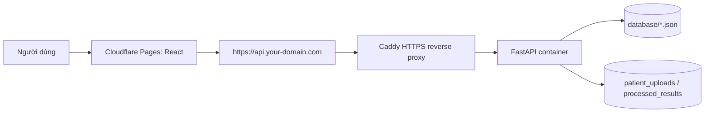

# Deploy production: Cloudflare Pages + VPS Docker + Caddy

Mục tiêu của lần deploy đầu tiên là đưa web lên mạng nhưng vẫn giữ dữ liệu giống local:

- Frontend React chạy trên Cloudflare Pages.
- Backend FastAPI chạy trên VPS bằng Docker Compose.
- Caddy đứng trước backend để cấp HTTPS cho API.
- Dữ liệu hiện tại vẫn nằm trong `database/`, `patient_uploads/`, `processed_results/` và các file JSON ở root repo trên VPS.
- Cloudflare R2/Postgres là bước 2 sau khi web đã chạy ổn, chưa bắt buộc cho lần deploy đầu.

## 0. Mô hình chạy



## 1. Chuẩn bị trước khi lên VPS

Trên máy local, kiểm tra web đang build được:

```powershell
cd D:\Downloads\Rehab-AI-Monitor-UI-new\web
npm run build
```

Kiểm tra Docker local nếu cần:

```powershell
cd D:\Downloads\Rehab-AI-Monitor-UI-new
$env:Path = "C:\Program Files\Docker\Docker\resources\bin;$env:Path"
docker compose up -d --build
docker compose ps
```

Mở local:

```text
http://127.0.0.1:5174
```

## 2. Chuẩn bị domain API

Bạn cần một domain hoặc subdomain cho backend API, ví dụ:

```text
api.your-domain.com
```

Tạo DNS record:

```text
Type: A
Name: api
Value: IP_PUBLIC_CUA_VPS
Proxy: DNS only khi mới debug
```

Sau khi API chạy ổn có thể bật proxy Cloudflare nếu muốn.

## 3. Cài Docker trên VPS Ubuntu

SSH vào VPS:

```bash
ssh root@YOUR_VPS_IP
```

Cài Docker:

```bash
apt update
apt install -y ca-certificates curl git
install -m 0755 -d /etc/apt/keyrings
curl -fsSL https://download.docker.com/linux/ubuntu/gpg -o /etc/apt/keyrings/docker.asc
chmod a+r /etc/apt/keyrings/docker.asc
echo "deb [arch=$(dpkg --print-architecture) signed-by=/etc/apt/keyrings/docker.asc] https://download.docker.com/linux/ubuntu $(. /etc/os-release && echo ${UBUNTU_CODENAME:-$VERSION_CODENAME}) stable" > /etc/apt/sources.list.d/docker.list
apt update
apt install -y docker-ce docker-ce-cli containerd.io docker-buildx-plugin docker-compose-plugin
docker --version
docker compose version
```

Mở firewall:

```bash
ufw allow OpenSSH
ufw allow 80
ufw allow 443
ufw --force enable
```

## 4. Clone code lên VPS

```bash
cd /opt
git clone https://github.com/quynhphuong1209/Rehab-AI-Monitor-UI-new.git
cd /opt/Rehab-AI-Monitor-UI-new
```

Nếu repo đã có sẵn:

```bash
cd /opt/Rehab-AI-Monitor-UI-new
git pull
```

Tạo sẵn thư mục dữ liệu nếu repo chưa có:

```bash
mkdir -p database patient_uploads processed_results
```

## 5. Copy dữ liệu local lên VPS

Chạy trên PowerShell ở máy Windows local:

```powershell
$VPS="root@YOUR_VPS_IP"
$ROOT="D:\Downloads\Rehab-AI-Monitor-UI-new"
$REMOTE="/opt/Rehab-AI-Monitor-UI-new"

scp -r "$ROOT\database" "${VPS}:$REMOTE/"
scp -r "$ROOT\patient_uploads" "${VPS}:$REMOTE/"
scp -r "$ROOT\processed_results" "${VPS}:$REMOTE/"
scp "$ROOT\video_list.json" "${VPS}:$REMOTE/"
scp "$ROOT\doctor_evaluations.json" "${VPS}:$REMOTE/"
scp "$ROOT\patient_symptoms.json" "${VPS}:$REMOTE/"
scp "$ROOT\research_data.json" "${VPS}:$REMOTE/"
scp "$ROOT\lich_su_tap_luyen.json" "${VPS}:$REMOTE/"
scp "$ROOT\schedules.json" "${VPS}:$REMOTE/"
```

Lưu ý: bước này chỉ copy bản deploy, không xóa dữ liệu local. Nếu đã có dữ liệu trên VPS, nên backup trước:

```bash
cd /opt/Rehab-AI-Monitor-UI-new
BACKUP_DIR="/opt/rehab-backups/$(date +%Y%m%d_%H%M%S)"
mkdir -p "$BACKUP_DIR"
cp -a database patient_uploads processed_results *.json "$BACKUP_DIR"/ 2>/dev/null || true
```

## 6. Tạo env production trên VPS

```bash
cd /opt/Rehab-AI-Monitor-UI-new/deploy
cp .env.production.example .env.production
nano .env.production
```

Sửa các dòng quan trọng:

```env
API_DOMAIN=api.your-domain.com
FRONTEND_ORIGIN=https://your-cloudflare-pages-project.pages.dev
REHAB_TOKEN_SECRET=chuoi-bi-mat-dai
REHAB_UPLOAD_MAX_MB=600
REHAB_UPLOAD_MAX_SIZE=700MB
```

Tạo secret:

```bash
openssl rand -hex 32
```

Không commit file `.env.production`.

## 7. Chạy backend production trên VPS

```bash
cd /opt/Rehab-AI-Monitor-UI-new/deploy
docker compose -f docker-compose.prod.yml --env-file .env.production config
docker compose -f docker-compose.prod.yml --env-file .env.production up -d --build
docker compose -f docker-compose.prod.yml --env-file .env.production ps
```

Kiểm tra log:

```bash
docker compose -f docker-compose.prod.yml --env-file .env.production logs -f backend
docker compose -f docker-compose.prod.yml --env-file .env.production logs -f caddy
```

Kiểm tra API:

```bash
curl https://api.your-domain.com/health
```

Kết quả đúng:

```json
{"ok":true,...}
```

## 8. Deploy frontend lên Cloudflare Pages

Vào Cloudflare Dashboard:

1. Workers & Pages.
2. Create application.
3. Pages.
4. Connect to Git.
5. Chọn repo `quynhphuong1209/Rehab-AI-Monitor-UI-new`.
6. Build settings:

```text
Framework preset: Vite
Root directory: web
Build command: npm run build
Build output directory: dist
```

Thêm Environment variable trong Cloudflare Pages:

```text
VITE_API_BASE_URL=https://api.your-domain.com
```

Deploy xong, lấy domain Pages thật, ví dụ:

```text
https://rehab-ai-monitor.pages.dev
```

Quay lại VPS sửa CORS:

```bash
cd /opt/Rehab-AI-Monitor-UI-new/deploy
nano .env.production
```

Đặt:

```env
FRONTEND_ORIGIN=https://rehab-ai-monitor.pages.dev
```

Restart:

```bash
docker compose -f docker-compose.prod.yml --env-file .env.production up -d
```

## 9. Kiểm tra đăng nhập production

Mở domain Cloudflare Pages rồi thử tài khoản có sẵn:

```text
NCV: 2211090031 / ncv123@
QTV: admin / admin123@
```

Nếu frontend báo lỗi CORS hoặc không gọi được API:

```bash
cd /opt/Rehab-AI-Monitor-UI-new/deploy
cat .env.production
docker compose -f docker-compose.prod.yml --env-file .env.production logs --tail=100 backend
```

Đảm bảo `FRONTEND_ORIGIN` khớp chính xác domain Pages, gồm cả `https://`.

## 10. Cập nhật code sau này

Khi bạn sửa code rồi push lên GitHub:

```bash
cd /opt/Rehab-AI-Monitor-UI-new
git pull
cd deploy
docker compose -f docker-compose.prod.yml --env-file .env.production up -d --build
```

Cloudflare Pages sẽ tự build lại frontend từ GitHub. Backend trên VPS cần chạy lệnh trên để cập nhật.

## 11. Cập nhật dữ liệu sau này

Nếu chỉ cập nhật JSON/video local rồi muốn đưa lên server:

```powershell
$VPS="root@YOUR_VPS_IP"
$ROOT="D:\Downloads\Rehab-AI-Monitor-UI-new"
$REMOTE="/opt/Rehab-AI-Monitor-UI-new"

scp -r "$ROOT\database" "${VPS}:$REMOTE/"
scp "$ROOT\video_list.json" "${VPS}:$REMOTE/"
scp "$ROOT\doctor_evaluations.json" "${VPS}:$REMOTE/"
```

Sau đó trên VPS:

```bash
cd /opt/Rehab-AI-Monitor-UI-new/deploy
docker compose -f docker-compose.prod.yml --env-file .env.production restart backend
```

## 12. Dừng server

```bash
cd /opt/Rehab-AI-Monitor-UI-new/deploy
docker compose -f docker-compose.prod.yml --env-file .env.production down
```

Lệnh `down` không xóa `database/`, `patient_uploads/`, `processed_results/` vì chúng là bind mount từ thư mục project.

## 13. Bước 2: Cloudflare R2/Postgres

Sau khi production chạy ổn, mới tách dữ liệu nặng:

- Upload `patient_uploads/` và `processed_results/` lên Cloudflare R2.
- Lưu object key/URL vào metadata.
- Giữ version/timestamp, không ghi đè file cũ.
- Chuyển dần JSON metadata sang Postgres nếu cần nhiều người dùng đồng thời.

Không nên làm R2/Postgres cùng lúc với lần deploy đầu tiên. Deploy trước bằng dữ liệu y như local, kiểm tra chạy ổn, rồi migrate dữ liệu nặng sau.

## 14. Lỗi thường gặp

### Docker báo `docker-credential-desktop` không tìm thấy trên Windows

Chạy PowerShell:

```powershell
$env:Path = "C:\Program Files\Docker\Docker\resources\bin;$env:Path"
docker compose up -d --build
```

### Upload video bị 413 hoặc bị ngắt

Tăng cả 2 biến trong `.env.production`:

```env
REHAB_UPLOAD_MAX_MB=1000
REHAB_UPLOAD_MAX_SIZE=1100MB
```

Rồi restart:

```bash
docker compose -f docker-compose.prod.yml --env-file .env.production up -d
```

### API không có HTTPS

Kiểm tra:

- DNS `api.your-domain.com` đã trỏ đúng IP VPS.
- Port `80` và `443` đã mở.
- Log Caddy không báo lỗi cấp chứng chỉ.

```bash
docker compose -f docker-compose.prod.yml --env-file .env.production logs --tail=100 caddy
```
