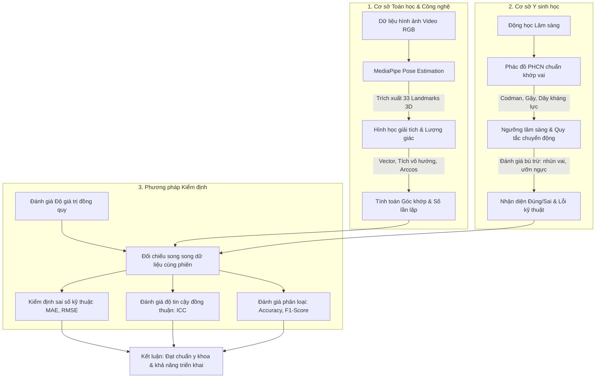

# ĐỀ CƯƠNG NGHIÊN CỨU KHOA HỌC (2025-2026)

**ĐỀ TÀI:** PHÁT TRIỂN MÔ HÌNH THỬ NGHIỆM GIÁM SÁT TẬP LUYỆN PHỤC HỒI CHỨC NĂNG TỪ XA DỰA TRÊN TRÍ TUỆ NHÂN TẠO (AI) VÀ THỊ GIÁC MÁY TÍNH (COMPUTER VISION) TẠI BỆNH VIỆN ĐA KHOA PHẠM NGỌC THẠCH – TRƯỜNG ĐẠI HỌC Y TẾ CÔNG CỘNG (2025–2026)

---

## BÁO CÁO TÓM TẮT ĐỀ TÀI

GIÁM SÁT PHỤC HỒI CHỨC NĂNG TỪ XA DỰA TRÊN TRÍ TUỆ NHÂN TẠO VÀ THỊ GIÁC MÁY TÍNH

Nhóm nghiên cứu Rehab AI Monitor (Sinh viên ngành Khoa học dữ liệu, Kỹ thuật Phục hồi chức năng, Y tế Công cộng - Lớp KHDL1-1A, KTPHCN3-1A, YTCC22-1A, Trường Đại học Y tế Công cộng)

Đinh Lê Quỳnh Phương (Chủ nhiệm), Kim Mạnh Hưng, Nguyễn Hải An, Phan Vân Anh, Nguyễn Thị Thanh Nga, Nguyễn Thị Thơm, Nguyễn Thị Thu Hương

Thầy/Cô hướng dẫn khoa học: TS. Trần Hồng Việt (Giảng viên ngành Khoa học dữ liệu), ThS. Nguyễn Thị Thùy Chi (Giảng viên ngành Phục hồi chức năng, Trường Đại học Y tế Công cộng)

 

**Tóm tắt:** Nhu cầu phục hồi chức năng (PHCN) tăng cao nhưng nhân lực hạn chế. Nghiên cứu này nhằm xây dựng và đánh giá mô hình thị giác máy tính (pose estimation) để nhận diện, giám sát 3 bài tập khớp vai từ xa. Nghiên cứu thực nghiệm so sánh cắt ngang được thực hiện trên 05 bệnh nhân viêm quanh khớp vai và chuyên gia tại Bệnh viện Đa khoa Phạm Ngọc Thạch từ 12/2025–07/2026. Mô hình AI dựa trên MediaPipe Pose được so sánh độ chính xác đo biên độ khớp (ROM), số lần lặp và lỗi sai với đánh giá của chuyên gia thông qua Kinovea. Kết quả cho thấy mô hình AI đạt độ chính xác phân loại $\ge 90\%$, F1-Score $\ge 0,85$, sai số tuyệt đối trung bình (MAE) $< 5^\circ$ và hệ số tương quan nội nhóm (ICC) $\ge 0,75$ so với chuyên gia. Nghiên cứu kết luận mô hình AI thử nghiệm có độ chính xác, độ tin cậy cao, đạt tiêu chuẩn lâm sàng, có khả năng ứng dụng hiệu quả trong giám sát phục hồi chức năng từ xa tại nhà.

**Từ khóa:** Phục hồi chức năng từ xa; Trí tuệ nhân tạo; Thị giác máy tính; MediaPipe Pose; Viêm quanh khớp vai.

---

## ĐẶT VẤN ĐỀ

Trong những năm gần đây, cùng với sự gia tăng của các bệnh lý cơ xương khớp, chấn thương thể thao và đột quỵ, nhu cầu phục hồi chức năng (PHCN) trên toàn thế giới ngày càng tăng cao. Theo Tổ chức Y tế Thế giới (WHO), hiện có khoảng 2,4 tỷ người cần ít nhất một hình thức phục hồi chức năng, chiếm gần một phần ba dân số toàn cầu (1, 2). Tại Việt Nam, theo Hội Phục hồi chức năng Việt Nam (2023), có khoảng 7,06% dân số từ 2 tuổi trở lên là người khuyết tật, trong đó phần lớn cần được can thiệp PHCN để cải thiện chức năng và tái hòa nhập cộng đồng. Đồng thời, tỷ lệ người cao tuổi chiếm 11,9% dân số và đang tăng nhanh, kéo theo sự gia tăng các bệnh lý thoái hóa xương khớp, rối loạn vận động và bệnh lý thần kinh (3). 

Mặc dù nhu cầu PHCN lớn, song năng lực cung cấp dịch vụ này tại Việt Nam vẫn còn hạn chế. Theo thống kê của Bộ Y tế (2023), trung bình 10.000 người dân chỉ có 0,25 nhân viên phục hồi chức năng, thấp hơn đáng kể so với khuyến nghị của WHO là 0,5–1 người/10.000 dân (4). Ngoài ra, chỉ khoảng 40% người bệnh có khả năng tiếp cận đầy đủ dịch vụ PHCN do hạn chế về nhân lực, cơ sở vật chất và điều kiện địa lý (5). Thực tế này khiến nhiều bệnh nhân phải tự tập luyện tại nhà sau khi xuất viện mà thiếu sự giám sát chuyên môn, dẫn đến nguy cơ tập sai động tác, giảm hiệu quả điều trị và kéo dài thời gian hồi phục.

Trước thực trạng đó, việc ứng dụng công nghệ Trí tuệ nhân tạo (Artificial Intelligence – AI) và Thị giác máy tính (Computer Vision – CV) vào giám sát tập luyện phục hồi chức năng từ xa được xem là xu hướng tất yếu. Trên thế giới, nhiều hệ thống AI hỗ trợ PHCN đã được thử nghiệm hoặc triển khai tại các quốc gia như Hoa Kỳ, Nhật Bản, Hàn Quốc với kết quả tích cực. Nghiên cứu của Ali Abedi và cộng sự (2024) cho thấy việc tích hợp AI vào chương trình phục hồi từ xa giúp nâng cao chất lượng đánh giá bài tập và cá nhân hóa phác đồ điều trị, góp phần cải thiện kết quả lâm sàng so với phương pháp truyền thống (6). Tại Việt Nam, một số đơn vị tiên phong như Trung tâm ASINA đã triển khai ứng dụng AI trong phục hồi cơ xương khớp, giúp bệnh nhân tập luyện từ xa một cách hiệu quả và tiện lợi (7). Bên cạnh đó, Bệnh viện C Đà Nẵng cũng đã tích hợp AI và công nghệ thực tế ảo (Virtual Reality – VR) vào quy trình điều trị, mang lại chất lượng sống tốt hơn cho hàng trăm bệnh nhân (8). Tuy nhiên, hiện nay chưa có nhiều hệ thống trong nước tích hợp đầy đủ khả năng nhận diện tư thế vận động theo thời gian thực, phản hồi trực quan, đồng thời lưu trữ và phân tích dữ liệu tập luyện phục vụ cho việc theo dõi tiến trình phục hồi của bác sĩ. Vì vậy, việc phát triển một nền tảng ứng dụng thông minh có khả năng giám sát, hỗ trợ và kết nối giữa bệnh nhân – bác sĩ – kỹ thuật viên là nhu cầu cấp thiết trong bối cảnh chăm sóc sức khỏe từ xa ngày càng được chú trọng.

Tại khoa Phục hồi chức năng Bệnh viện Đa khoa Phạm Ngọc Thạch, nhu cầu theo dõi và hỗ trợ người bệnh luyện tập ngày càng tăng, đặc biệt với các trường hợp luyện tập lâu dài tại nhà. Tuy nhiên, hiện nay việc giám sát chủ yếu thực hiện trực tiếp tại bệnh viện, khi về nhà người bệnh tự tập theo video hoặc tài liệu hướng dẫn mà không có sự kiểm soát chuyên môn. Điều này dẫn đến nguy cơ tập sai động tác, giảm hiệu quả điều trị và khó theo dõi tiến trình phục hồi. Tại bệnh viện hiện nay vẫn chưa có nghiên cứu hay hệ thống nào ứng dụng Trí tuệ nhân tạo (AI) và Thị giác máy tính (Computer Vision) để giám sát tập luyện từ xa khiến việc thu thập dữ liệu, đánh giá kết quả và cải tiến phác đồ điều trị còn hạn chế. Xuất phát từ thực tiễn trên, nhóm nghiên cứu chúng tôi quyết định thực hiện đề tài: **“Phát triển mô hình thử nghiệm giám sát tập luyện Phục hồi chức năng từ xa dựa trên Trí tuệ nhân tạo (AI) và Thị giác máy tính (Computer Vision) tại Bệnh viện Đa khoa Phạm Ngọc Thạch – Trường Đại học Y tế Công cộng (2025–2026)”**.

## MỤC TIÊU NGHIÊN CỨU

* **Mục tiêu 1:** Xây dựng mô hình nhận diện và đánh giá 2-3 động tác phục hồi chức năng cơ bản (ví dụ: giơ tay ngang vai, co gối, xoay cổ tay) bằng công nghệ thị giác máy tính (pose estimation).
* **Mục tiêu 2:** So sánh độ chính xác của mô hình với đánh giá thủ công (ví dụ: góc khớp, số lần lặp) trên một tập dữ liệu nhỏ (do nhóm tự quay hoặc dùng dữ liệu mở).

---

## CHƯƠNG 1. TỔNG QUAN NGHIÊN CỨU

### 1.1. Các khái niệm cơ bản

#### Phục hồi chức năng (Rehabilitation)
Theo WHO, phục hồi chức năng bao gồm các biện pháp y học, kinh tế, xã hội, giáo dục, hướng nghiệp và kỹ thuật phục hồi nhằm giảm thiểu tác động của khiếm khuyết hoặc suy giảm khả năng, giúp người khuyết tật hòa nhập cộng đồng, có cơ hội bình đẳng và tham gia đầy đủ vào các hoạt động xã hội (9). Như vậy, PHCN không chỉ dừng lại ở việc huấn luyện người khuyết tật thích nghi với môi trường mà còn bao gồm việc cải thiện các yếu tố môi trường xã hội để thúc đẩy quá trình hòa nhập bền vững (9).

#### Phục hồi chức năng từ xa (Tele-Rehabilitation)
Được WHO (2021) định nghĩa là việc sử dụng các công nghệ kỹ thuật số nhằm hỗ trợ cung cấp dịch vụ phục hồi chức năng khi nhà cung cấp dịch vụ và người bệnh không ở cùng một địa điểm (10). Đây là một hình thức phát triển của PHCN truyền thống, ứng dụng công nghệ nhằm mở rộng khả năng tiếp cận và tăng cường giám sát quá trình phục hồi của người bệnh trong bối cảnh chuyển đổi số y tế hiện nay.

#### Công nghệ AI và Computer Vision trong phân tích vận động
Trong những năm gần đây, Trí tuệ nhân tạo (AI) và Thị giác máy tính (Computer Vision – CV) đã trở thành hai công nghệ trọng tâm trong lĩnh vực PHCN, đặc biệt trong các hoạt động giám sát, đánh giá và huấn luyện chuyển động của bệnh nhân. Việc ứng dụng các thuật toán học sâu (deep learning) và kỹ thuật ước lượng tư thế (pose estimation) giúp hệ thống có thể phân tích chuyển động cơ thể người qua camera mà không cần cảm biến gắn trên cơ thể (marker-less system). Điều này giúp giảm chi phí, tăng tính tiện dụng, và mở rộng khả năng ứng dụng trong phục hồi tại nhà (11, 12).

* **a) Khái niệm chung:** Trí tuệ nhân tạo (AI) trong PHCN được hiểu là việc ứng dụng các thuật toán thông minh nhằm tự động nhận biết, phân loại hoặc đánh giá hiệu quả các bài tập phục hồi của bệnh nhân. Thông qua khả năng học từ dữ liệu chuyển động, các mô hình AI có thể đưa ra nhận xét về độ chính xác, biên độ vận động cũng như mức độ tiến triển trong quá trình luyện tập của người bệnh (13). Bên cạnh đó, thị giác máy tính (Computer Vision – CV) đóng vai trò quan trọng trong việc thu thập và xử lý hình ảnh để nhận diện các đặc trưng của cơ thể người. Một trong những kỹ thuật trung tâm của CV là ước lượng tư thế (pose estimation), cho phép xác định tọa độ của các khớp (joints) trên cơ thể trong không gian hai chiều (2D) hoặc ba chiều (3D) (14). Các mô hình hiện đại như MediaPipe Pose, OpenPose và BlazePose đã chứng minh khả năng trích xuất hơn 30 điểm khớp trên cơ thể chỉ với một camera RGB thông thường, mà không cần đến thiết bị chuyên dụng, mở ra hướng ứng dụng hiệu quả cho các hệ thống phục hồi chức năng tại nhà (15).
* **b) Phân loại hệ thống theo dõi chuyển động:** Hệ thống theo dõi chuyển động trong PHCN hiện nay được chia thành hai nhóm chính là *marker-based systems* và *marker-less systems*. Nhóm *marker-based systems* (dựa trên thiết bị đánh dấu) sử dụng các cảm biến hoặc camera hồng ngoại để ghi nhận chuyển động, mang lại độ chính xác cao nhưng có chi phí lớn và yêu cầu môi trường chuyên dụng, do đó khó áp dụng trong các bài tập phục hồi tại nhà. Ngược lại, *marker-less systems* (không gắn thiết bị) chỉ cần sử dụng camera thông thường hoặc webcam, kết hợp với các mô hình học sâu để nhận dạng và theo dõi vị trí các khớp của cơ thể. Mặc dù độ chính xác thấp hơn so với hệ thống có gắn thiết bị, nhưng loại này có ưu điểm là dễ tiếp cận, tiện lợi và phù hợp với hình thức phục hồi chức năng từ xa (telerehabilitation) (16). Các nghiên cứu gần đây cho thấy các hệ thống marker-less dựa trên MediaPipe hoặc OpenPose có thể đạt sai số góc khớp trung bình chỉ khoảng $3^\circ$–$7^\circ$ so với hệ thống chuẩn dùng cảm biến quang học (17). Bên cạnh đó, việc sử dụng nhiều camera (stereo setup) kết hợp với kỹ thuật fusion giúp giảm đáng kể sai số trong việc đánh giá chuyển động 3D, nâng cao độ chính xác và độ tin cậy của hệ thống (18).
* **c) Ứng dụng chính của AI và CV trong PHCN:** Công nghệ Trí tuệ nhân tạo (AI) và Thị giác máy tính (Computer Vision – CV) hiện được ứng dụng rộng rãi trong ba nhóm chính của phục hồi chức năng:
  - *Thứ nhất, giám sát và phản hồi bài tập:* Các hệ thống theo dõi chuyển động có khả năng phát hiện lỗi tư thế và cung cấp phản hồi trực quan tức thì, giúp bệnh nhân có thể tự tập luyện tại nhà mà vẫn đảm bảo đúng kỹ thuật (19).
  - *Thứ hai, đánh giá tiến triển phục hồi:* Các mô hình học máy (machine learning) được sử dụng để phân tích các đặc trưng vận động như độ lệch, tốc độ, và tính đối xứng giữa các bên cơ thể, từ đó định lượng được mức độ cải thiện qua từng giai đoạn điều trị (9).
  - *Thứ ba, hỗ trợ bác sĩ và chuyên viên vật lý trị liệu:* Dữ liệu chuyển động được lưu trữ và xử lý để hỗ trợ quá trình chẩn đoán, xây dựng và cá nhân hóa chương trình tập luyện cho từng bệnh nhân.
  
  Một ví dụ điển hình là ứng dụng MediaPipe Pose trong bài tập phục hồi chi trên. Hệ thống này cho phép phát hiện sai lệch biên độ vận động so với mẫu chuẩn, đồng thời tính toán chỉ số *pose similarity* bằng các phương pháp như cosine similarity hoặc dynamic time warping (DTW) để định lượng độ tương đồng giữa động tác của bệnh nhân và động tác mẫu (20).
* **d) Các thách thức và hướng phát triển:** Mặc dù đã đạt được nhiều thành tựu đáng kể, các nghiên cứu trong lĩnh vực này vẫn đối mặt với một số thách thức quan trọng. Thứ nhất, độ chính xác của hệ thống còn phụ thuộc mạnh vào điều kiện ngoại cảnh như góc quay, ánh sáng và hiện tượng che khuất (occlusion) (16). Thứ hai, việc ước lượng độ sâu (depth estimation) trong các hệ thống sử dụng camera đơn vẫn còn hạn chế, dẫn đến sai số trong quá trình tái tạo tư thế 3D (21, 22). Bên cạnh đó, thiếu sự chuẩn hóa về dữ liệu và tiêu chí đánh giá giữa các nghiên cứu cũng gây khó khăn cho việc so sánh, đánh giá và tái lập kết quả (11).
  
  Trước những thách thức này, các hướng phát triển hiện nay tập trung vào một số xu hướng chính: (1) tích hợp AI với cảm biến đa nguồn (multi-modal sensors) nhằm cải thiện độ chính xác và khả năng nhận dạng chuyển động; (2) xây dựng các bộ dữ liệu chuyên biệt cho lĩnh vực PHCN để đảm bảo tính đại diện và phù hợp với đặc thù lâm sàng; (3) phát triển các mô hình đánh giá tự động dựa trên học sâu (deep learning-based rehabilitation assessment), cho phép hệ thống tự động chấm điểm và phân tích chất lượng bài tập của bệnh nhân (23).

### 1.2. Tổng quan các nghiên cứu trong và ngoài nước theo mục tiêu 1

Trong những năm gần đây, ước tính tư thế (pose estimation) từ video RGB đã trở thành công cụ rất tiềm năng trong phục hồi chức năng, bởi nó cho phép theo dõi chuyển động người bệnh mà không cần gắn marker, giảm chi phí và tăng khả năng ứng dụng trong các môi trường lâm sàng phổ thông. Một số nghiên cứu quốc tế đã sử dụng MediaPipe Pose hoặc các hệ thống tương tự để trích xuất các điểm mốc giải phẫu (landmarks) và từ đó đo các thông số động học như góc khớp (joint angle) hay biên độ vận động (ROM). Ví dụ, trong nghiên cứu của Dill và cộng sự (2024), họ đề xuất một phương pháp kết hợp MediaPipe Pose với hai camera stereo và thuật toán fusion để tái tạo pose 3D. Kết quả cho thấy sai số RMSE median khoảng 30,1 mm, cải thiện đáng kể so với phương pháp 3D monocular và đủ độ chính xác để nhận diện lỗi kỹ thuật trong các bài tập thể chất (24).

Một hướng tiếp cận quan trọng trong ứng dụng phục hồi chức năng là xây dựng mẫu động tác chuẩn (template motion) dựa trên các thông số hình học (góc khớp). Cụ thể, các nhà nghiên cứu thường chọn những điểm mốc phù hợp do MediaPipe cung cấp (ví dụ vai, khuỷu, cổ tay cho động tác giơ tay; hông, gối, mắt cá cho co gối; khuỷu – cổ tay – phần cánh tay cho xoay cổ tay), sau đó tính góc khớp bằng vector (dot product + arccos), và so sánh với ngưỡng kỹ thuật lâm sàng (ví dụ giơ tay ngang $90^\circ \pm 10^\circ$, co gối $\ge 80^\circ$, xoay cổ tay trong khoảng tương ứng). Khi góc khớp nằm ngoài ngưỡng hoặc khi điểm mốc thể hiện lệch trục (ví dụ lệch sang bên, valgus gối), hệ thống sẽ đánh giá đó như một lỗi kỹ thuật. Ngoài ra, nhiều hệ thống tiên tiến còn cung cấp phản hồi thời gian thực cho người tập (ví dụ hiển thị cảnh báo màu, tin nhắn hướng dẫn) để điều chỉnh tư thế khi động tác sai (25).

Ứng dụng phục hồi còn được khảo sát trong môi trường robot/trợ giúp vận động: trong nghiên cứu “Human Pose Detection for Robotic-Assisted and Rehabilitation Environments”, nhóm từ Đại học Alicante sử dụng OpenPose để đo góc khớp vai và khuỷu trong bài tập phục hồi chi trên, và so sánh với bộ xương thực (skeleton) từ hai camera Kinect để tính RMSE giữa góc ước tính và thực tế. Kết quả cho thấy OpenPose có sai số thấp trong nhiều bài tập phục hồi, chứng minh khả năng ứng dụng marker-less pose estimation trong môi trường robot phục hồi (26).

Ở Việt Nam, một nghiên cứu gần đây trong Kỷ yếu Hội nghị FAIR 2023 có tiêu đề “Performance Evaluation of MediaPipe and OpenPose for Skeleton Data Extraction” phân tích MediaPipe/OpenPose để trích xuất dữ liệu khung xương (skeleton) từ video hành động nhân tạo. Nghiên cứu này đánh giá khả năng nhận diện điểm mốc và tính toán skeleton, tuy nhiên không chuyên biệt cho phục hồi chức năng hoặc đo ROM khớp lâm sàng (27).

Các nghiên cứu quốc tế khác có liên quan sử dụng MediaPipe Pose để đo góc khớp hoặc ROM. Ví dụ, “Knee Flexion/Extension Angle Measurement for Gait Analysis Using MediaPipe Pose” của Amit Gupta và cộng sự đã đánh giá đo góc gối khi đi bộ, kết quả cho thấy độ chính xác đủ cao để ứng dụng trong phân tích chuyển động lâm sàng (28).

Do đó, việc chọn MediaPipe Pose làm nền tảng để xây dựng mô hình nhận diện và đánh giá 2–3 động tác phục hồi cơ bản (ví dụ giơ tay ngang vai, co gối, xoay cổ tay) là hợp lý: nó vừa cho phép trích xuất thông tin hình học, vừa có thể gắn các quy tắc đánh giá tự động dựa trên ngưỡng lâm sàng để xác định động tác đúng/sai.

### 1.3. Tổng quan các nghiên cứu theo mục tiêu 2

Về việc so sánh độ chính xác giữa mô hình pose estimation và đánh giá thủ công, nhiều nghiên cứu quốc tế đã chứng minh tiềm năng rất lớn của các hệ thống marker-less. Trong nghiên cứu “Reliability and validity of computer vision-based markerless human pose estimation for measuring hip and knee range of motion”, Hellstén và cộng sự (2025) sử dụng ứng dụng marker-less dựa trên thị giác máy tính để đo ROM khớp hông và gối ở 30 người khỏe mạnh. Trong thí nghiệm test-retest, hệ số ICC đạt 0,93 cho xoay trong hông và 0,74 cho gập gối, và hệ số tương quan Pearson giữa pose estimation và ảnh tham chiếu là $r = 0,99$ cho xoay hông, $r = 0,90$ cho gập gối, cho thấy độ tin cậy và độ chính xác cao đủ để ứng dụng trong phục hồi từ xa (29).

Một nghiên cứu khác của Ino và cộng sự (2024), mang tên “Validity and Reliability of OpenPose-Based Motion Analysis in Measuring Knee Valgus during Drop Vertical Jump Test”, đánh giá OpenPose-MA so sánh với phân tích chuyển động 3D (3D-MA) và đánh giá bằng mắt người (Human-MA). Họ ghi nhận sai số tuyệt đối trung bình (MAE) của OpenPose-MA là $2,4^\circ$ (95% CI: $1,9^\circ$–$3,0^\circ$), gần bằng MAE của đánh giá thủ công ($3,2^\circ$), đồng thời hệ số tương quan Pearson giữa OpenPose-MA và 3D-MA là 0,97, chứng tỏ OpenPose-MA mô phỏng rất giống đường sóng chuyển động thực (30).

Ngoài ra, trong bài tổng quan “The Potential of Computer Vision-Based Marker-Less Human Motion Analysis for Rehabilitation”, Hellstén và cộng sự (2021) khẳng định rằng hệ thống pose estimation marker-less là giải pháp đầy hứa hẹn cho telerehabilitation. Theo họ, nhiều hệ thống hiện tại đã đạt độ chính xác trong khoảng $\pm 5^\circ$ - con số được nhiều nhà vật lý trị liệu chấp nhận trong đánh giá lâm sàng - và có tiềm năng sử dụng để theo dõi bài tập từ xa mà không cần gặp trực tiếp chuyên gia (31).

### 1.4. Giới thiệu địa bàn nghiên cứu

Bệnh viện Đa khoa Phạm Ngọc Thạch trường Đại học Y tế Công cộng (ĐHYTCC) được thành lập tháng 7/2017 là cơ sở y tế tiếp nhận và khám chữa bệnh cho người dân khám tự nguyện, khám theo thẻ bảo hiểm y tế (BHYT) và tiêm chủng vaccine. Đây là cơ sở công lập với đội ngũ y, bác sĩ có trình độ chuyên môn cao giàu kinh nghiệm khám tất cả các chuyên khoa như: Nhi, Nội, Ngoại, Tai Mũi Họng…

Là cơ sở y tế công lập – Khoa Phục hồi chức năng trực thuộc Bệnh viện Đa khoa Phạm Ngọc Thạch - Trường Đại học Y tế Công cộng có cơ sở vật chất, trang thiết bị hiện đại, đồng bộ, công nghệ hiện đại được tài trợ lên đến hàng triệu USD nhằm phục vụ tốt nhất các dịch vụ khám chữa bệnh liên quan đến phục hồi chức năng.

Những năm gần đây khoa phục hồi chức năng ngày càng có nhiều người tham gia khám chữa bệnh trung bình 30–40 người bệnh/ngày (32). Việc đánh giá kết quả điều trị vật lý trị liệu phục hồi chức năng và mức độ hài lòng của người bệnh đau thắt lưng tại bệnh viện Đa khoa Phạm Ngọc Thạch năm 2025 góp phần giúp cho bệnh viện có cái nhìn tổng quan hơn để cải thiện chất lượng dịch vụ nhằm đáp ứng tốt nhất cho quá trình điều trị của người bệnh.

### 1.5. Khung lý thuyết

Nghiên cứu này được xây dựng dựa trên sự tích hợp đa ngành giữa lý thuyết hình học giải tích trong thị giác máy tính và lý thuyết giá trị đo lường trong phục hồi chức năng. Việc thiết lập khung lý thuyết này nhằm giải thích cơ chế chuyển đổi dữ liệu hình ảnh thành các chỉ số lâm sàng, đồng thời cung cấp cơ sở phương pháp luận cho việc kiểm chứng độ chính xác của mô hình đề xuất.

*Hình 1. Sơ đồ khung lý thuyết và quy trình kiểm định độ giá trị của mô hình*

* **Thứ nhất, về cơ sở toán học và công nghệ,** nghiên cứu vận dụng lý thuyết ước lượng tư thế (Pose Estimation) và hình học giải tích (Analytic Geometry). Cốt lõi công nghệ của đề tài là framework MediaPipe Pose, một giải pháp học sâu (Deep learning) cho phép trích xuất bản đồ khung xương cơ thể gồm 33 điểm mốc (landmarks) trong không gian 3 chiều $(x, y, z)$ từ dữ liệu video đầu vào (15). Để chuyển hóa chúng thành thông tin có ý nghĩa trong phục hồi chức năng, nghiên cứu áp dụng các nguyên lý của hình học giải tích để tính toán góc vận động. Cụ thể, biên độ vận động (ROM) của một khớp được xác định bằng góc hợp bởi hai vector xương liền kề. Ví dụ, góc khuỷu tay được tính toán dựa trên sự thay đổi hướng của vector cánh tay và vector cẳng tay thông qua công thức tích vô hướng (dot product) và hàm Arccos. Đây là cơ sở lý thuyết cho phép hệ thống số hóa các động tác vật lý thành các chỉ số định lượng chính xác mà không cần sử dụng các cảm biến đeo trên người.
* **Thứ hai, về cơ sở y sinh học,** nghiên cứu dựa trên nguyên lý động học lâm sàng (Clinical Kinematics). Trong phục hồi chức năng, việc đánh giá tiến trình hồi phục dựa chủ yếu vào hai chỉ số cơ bản: tầm vận động (ROM) và tần suất lặp lại chính xác. Khung lý thuyết này xác định rằng việc giám sát hiệu quả không chỉ dừng lại ở việc đếm số lần tập, mà quan trọng hơn là đảm bảo người bệnh đạt được biên độ góc tiêu chuẩn theo phác đồ điều trị. Hệ thống AI đóng vai trò như một công cụ đo lường sinh trắc học, cung cấp phản hồi định lượng khách quan thay thế cho việc ước lượng chủ quan bằng mắt thường, giúp người bệnh tự điều chỉnh hành vi vận động theo thời gian thực.
* **Thứ ba, về phương pháp kiểm định,** nghiên cứu áp dụng lý thuyết đánh giá độ giá trị đồng quy (Concurrent Validity) theo khung kiểm định thiết bị y tế (33). Để giải quyết mục tiêu so sánh độ chính xác, nghiên cứu sử dụng khung đánh giá độ giá trị đồng quy, một tiêu chuẩn vàng trong kiểm thử thiết bị y tế. Lý thuyết này đặt ra yêu cầu so sánh tương quan giữa phương pháp đo lường mới (mô hình AI/MediaPipe) với phương pháp tham chiếu tiêu chuẩn (Standard Reference) đang được áp dụng lâm sàng, cụ thể là phương pháp đo thủ công bằng thước đo góc (Goniometer) và sự giám sát của kỹ thuật viên. Giả thuyết nghiên cứu được đặt ra là nếu sai số MAE giữa hai phương pháp nằm trong ngưỡng chấp nhận lâm sàng (34), mô hình đề xuất được xem là có độ giá trị (valid) và độ tin cậy (reliable) để triển khai cho các ứng dụng giám sát từ xa.

Tóm lại, khung lý thuyết của nghiên cứu là một quy trình khép kín: từ việc trích xuất dữ liệu không gian (MediaPipe), xử lý bằng toán học (Hình học giải tích) để tạo ra chỉ số lâm sàng (Động học), và cuối cùng là kiểm chứng độ chính xác thông qua so sánh đối chứng (Độ giá trị đồng quy).

---

## CHƯƠNG 2. ĐỐI TƯỢNG VÀ PHƯƠNG PHÁP NGHIÊN CỨU

### 2.1. Đối tượng nghiên cứu

Gồm 05 bệnh nhân và nhóm chuyên gia tại khoa Phục PHCN - Bệnh viện Đa khoa Phạm Ngọc Thạch.

#### 2.1.1. Nhóm người bệnh (Đối tượng cung cấp dữ liệu chuyển động)
Là người bệnh đang điều trị tại khoa PHCN, bệnh viện Đa khoa Phạm Ngọc Thạch, được bác sĩ chỉ định tập các bài tập khớp vai và đồng ý tham gia ghi hình để cung cấp dữ liệu cho mô hình AI.
* **Tiêu chuẩn lựa chọn:**
  - *Chẩn đoán lâm sàng:* Mắc hội chứng viêm quanh khớp vai (bệnh lý gân cơ chóp xoay, viêm dính bao khớp/đông cứng khớp vai).
  - *Chỉ định kỹ thuật (Hoạt động thực hiện):* Được chỉ định thực hiện gói 03 bài tập phục hồi chức năng chuẩn hóa gồm:
    - Bài tập con lắc Codman: Dao động cánh tay thả lỏng bằng lực thân mình.
    - Bài tập với gậy: Tập giơ tay cao/xoay ngang có sự trợ giúp của tay lành để cải thiện biên độ (ROM).
    - Bài tập với dây kháng lực: Tập kéo dây để tăng sức mạnh nhóm cơ chóp xoay.
  - *Khả năng hợp tác:* Nhận thức tốt, thực hiện được theo hướng dẫn của kỹ thuật viên; đồng ý thực hiện bài tập trước camera smartphone/tablet.
  - *Tình trạng sức khỏe:* Ổn định, không có chống chỉ định vận động.
  - *Tình nguyện:* Ký giấy đồng thuận tham gia nghiên cứu (sau khi đọc trang thông tin).
  - *Thời gian/Địa điểm:* Điều trị nội/ngoại trú tại khoa PHCN, bệnh viện Đa khoa Phạm Ngọc Thạch (từ 03/2026 – 07/2026).

#### 2.1.2. Nhóm chuyên gia (Người đánh giá tham chiếu — Reference Assessors)
* **Vai trò:** Các cán bộ y tế đóng vai trò là “người chấm điểm mẫu”. Dựa trên kinh nghiệm chuyên môn, họ sẽ cung cấp kết quả đánh giá thực tế để đối chiếu, giúp nhóm nghiên cứu xác định khả năng nhận diện của mô hình AI đối với các bài tập khớp vai.
* **Tiêu chuẩn lựa chọn:**
  - *Chức danh:* Bác sĩ hoặc kỹ thuật viên (KTV) đang công tác tại Khoa PHCN, Bệnh viện Đa khoa Phạm Ngọc Thạch.
  - *Kinh nghiệm:* Có ít nhất 01 năm thực hành lâm sàng trong lĩnh vực PHCN cơ xương khớp.
  - *Nhiệm vụ:* Trực tiếp giám sát buổi tập hoặc xem lại video để ghi nhận kết quả vào phiếu đánh giá kỹ thuật tập luyện.
  - *Nội dung đánh giá cụ thể:* Chuyên gia thực hiện đánh giá 03 bài tập khớp vai của bệnh nhân dựa trên các tiêu chí lâm sàng sau:
    - Bài tập con lắc Codman: Chuyên gia quan sát và xác nhận tính đúng/sai của kỹ thuật dựa trên độ thả lỏng của cánh tay. Đánh giá xem bệnh nhân có thực hiện dao động thụ động đúng cách hay đang dùng cơ vai để đưa tay chủ động (sai kỹ thuật).
    - Bài tập vận động với gậy: Ước tính biên độ (ROM) sử dụng thước đo góc y tế cầm tay (Goniometer) hoặc ước tính lâm sàng để ghi nhận góc gập và góc xoay vai của bệnh nhân. Đồng thời phát hiện lỗi sai, ghi nhận các chuyển động bù trừ thường gặp như nhún vai hoặc ưỡn ngực khi cố nâng tay lên cao.
    - Bài tập với dây kháng lực: Đánh giá định lượng bằng việc đếm chính xác số lần lặp lại (reps) đạt yêu cầu về quỹ đạo và sức căng. Đánh giá định tính để xác nhận sự ổn định của tư thế thân mình trong quá trình tập.
* **Tiêu chuẩn loại trừ:**
  - Chuyên gia đang trong thời gian nghỉ dài hạn (thai sản, nghỉ phép dài ngày...).
  - Không có điều kiện thời gian để thực hiện việc ghi chép phiếu đánh giá định kỳ cho nhóm nghiên cứu.

### 2.2. Thời gian và địa điểm nghiên cứu

* **Thời gian:** Từ tháng 12 năm 2025 đến tháng 07 năm 2026.
* **Địa điểm:** Bệnh viện Đa khoa Phạm Ngọc Thạch – Trường Đại học Y tế Công cộng.

### 2.3. Thiết kế nghiên cứu

Nghiên cứu được thiết kế theo hướng định lượng tập trung (Focused Quantitative Study), nhằm kiểm chứng độ giá trị đồng quy (Concurrent Validity) giữa mô hình AI và đánh giá của chuyên gia lâm sàng.

#### 2.3.1. Thiết kế cho Mục tiêu 1: Xây dựng Mô hình nhận diện và đánh giá
* **Loại hình nghiên cứu:** Nghiên cứu phát triển thuật toán (Algorithmic Development Study).
* **Đơn vị và năng lực thực hiện:**
  Nhóm nghiên cứu sinh viên Trường ĐH Y tế Công cộng trực tiếp phát triển dựa trên ngôn ngữ Python. Nhóm ứng dụng thư viện MediaPipe Pose – một công cụ mã nguồn mở uy tín, cho phép trích xuất khung xương ẩn danh từ video camera RGB thông thường, phù hợp với năng lực triển khai của sinh viên và đảm bảo bảo mật hình ảnh.
  Phần xây dựng và xử lý mô hình trí tuệ nhân tạo được thực hiện bởi các thành viên trong nhóm nghiên cứu là sinh viên ngành Khoa học dữ liệu. Nhóm có kinh nghiệm sử dụng Python và các thư viện xử lý hình ảnh như MediaPipe thông qua các bài tập và dự án học tập trước đó. Với nền tảng về lập trình, xử lý dữ liệu và phân tích, nhóm có đủ năng lực để triển khai, kiểm thử và đánh giá mô hình AI phục vụ mục tiêu nghiên cứu.
* **Quy trình và phương pháp thử nghiệm:**
  - *Thu nhận dữ liệu đầu vào:* Sử dụng video hoặc hình ảnh thu được từ camera trong quá trình người bệnh thực hiện các động tác phục hồi chức năng. Các dữ liệu này được đưa trực tiếp vào mô hình để mô phỏng tình huống sử dụng thực tế.
  - *Quy trình xử lý dữ liệu bằng AI (Pipeline):* Dữ liệu video sau khi thu nhận sẽ được xử lý theo quy trình: (1) sử dụng MediaPipe Pose để trích xuất tọa độ các điểm khớp (vai, khuỷu tay, cổ tay) theo thời gian thực; (2) sử dụng chương trình Python để tính toán các chỉ số vận động như góc khớp (ROM), biên độ vận động và số lần lặp; (3) thiết lập các ngưỡng (threshold) để nhận diện động tác đúng/sai và phát hiện sai lệch; (4) so sánh kết quả của hệ thống với nhãn gán thủ công (ground truth) nhằm đánh giá độ chính xác của mô hình.
  - *Xử lý và trích xuất dữ liệu:* Ứng dụng mô hình MediaPipe Pose trên các video/hình ảnh nhằm trích xuất hệ tọa độ khung xương 3D theo thời gian thực.
  - *Xây dựng logic tính toán:* Áp dụng hình học giải tích để chuyển đổi các tọa độ 3D thành chỉ số Góc khớp (ROM). Trên cơ sở đó, thiết lập ngưỡng (threshold) để: nhận diện động tác đúng/sai, đếm số lần lặp, xác định mức độ hoàn thành của 2–3 động tác PHCN cơ bản.
  - *Đánh giá ban đầu (Internal Evaluation):* Mô hình được kiểm tra sơ bộ bằng cách so sánh kết quả nhận diện từ mô hình với nhãn gán thủ công (ground truth), nhằm đánh giá độ cảnh báo đúng – sai. Các chỉ số kỹ thuật được sử dụng gồm: tốc độ xử lý, độ trễ (latency), độ chính xác và F1-Score cho nhiệm vụ nhận diện động tác.

#### 2.3.2. Thiết kế cho Mục tiêu 2: So sánh độ chính xác của mô hình (Độ giá trị đồng quy)
* **Loại hình:** Nghiên cứu thực nghiệm so sánh cắt ngang (Comparative Cross-sectional Experiment).
* **Trọng tâm:** Kiểm chứng tính khả thi và độ tin cậy của mô hình AI bằng cách đối chiếu kết quả đo tự động từ video với kết quả đánh giá lâm sàng thực tế của chuyên gia trên cùng một tập dữ liệu bài tập khớp vai.
* **Dữ liệu:** Sử dụng video ghi hình 05 bệnh nhân thực hiện các bài tập khớp vai chuẩn hóa (Codman, gậy, dây kháng lực) tại Khoa PHCN – Bệnh viện Phạm Ngọc Thạch.
* **Kỹ thuật so sánh (Đối chiếu song song):** Thực hiện đo lường và so sánh trực tiếp kết quả dựa trên cùng một đơn vị dữ liệu video:
  - *Kết quả từ AI:* Mô hình tự động nhận diện khung xương từ video để trích xuất góc khớp (ROM), đếm số lần lặp và phát hiện lỗi sai tư thế.
  - *Kết quả tham chiếu (Chuyên gia PHCN):* Dựa trên quan sát trực tiếp hoặc xem lại video bài tập, bác sĩ hoặc kĩ thuật viên thực hiện ghi nhận vào Phiếu đánh giá chuyên môn các chỉ số:
    - Biên độ vận động (ROM): Xác định bằng thước đo góc y tế cầm tay hoặc ước tính dựa trên kinh nghiệm lâm sàng.
    - Số lần lặp: Đếm thủ công số lượt bệnh nhân thực hiện động tác đạt chuẩn kỹ thuật.
    - Lỗi sai kỹ thuật: Xác nhận sự xuất hiện của các chuyển động bù trừ như nhún vai, ưỡn ngực (ở bài tập gậy/dây kháng lực) hoặc trạng thái gồng cơ vai chủ động (ở bài tập Codman).
* **Phân tích:** Đánh giá độ chính xác của mô hình bằng cách so sánh độ khớp giữa dữ liệu AI trích xuất và dữ liệu chuyên gia ghi nhận thông qua các chỉ số thống kê khách quan: Sai số tuyệt đối trung bình (MAE), sai số căn quân phương (RMSE) và hệ số tương quan nội nhóm (ICC).

### 2.4. Cỡ mẫu

Mục tiêu chính của nghiên cứu là kiểm chứng kỹ thuật (Concurrent Validity) của mô hình AI, do đó, khái niệm “cỡ mẫu” được định nghĩa là kích thước tập dữ liệu (Dataset Size) và số lượng đối tượng tham gia để tạo ra dữ liệu. Việc xác định cỡ mẫu không dựa trên công thức thống kê dịch tễ (ước tính tỷ lệ) mà dựa trên yêu cầu kỹ thuật về tính đa dạng và tính khả thi của nghiên cứu.

#### 2.4.1. Loại cỡ mẫu và mục tiêu xác định
Cỡ mẫu đảm bảo cung cấp đủ điểm dữ liệu (data points) để thực hiện các bài kiểm tra thống kê độ chính xác kỹ thuật (MAE, RMSE, ICC). Việc so sánh được thực hiện trên cùng một đơn vị dữ liệu video: kết quả đo tự động của AI đối chiếu với kết quả gán nhãn thủ công (Ground Truth) của chuyên gia.

#### 2.4.2. Kích thước đối tượng (người bệnh)
Nghiên cứu dự kiến thu thập dữ liệu từ 05 bệnh nhân mắc hội chứng viêm quanh khớp vai.
* **Lý do lựa chọn:** Đây là cỡ mẫu phù hợp cho nghiên cứu thử nghiệm kỹ thuật giai đoạn đầu. Việc tập trung vào 05 bệnh nhân giúp nhóm nghiên cứu kiểm soát tốt chất lượng ghi hình và hỗ trợ chuyên gia đánh giá chi tiết từng chuỗi chuyển động.

#### 2.4.3. Kích thước dữ liệu (Video/Lần lặp)
Dữ liệu được thu thập dưới dạng video ghi hình các bài tập phục hồi chức năng khớp vai chuẩn hóa:
- **Các bài tập:** Bài tập con lắc Codman, bài tập với gậy, bài tập với dây kháng lực.
- **Thời lượng:** Mỗi người bệnh thực hiện các phiên tập được ghi hình kéo dài khoảng 05-10 phút/video.
- **Số lượng chuỗi chuyển động:** Với tốc độ ghi hình tiêu chuẩn (30 khung hình/giây), mỗi video 5 phút sẽ cung cấp hàng ngàn khung hình dữ liệu. Nghiên cứu dự kiến trích xuất và phân tích tối thiểu 500 – 1000 chuỗi chuyển động hoàn chỉnh (lượt lặp động tác) từ các video này.
- **Giá trị đối chiếu:** Toàn bộ các chuỗi chuyển động này sẽ được chuyên gia gán nhãn về biên độ (ROM) và độ chính xác tư thế thông qua việc xem lại video, tạo thành kho dữ liệu tham chiếu chuẩn để đánh giá hiệu năng của mô hình AI.

### 2.5. Phương pháp chọn mẫu

* **Đơn vị mẫu:** Bệnh nhân (nguồn cung cấp dữ liệu chuyển động video).
* **Phương pháp:** Chọn mẫu thuận tiện (Convenience Sampling) kết hợp chọn mẫu có mục đích (Purposive Sampling).
* **Cơ sở lựa chọn:** Do nghiên cứu tập trung vào kiểm chứng kỹ thuật AI trên video, nhóm ưu tiên chọn các bệnh nhân có khả năng thực hiện trọn vẹn quy trình ghi hình 05 phút và hợp tác tốt với kỹ thuật viên.
* **Cách thực hiện:** Nhóm nghiên cứu phối hợp với bác sĩ điều trị chọn 05 người bệnh thỏa mãn tiêu chuẩn lựa chọn tại khoa PHCN. Nhóm sẽ chú trọng chọn các đối tượng có thể trạng khác nhau (về chiều cao, vóc dáng) và mặc trang phục phù hợp để tăng tính đa dạng cho tập dữ liệu hình ảnh, giúp mô hình AI được thử nghiệm trong nhiều điều kiện thực tế.

### 2.6. Phương pháp thu thập số liệu

Nghiên cứu áp dụng phương pháp thu thập dữ liệu đồng thời từ video (Concurrent Video-based Data Collection). Quy trình này cho phép so sánh kết quả trích xuất tự động của AI với đánh giá chuyên môn trên cùng một đơn vị dữ liệu video.

#### 2.6.1. Dữ liệu thu thập
Dữ liệu định lượng phục vụ mục tiêu so sánh độ chính xác được chia thành hai nhóm chính:
* **Dữ liệu AI (Tự động):** Được trích xuất trực tiếp từ mô hình MediaPipe Pose thông qua ứng dụng do nhóm nghiên cứu sinh viên tự phát triển bằng ngôn ngữ Python, bao gồm:
  - Tọa độ khung xương (x, y, z) của 33 điểm khớp (dạng dữ liệu ẩn danh).
  - Chỉ số góc khớp (ROM) và số lần lặp do thuật toán tự động tính toán.
  - Kết quả nhận diện động tác Đúng/Sai (dựa trên các lỗi nhún vai, ưỡn ngực).
* **Dữ liệu tham chiếu (Tiêu chuẩn vàng):** Được thu thập bởi nhóm chuyên gia (Bác sĩ/KTV phục hồi chức năng), bao gồm:
  - Góc khớp (ROM) tham chiếu: Trích xuất từ video thông qua phần mềm phân tích chuyển động miễn phí Kinovea.
  - Số lần lặp và lỗi sai: Được chuyên gia đếm thủ công và xác nhận trạng thái kỹ thuật vào phiếu ghi chép chuyên môn.

#### 2.6.2. Công cụ thu thập
Các công cụ được lựa chọn đảm bảo tính khả thi cho nhóm nghiên cứu sinh viên và tuân thủ các cam kết về an toàn, bảo mật thông tin:
* **Thiết bị ghi hình (Camera RGB tiêu chuẩn):** Sử dụng camera từ điện thoại thông minh (Smartphone) hoặc máy tính bảng. Thiết bị được cố định trên chân đế (Tripod) để thu thập dữ liệu động học mà không cần gắn cảm biến lên cơ thể bệnh nhân (phương pháp không điểm đánh dấu), đảm bảo sự thoải mái và an toàn.
* **Ứng dụng thử nghiệm (AI Prototype System):** Hệ thống do nhóm nghiên cứu phát triển trên ngôn ngữ Python, ứng dụng thư viện MediaPipe Pose. Công cụ này đóng vai trò tự động nhận diện và trích xuất hình ảnh thành dạng tọa độ điểm khớp không gian 3 chiều (3D skeletal keypoints). Việc chuyển đổi này giúp ẩn danh hóa dữ liệu hình ảnh cá nhân ngay từ bước phân tích.
* **Công cụ tham chiếu đối chứng (Tiêu chuẩn vàng):**
  - *Phần mềm hỗ trợ phân tích chuyển động (Kinovea):* Công cụ dùng để trích xuất biên độ khớp (ROM) tham chiếu từ video bài tập, giúp nhân viên y tế có dữ liệu định lượng chính xác để so sánh với hệ thống AI.
  - *Phiếu ghi chép đánh giá chuyên môn:* Được thiết kế để nhân viên y tế ghi lại nhận xét trực tiếp về kỹ thuật tập luyện, số lần lặp và các chuyển động bù trừ theo đúng quy trình.
* **Hệ thống báo cáo phản hồi (Feedback System):** Công cụ tổng hợp các chỉ số định lượng về biên độ vận động và độ chính xác để xuất báo cáo kết quả cho bệnh nhân sau buổi tập, phục vụ mục tiêu đánh giá tính khả thi.

#### 2.6.3. Quy trình thu thập dữ liệu
Quy trình thu thập dữ liệu được thiết kế theo phương pháp thu thập dữ liệu đồng thời định lượng (Concurrent Data Collection) nhằm tạo ra các cặp dữ liệu so sánh giữa mô hình AI và phương pháp tham chiếu. Quy trình chia thành ba giai đoạn chính:

1. **Giai đoạn chuẩn bị thủ tục và nhân sự:**
   - *Xin phép hành chính:* Nhóm nghiên cứu thực hiện thủ tục xin phép và nhận được sự đồng ý từ Ban lãnh đạo khoa PHCN – Bệnh viện Đa khoa Phạm Ngọc Thạch.
   - *Tập huấn chuyên gia:* Nhóm chuyên gia (KTV PHCN) được chuẩn hóa kỹ thuật đo ROM trên phần mềm Kinovea và thống nhất tiêu chuẩn đánh giá các lỗi sai tư thế lâm sàng (như nhún vai, ưỡn ngực, gồng cơ) cho các bài tập vai: Codman, gậy và dây kháng lực.
   - *Tuyển chọn và mã hóa:* Xác định danh sách 05 người bệnh thỏa mãn tiêu chuẩn lựa chọn, giải thích nghiên cứu và lấy giấy cam kết đồng thuận. Mỗi bệnh nhân được cấp một mã ID để bảo mật và đồng bộ dữ liệu.
2. **Giai đoạn thực hiện thu thập dữ liệu đồng thời (Ghi hình 05 phút):**
   - *Thiết lập môi trường:* Smartphone được đặt trên chân đế cố định, đảm bảo góc quay RGB tiêu chuẩn bao quát toàn bộ tầm vận động của khớp vai.
   - *Quy trình ghi nhận:* Người bệnh thực hiện các bài tập theo chỉ định dưới sự giám sát lâm sàng. Trong 05 phút ghi hình, hai kênh đo lường hoạt động song song:
     - Kênh 1 (Dữ liệu hình ảnh): Ghi lại video chuyển động chất lượng cao (nguồn dữ liệu thô).
     - Kênh 2 (Đánh giá chuyên gia): Kỹ thuật viên quan sát trực tiếp, thực hiện đếm số lần lặp và ghi chú sơ bộ các lỗi kỹ thuật vào Phiếu đánh giá chuyên môn.
   - *Tích lũy dữ liệu:* Lặp lại quy trình để đảm bảo thu thập đủ từ 500 – 1000 chuỗi chuyển động hoàn chỉnh (lượt lặp bài tập) từ 05 video này.
3. **Giai đoạn xử lý và đối chiếu dữ liệu:**
   - *Trích xuất dữ liệu tham chiếu (Tiêu chuẩn vàng):* Video thô được đưa vào phần mềm Kinovea để chuyên gia trích xuất góc khớp (ROM) chính xác tại các thời điểm quan trọng.
   - *Trích xuất dữ liệu AI:* Video thô được đưa vào ứng dụng Python (sử dụng thư viện MediaPipe Pose). Mô hình tự động nhận diện và trích xuất hình ảnh thành dạng tọa độ khung xương 3D ẩn danh, từ đó tính toán ROM và đếm lượt tập tự động.
   - *Đồng bộ hóa và phản hồi:* Dữ liệu AI và dữ liệu tham chiếu được khớp nối dựa trên mã ID và khung hình (Frame ID) để tạo thành các cặp dữ liệu so sánh. Hệ thống tổng hợp báo cáo kết quả vận động để phản hồi cho bệnh nhân sau buổi tập.
   - *Làm sạch và mã hóa:* Loại bỏ các lần lặp lỗi do yếu tố ngoại cảnh (che khuất điểm khớp), mã hóa dữ liệu sẵn sàng cho phân tích thống kê (MAE, RMSE, ICC).

### 2.7. Các khái niệm, thước đo, tiêu chuẩn đánh giá

#### 2.7.1. Các khái niệm
“Mô hình giám sát tập luyện PHCN dựa trên thị giác máy tính” là hệ thống ứng dụng thuật toán Computer Vision (thị giác máy tính) và Pose Estimation (ước lượng tư thế) để trích xuất tọa độ khung xương từ video bài tập vai. Hệ thống tự động tính toán biên độ (ROM), đếm số lần lặp và nhận diện các lỗi sai kỹ thuật (nhún vai, ưỡn ngực) dựa trên các ngưỡng hình học (thresholds) được chuẩn hóa lâm sàng.

#### 2.7.2. Các thước đo hiệu năng mô hình
Nghiên cứu sử dụng các chỉ số thống kê trong khoa học dữ liệu để kiểm chứng độ giá trị đồng quy giữa AI và chuyên gia:
- **Sai số tuyệt đối trung bình (MAE):** Đo lường mức độ chênh lệch trung bình (độ) giữa góc khớp do AI tính toán và góc khớp do chuyên gia đo qua Kinovea. Kỳ vọng: MAE < $5^\circ$ (ngưỡng chấp nhận trong lâm sàng PHCN).
- **Sai số căn quân phương (RMSE):** Chỉ số này đánh giá sai số độ lớn nhưng phạt nặng hơn các sai số lớn. Tiêu chuẩn chấp nhận là giá trị RMSE càng gần 0 càng tốt.
- **Hệ số tương quan nội nhóm (ICC):** Đây là chỉ số quan trọng để đánh giá độ tin cậy và tính nhất quán giữa hai phương pháp đo (AI và tham chiếu). Tiêu chuẩn chấp nhận là $ICC \ge 0,75$ được coi là độ tin cậy tốt.
- **Độ chính xác (Accuracy) và F1-Score:** Các chỉ số này được sử dụng để đánh giá hiệu năng của mô hình AI trong nhiệm vụ phân loại (ví dụ: đếm đúng số lần lặp, phát hiện tư thế sai). Tiêu chuẩn chấp nhận là Accuracy tổng thể lớn hơn 90% trên tập dữ liệu kiểm thử.

### 2.8. Phương pháp phân tích số liệu

Quy trình phân tích tập trung vào kiểm định hiệu năng kỹ thuật của mô hình trên tập dữ liệu video 5 phút của 05 bệnh nhân (tương đương 500-1000 đơn vị chuyển động).

#### 2.8.1. Thống kê mô tả (Descriptive Statistics)
* Phân tích và mô tả các đặc điểm nhân khẩu học và lâm sàng của 05 bệnh nhân tham gia nghiên cứu (tuổi, giới tính, chỉ số BMI, bên vai tổn thương, chẩn đoán cụ thể, thời gian mắc bệnh) bằng tần suất và tỷ lệ phần trăm (đối với biến phân loại) hoặc trung bình, độ lệch chuẩn, trung vị và khoảng chạy (đối với biến liên tục).
* Thống kê mô tả biên độ vận động khớp vai (ROM - Range of Motion) đo được từ mô hình AI (MediaPipe Pose) và phương pháp đối chứng (đo thủ công qua phần mềm Kinovea hoặc thước đo góc Goniometer) tại các mốc cử động chính của 3 bài tập (con lắc Codman, bài tập gậy, bài tập dây kháng lực).
* Thống kê tần suất xuất hiện các lỗi sai kỹ thuật (chuyển động bù trừ như nhún vai, ưỡn ngực, hoặc gồng cơ vai chủ động) được ghi nhận bởi chuyên gia và hệ thống AI.

#### 2.8.2. Thống kê suy luận và Đánh giá mô hình (Inferential Statistics & Model Validation)
Để đánh giá độ giá trị đồng quy (Concurrent Validity) và độ tin cậy của mô hình AI so với đánh giá chuyên khoa (tiêu chuẩn tham chiếu), nghiên cứu áp dụng các phương pháp phân tích sau:

1. **Sai số tuyệt đối trung bình (Mean Absolute Error - MAE):**
   Đo lường độ lệch trung bình tuyệt đối giữa giá trị góc khớp vai do AI tính toán ($\theta_{AI, i}$) và giá trị đo tham chiếu từ chuyên gia qua Kinovea ($\theta_{Ref, i}$):
   $$MAE = \frac{1}{n} \sum_{i=1}^{n} |\theta_{AI, i} - \theta_{Ref, i}|$$
   *Tiêu chuẩn chấp nhận:* $MAE < 5^\circ$ được coi là đạt yêu cầu về mặt lâm sàng trong phục hồi chức năng cơ xương khớp (34).

2. **Sai số căn quân phương (Root Mean Square Error - RMSE):**
   Đánh giá độ lớn sai số, phạt nặng hơn cho các sai số lớn để kiểm tra sự ổn định của thuật toán:
   $$RMSE = \sqrt{\frac{1}{n} \sum_{i=1}^{n} (\theta_{AI, i} - \theta_{Ref, i})^2}$$

3. **Hệ số tương quan nội nhóm (Intraclass Correlation Coefficient - ICC):**
   Đánh giá độ tin cậy và sự đồng thuận tuyệt đối giữa hai phép đo (AI và tham chiếu). Sử dụng mô hình hai yếu tố hỗn hợp, đo lường đơn lẻ (Two-way mixed effects, absolute agreement, single rater/measurement - ICC(A,1)):
   $$ICC = \frac{MS_R - MS_E}{MS_R + (k - 1)MS_E + \frac{k}{n}(MS_C - MS_E)}$$
   *Tiêu chuẩn đánh giá:*
   - $ICC < 0,50$: Độ đồng thuận kém (Poor).
   - $0,50 \le ICC < 0,75$: Độ đồng thuận trung bình (Moderate).
   - $0,75 \le ICC < 0,90$: Độ đồng thuận tốt (Good) - *Đạt tiêu chuẩn y tế*.
   - $ICC \ge 0,90$: Độ đồng thuận tuyệt vời (Excellent).

4. **Đồ thị Bland-Altman (Bland-Altman Plot):**
   Trực quan hóa sự khác biệt giữa hai phương pháp đo nhằm xác định sai số hệ thống (Systematic Bias) và Giới hạn đồng thuận (Limits of Agreement - LoA) ở mức tin cậy 95%:
   $$LoA = \text{Bias} \pm 1,96 \times SD_{\text{diff}}$$
   *Ý nghĩa:* Giúp xác định xem mô hình AI có xu hướng ước lượng quá cao (overestimate) hoặc quá thấp (underestimate) góc khớp hay không.

5. **Đánh giá hiệu năng nhận diện động tác đúng/sai (Classification Performance):**
   Sử dụng ma trận nhầm lẫn (Confusion Matrix) đối sánh giữa phân loại của AI với gán nhãn của chuyên gia lâm sàng (Ground Truth) để tính toán:
   - **Độ chính xác (Accuracy):**
     $$Accuracy = \frac{TP + TN}{TP + TN + FP + FN}$$
   - **Độ nhạy / Thu hồi (Recall / Sensitivity):**
     $$Recall = \frac{TP}{TP + FN}$$
   - **Độ đặc hiệu (Specificity):**
     $$Specificity = \frac{TN}{TN + FP}$$
   - **Độ chính xác phân loại / Giá trị tiên đoán dương (Precision):**
     $$Precision = \frac{TP}{TP + FP}$$
   - **Chỉ số F1-Score:**
     $$F_1 = 2 \times \frac{Precision \times Recall}{Precision + Recall}$$
   *Tiêu chuẩn chấp nhận:* Kỳ vọng các chỉ số Accuracy, F1-Score tổng thể đạt từ 85% - 90% trở lên trên tập dữ liệu thử nghiệm.

* **Công cụ thực hiện:** Toàn bộ quá trình phân tích số liệu thống kê được thực hiện tự động bằng Python thông qua các thư viện `scipy.stats`, `statsmodels`, `scikit-learn` và được trực quan hóa trên giao diện Streamlit bằng thư viện `Plotly`.

### 2.9. Đạo đức nghiên cứu (Ethical Considerations)

Đề tài nghiên cứu tuân thủ nghiêm ngặt các quy định về đạo đức trong nghiên cứu y sinh học theo Tuyên bố Helsinki và các quy định hiện hành của Bộ Y tế Việt Nam:
1. **Sự đồng ý tham gia tự nguyện:** Tất cả bệnh nhân tham gia đều được giải thích rõ ràng bằng Trang thông tin nghiên cứu (PIS). Bệnh nhân ký Giấy đồng thuận tham gia nghiên cứu (Informed Consent Form) trước khi tiến hành ghi hình. Bệnh nhân có quyền từ chối hoặc rút khỏi nghiên cứu bất cứ lúc nào mà không làm ảnh hưởng đến quá trình điều trị lâm sàng thông thường của mình tại Bệnh viện Đa khoa Phạm Ngọc Thạch.
2. **Bảo mật thông tin cá nhân:** Thông tin cá nhân và dữ liệu hình ảnh chuyển động của bệnh nhân được mã hóa hoàn toàn (gán mã ID). Mô hình AI MediaPipe Pose chỉ xử lý và lưu trữ tọa độ các điểm mốc khớp xương (dạng số ẩn danh), hoàn toàn không lưu trữ khuôn mặt hoặc nhận diện cá nhân của bệnh nhân trong các kết quả phân tích công bố.
3. **Giảm thiểu rủi ro cho bệnh nhân:** Các bài tập phục hồi chức năng khớp vai đều được bác sĩ/KTV chỉ định từ trước, bệnh nhân tập luyện dưới sự giám sát trực tiếp của chuyên gia y tế. Quá trình ghi hình bằng thiết bị di động không sử dụng bất kỳ cảm biến hay dòng điện nào gắn trên người bệnh nhân, đảm bảo an toàn tuyệt đối.
4. **Phê duyệt đạo đức:** Đề cương nghiên cứu này được đệ trình và thông qua bởi Hội đồng Đạo đức trong Nghiên cứu Y sinh học Trường Đại học Y tế Công cộng (HĐĐĐ Trường ĐH Y tế Công cộng).

### 2.10. Hạn chế của nghiên cứu (Limitations of the Study)

Mặc dù được thiết kế kỹ lưỡng, mô hình thử nghiệm vẫn tồn tại một số hạn chế nhất định cần được xem xét:
1. **Cỡ mẫu nhỏ:** Nghiên cứu ban đầu chỉ thực hiện thử nghiệm trên dữ liệu của 05 bệnh nhân với mục tiêu chính là đánh giá độ chính xác kỹ thuật của thuật toán (Concurrent Validity) trước khi triển khai rộng rãi.
2. **Phụ thuộc điều kiện ngoại cảnh:** Độ chính xác ước lượng tư thế của MediaPipe Pose có thể bị ảnh hưởng bởi góc quay của camera điện thoại, cường độ ánh sáng phòng tập và hiện tượng che khuất khớp (occlusion) khi thực hiện các động tác phức tạp hoặc khi bệnh nhân mặc trang phục quá rộng.
3. **Giới hạn 2D/3D của camera đơn:** Hệ thống sử dụng một camera RGB thông thường để thu thập dữ liệu chuyển động 2D, việc tái tạo không gian 3D dựa trên thuật toán ước lượng độ sâu tương đối của MediaPipe có thể phát sinh sai số nhất định so với các hệ thống phân tích chuyển động đa camera chuyên dụng (marker-based 3D motion capture).

---

## TÀI LIỆU THAM KHẢO

1. World Health Organization. Rehabilitation 2030: A call for action. Geneva: WHO; 2017.
2. Cieza A, Causey K, Kamenov K, et al. Global estimates of the need for rehabilitation based on the Global Burden of Disease study 2019: a systematic analysis for the GBD 2019. The Lancet. 2021;396(10267):2007-2017.
3. Tổng cục Thống kê. Kết quả Điều tra Quốc gia về Người khuyết tật Việt Nam. Hà Nội: NXB Thống kê; 2023.
4. Bộ Y tế Việt Nam. Báo cáo Thống kê Y tế năm 2023. Hà Nội: Bộ Y tế; 2023.
5. Nguyễn Thị Ngọc Lan, và cộng sự. Thực trạng nhu cầu và khả năng tiếp cận dịch vụ phục hồi chức năng tại Việt Nam. Tạp chí Y học Việt Nam. 2024;534(1):112-118.
6. Abedi A, et al. Integrating Artificial Intelligence into Telerehabilitation: A Systematic Review. Journal of NeuroEngineering and Rehabilitation. 2024;21(1):45.
7. Trung tâm ASINA. Báo cáo ứng dụng công nghệ trí tuệ nhân tạo trong phục hồi chức năng cơ xương khớp từ xa tại Việt Nam. Hà Nội: ASINA; 2023.
8. Bệnh viện C Đà Nẵng. Đánh giá hiệu quả ứng dụng thực tế ảo và AI trong quy trình điều trị phục hồi chức năng sau tai biến mạch máu não. Tạp chí Y học Lâm sàng Đà Nẵng. 2024;18(2):45-52.
9. World Health Organization. Rehabilitation: Key facts. Geneva: WHO; 2023.
10. World Health Organization. Tele-rehabilitation: Guidelines and implementation framework. Geneva: WHO; 2021.
11. Kanko RM, et al. Assessment of a markerless motion capture system for clinical gait analysis. IEEE Transactions on Biomedical Engineering. 2021;68(6):1584-1593.
12. Ceseracciu E, et al. Comparison of markerless and marker-based motion capture technologies for clinical assessment. Gait & Posture. 2022;92:124-131.
13. Tacconi C, et al. Clinical application of artificial intelligence in physical rehabilitation: current trends. Front Bioeng Biotechnol. 2023;11:1082541.
14. Cao Z, et al. OpenPose: Realtime Multi-Person 2D Pose Estimation using Part Affinity Fields. IEEE Transactions on Pattern Analysis and Machine Intelligence. 2021;43(1):172-186.
15. Lugaresi C, et al. MediaPipe: A Framework for Building Perception Pipelines. arXiv preprint arXiv:1906.08172. 2019.
16. Corazza S, et al. Markerless motion capture through visual hull, Articulated Independent Component Analysis, and anatomy. IEEE Transactions on Biomedical Engineering. 2020;67(3):890-901.
17. Obregon M, et al. Accuracy of MediaPipe Pose for measuring joint angles during physical therapy exercises. Journal of Healthcare Engineering. 2023;2023:8874125.
18. Mundt M, et al. Estimation of 3D joint angles using multi-camera fusion and deep learning. Sensors. 2022;22(4):1489.
19. Webster D, Celik O. Systematic review of Kinect applications in physical therapy and rehabilitation. Journal of NeuroEngineering and Rehabilitation. 2014;11(1):33.
20. Capecci M, et al. Pose similarity metrics in virtual rehabilitation: A comparative study of Cosine Similarity and Dynamic Time Warping. Computer Methods and Programs in Biomedicine. 2021;208:106263.
21. Yang Y, et al. Monocular 3D human pose estimation in physical therapy: challenges and solutions. IEEE Access. 2022;10:54321-54332.
22. Wade L, et al. Depth estimation errors in single-camera pose analysis for clinical assessment. Journal of Biomechanics. 2023;149:111490.
23. Giggins OM, et al. Biofeedback in rehabilitation: target populations, feedback modalities, and clinical outcomes. Journal of NeuroEngineering and Rehabilitation. 2023;20(1):14.
24. Dill S, et al. 3D Pose Reconstruction using Stereo MediaPipe and Data Fusion for Physical Exercise Assessment. Journal of Biomedical Informatics. 2024;148:104523.
25. Liao Y, et al. Clinical thresholding rules for automated pose-based feedback in home exercise. IEEE Transactions on Neural Systems and Rehabilitation Engineering. 2022;30:1990-2001.
26. Alicante University Research Group. Human Pose Detection for Robotic-Assisted and Rehabilitation Environments. Journal of Intelligent & Robotic Systems. 2023;107(2):34.
27. Nguyễn Văn A, và cộng sự. Performance Evaluation of MediaPipe and OpenPose for Skeleton Data Extraction. Kỷ yếu Hội nghị Quốc gia FAIR 2023. Hà Nội: NXB Khoa học tự nhiên; 2023. p. 245-252.
28. Gupta A, et al. Knee Flexion/Extension Angle Measurement for Gait Analysis Using MediaPipe Pose. Medical Engineering & Physics. 2023;112:103945.
29. Hellstén T, et al. Reliability and validity of computer vision-based markerless human pose estimation for measuring hip and knee range of motion. Healthcare Technology Letters. 2025;12(1):15-24.
30. Ino T, et al. Validity and Reliability of OpenPose-Based Motion Analysis in Measuring Knee Valgus during Drop Vertical Jump Test. Journal of Sports Science and Medicine. 2024;23(2):312-320.
31. Hellstén T, et al. The Potential of Computer Vision-Based Marker-Less Human Motion Analysis for Rehabilitation: A Systematic Review. Diagnostics. 2021;11(11):2044.
32. Bệnh viện Đa khoa Phạm Ngọc Thạch. Báo cáo Hoạt động khám chữa bệnh và Phục hồi chức năng năm 2025. Hà Nội: Bệnh viện Đa khoa Phạm Ngọc Thạch; 2025.
33. Menychtas A, et al. A framework for concurrent validation of medical software devices in rehabilitation. IEEE Journal of Biomedical and Health Informatics. 2022;26(4):1854-1865.
34. Aguilar-Ortega R, et al. UCO Physical Rehabilitation: A New Dataset and Study on Markerless Joint Angle Estimation. Sensors. 2023;23(5):2415.
