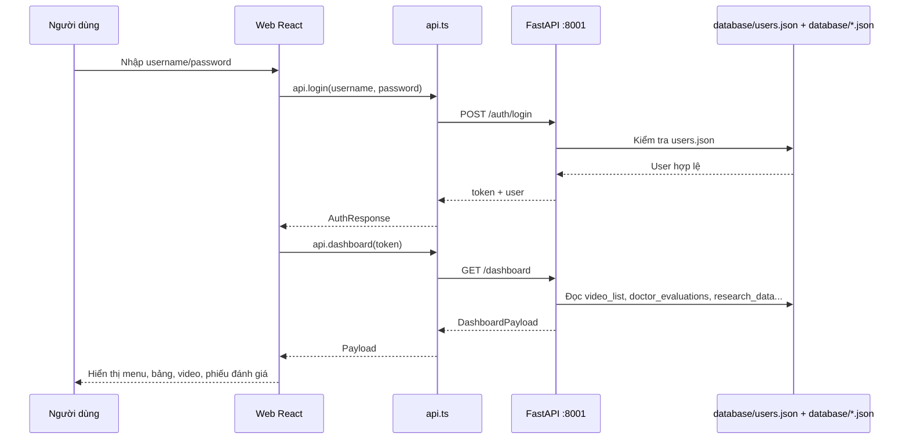
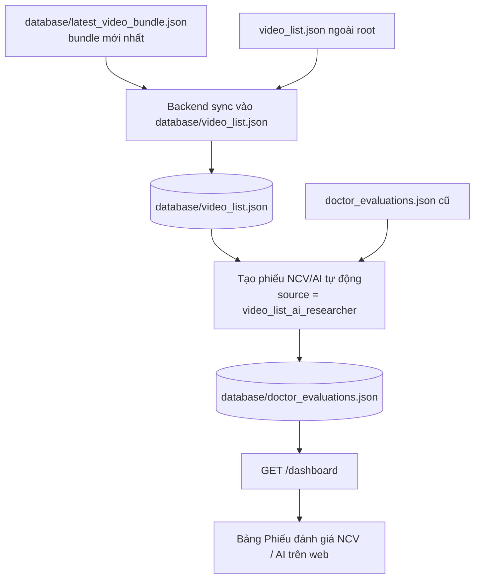
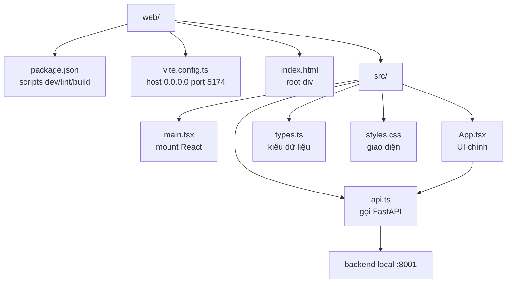

# Rehab AI Monitor Web

Tài liệu này mô tả phần web local trong thư mục `web` và cách chạy cùng backend/API local của hệ thống Rehab AI Monitor.

## Tổng Quan

Web là frontend React/Vite. Backend là FastAPI trong `backend/main.py`.

Luồng chạy local:

1. Người dùng mở [Frontend local](http://127.0.0.1:5174).
2. React chạy qua `web/src/App.tsx` và `web/src/api.ts`.
3. Frontend gọi [Backend API local](http://127.0.0.1:8001).
4. Backend trong `backend/main.py` đọc và đồng bộ `database/*.json`.

Frontend không đọc JSON trực tiếp. Frontend gọi API, backend đọc và đồng bộ dữ liệu từ các file JSON trong `database`.

## Sơ Đồ Vận Hành

### Luồng Chạy Web Local


### Luồng Login Và Tải Dashboard



### Luồng Cập Nhật Kết Quả NCV/AI Mới Nhất



### Folder `web` Đóng Vai Trò Gì



## Cấu Trúc Web

```text
web/
  index.html              Entry HTML của Vite
  package.json            Scripts và dependencies frontend
  vite.config.ts          Cấu hình Vite, mặc định host 0.0.0.0 port 5174
  src/
    main.tsx              Mount React vào DOM
    App.tsx               Toàn bộ UI chính: login, dashboard, tabs, bảng, video, phiếu
    api.ts                Client gọi FastAPI, mặc định API base là backend local port 8001
    types.ts              Kiểu dữ liệu frontend
    styles.css            CSS toàn bộ giao diện
```

Dependencies chính:

- React `19`
- Vite `6`
- TypeScript `5`
- `lucide-react` cho icon

## Chạy Backend/API Local

Mở PowerShell terminal số 1:

```powershell
cd D:\Downloads\Rehab-AI-Monitor-UI-new
D:\miniconda3\python.exe -m uvicorn backend.main:app --host 127.0.0.1 --port 8001
```

Giữ terminal này mở.

URL backend/API:

| Mục | Link |
| --- | --- |
| Health | [Backend health](http://127.0.0.1:8001/health) |
| API docs | [FastAPI docs local](http://127.0.0.1:8001/docs) |
| Login | [Login endpoint](http://127.0.0.1:8001/auth/login) |
| Dashboard | [Dashboard endpoint](http://127.0.0.1:8001/dashboard) |

Test backend:

```powershell
Invoke-RestMethod http://127.0.0.1:8001/health
```

Test login và dashboard:

```powershell
$login = Invoke-RestMethod `
  -Method Post `
  -Uri "http://127.0.0.1:8001/auth/login" `
  -ContentType "application/json" `
  -Body (@{ username = "2211090031"; password = "ncv123@" } | ConvertTo-Json)

Invoke-RestMethod `
  -Uri "http://127.0.0.1:8001/dashboard" `
  -Headers @{ Authorization = "Bearer $($login.token)" }
```

## Chạy Frontend/Web Local

Mở PowerShell terminal số 2:

```powershell
cd D:\Downloads\Rehab-AI-Monitor-UI-new\web
npm install
npm run dev
```

Mở [Frontend local](http://127.0.0.1:5174).

Port mặc định trong `vite.config.ts` là `5174`.

## URL Frontend Đã Deploy

Frontend React đã được đẩy lên Cloudflare Pages với deployment ID `18f0b817-db9e-4be3-b4d3-896b85201fb5`.

| Môi trường | Link mở web |
| --- | --- |
| Cloudflare Pages deployment | [18f0b817.rehab-ai-monitor.pages.dev](https://18f0b817.rehab-ai-monitor.pages.dev/) |
| Domain chính | [rehab-ai-monitor.com](https://rehab-ai-monitor.com/) |
| Domain www | [www.rehab-ai-monitor.com](https://www.rehab-ai-monitor.com/) |

Backend production dự kiến chạy ở [api.rehab-ai-monitor.com](https://api.rehab-ai-monitor.com). Khi đổi API thật, cập nhật `API_DOMAIN` trong `deploy/.env.production` và `VITE_API_BASE_URL` trên Cloudflare Pages cho khớp.

## Chạy Bằng Docker

Từ thư mục gốc dự án:

```powershell
cd D:\Downloads\Rehab-AI-Monitor-UI-new
docker compose up --build
```

Mở các link local:

| Dịch vụ | Link |
| --- | --- |
| Frontend | [Frontend local](http://127.0.0.1:5174) |
| Backend | [Backend API local](http://127.0.0.1:8001) |
| API docs | [FastAPI docs local](http://127.0.0.1:8001/docs) |

`docker-compose.yml` dùng bind mount nên dữ liệu local được giữ nguyên:

```text
./database            -> /app/database
./patient_uploads     -> /app/patient_uploads
./processed_results   -> /app/processed_results
./video_list.json     -> /app/video_list.json
./doctor_evaluations.json -> /app/doctor_evaluations.json
```

## Thứ Tự Vận Hành

1. Chạy backend trước ở port `8001`.
2. Chạy frontend sau ở port `5174`.
3. Mở web trong trình duyệt.
4. Đăng nhập.
5. Vào tab cần xem: `Kết quả đánh giá`, `Phiếu đánh giá`, `Phân tích & trích xuất`, hoặc `Dữ liệu NCKH`.

Tài khoản đang dùng để kiểm thử:

```text
Username: 2211090031
Password: ncv123@
Role: Nghiên cứu viên
```

## Vận Hành Phân Tích, Đánh Giá Và Train Model

### Luồng Phân Tích AI Trên Web

1. Người dùng đăng nhập và chọn video bệnh nhân cần phân tích.
2. Frontend gọi backend FastAPI qua `web/src/api.ts`, chủ yếu dùng các endpoint `POST /videos/{identifier}/analysis-jobs`, `GET /videos/{identifier}/analysis-jobs/latest` và `GET /videos/{identifier}/detail`.
3. Backend mở video bằng OpenCV, chạy MediaPipe Pose/BlazePose để lấy 33 landmarks, tính góc vai/khuỷu và lưu dữ liệu frame.
4. Hệ thống so sánh dữ liệu góc với chuẩn bài tập trong `database/reference_codman.json`, `database/reference_gay.json`, `database/reference_day.json`.
5. Với Codman, backend chia 3 giai đoạn và dùng ngưỡng sai số động: GĐ1 ±45°, GĐ2 ±30°, GĐ3 ±15°.
6. Kết quả frame được gắn nhãn `PASS/NEAR/FAIL/UNKNOWN`, sau đó xuất video overlay, frames, CSV/JSON và metrics vào `processed_results/`.
7. Dashboard React đọc lại kết quả qua API để dựng video, biểu đồ góc khớp, phân bố kết quả, histogram, boxplot, radar và bảng chỉ số.

### Luồng Bác Sĩ/KTV Đánh Giá

1. Bác sĩ/KTV đăng nhập bằng role tương ứng.
2. Mở tab `PHIẾU ĐÁNH GIÁ` hoặc chi tiết bệnh nhân/video.
3. Xem video gốc, video overlay, frames, biểu đồ và kết quả NCV/AI.
4. Đối chiếu kết quả AI với quan sát lâm sàng: tầm vận động, bù trừ thân người, kiểm soát vai/khuỷu, chất lượng video, triệu chứng đau/VAS và khả năng thực hiện bài tập.
5. Nhập phiếu đánh giá chuyên môn gồm kết quả `Đúng`, `Gần đúng` hoặc `Sai`, nhận xét lâm sàng và hướng dẫn tiếp theo.
6. Backend lưu phiếu vào `database/doctor_evaluations.json`. Phiếu NCV/AI tự động từ `video_list` có `source = video_list_ai_researcher`; phiếu bác sĩ/KTV nhập tay được giữ riêng để phục vụ ground truth và theo dõi chuyên môn.

### Mô Hình Đang Dùng

Dự án dùng 2 tầng model:

| Tầng | Mô hình | Vai trò |
| --- | --- | --- |
| 1 | MediaPipe Pose / BlazePose | Trích xuất 33 landmarks và góc khớp theo frame |
| 2 | scikit-learn `RandomForestClassifier` | Phân loại frame thành `Sai`, `Gần đúng`, `Đúng` |

MediaPipe là mô hình đã huấn luyện sẵn, dự án không train lại MediaPipe. Phần train ML trong repo là train `RandomForestClassifier` từ CSV đã trích xuất bởi MediaPipe.

Model hiện có:

| Thuộc tính | Giá trị |
| --- | --- |
| File model | `database/pose_classifier.pkl` |
| Feature schema | `database/pose_classifier_features.json` |
| Loại model | `RandomForestClassifier` |
| Số cây | 200 |
| `max_depth` | 12 |
| `class_weight` | `balanced` |
| Số feature | 34 |
| Classes | `[0, 1, 2]` = `Sai`, `Gần đúng`, `Đúng` |

Dữ liệu train đã kiểm tra read-only:

| Chỉ số | Giá trị |
| --- | ---: |
| CSV train trong `processed_results` | 62 |
| CSV hợp lệ | 61 |
| Tổng mẫu hợp lệ | 329,421 |
| Nhãn `Sai` | 134,140 |
| Nhãn `Gần đúng` | 41,646 |
| Nhãn `Đúng` | 153,635 |

### Train Hoặc Cập Nhật Model

Train từ PowerShell tại thư mục gốc dự án:

```powershell
cd D:\Downloads\Rehab-AI-Monitor-UI-new
python scripts\train_classifier.py
```

Pipeline train/apply:

```powershell
cd D:\Downloads\Rehab-AI-Monitor-UI-new
python scripts\run_ml_pipeline.py train
python scripts\run_ml_pipeline.py apply
python scripts\run_ml_pipeline.py all
```

Lưu ý: `train_classifier.py` sẽ ghi/cập nhật `database/pose_classifier.pkl` và `database/pose_classifier_features.json`. Lệnh `apply` hoặc `all` có thể ghi thêm kết quả ML vào CSV/frame JSON và cập nhật metrics. Nếu chỉ muốn kiểm tra an toàn thì chỉ load model hoặc đọc thống kê dữ liệu, không chạy train/apply.

## API Frontend Đang Gọi

Frontend gọi API qua `web/src/api.ts`. API base mặc định là [Backend API local](http://127.0.0.1:8001).

Các endpoint chính trong `backend/main.py`:

| Endpoint | Mục đích |
| --- | --- |
| `GET /health` | Kiểm tra backend sống |
| `GET /auth/login-options` | Lấy danh sách tài khoản gợi ý ở màn login |
| `POST /auth/login` | Đăng nhập |
| `POST /auth/register` | Đăng ký bệnh nhân |
| `POST /auth/reset-password` | Đặt lại mật khẩu |
| `POST /auth/logout` | Đăng xuất |
| `GET /auth/me` | Lấy user hiện tại |
| `GET /dashboard` | Payload chính cho toàn bộ dashboard |
| `GET /videos/{identifier}/detail` | Chi tiết video, frame, chart, evaluation |
| `POST /videos/latest-bundle` | Lưu bundle video mới nhất |
| `POST /videos/upload` | Upload video bệnh nhân |
| `POST /videos/{identifier}/evaluations` | Lưu phiếu đánh giá |
| `GET /videos/{identifier}/analysis-jobs/latest` | Job phân tích mới nhất |
| `GET /videos/{identifier}/analysis-jobs/history` | Lịch sử job phân tích |
| `POST /videos/{identifier}/analysis-jobs` | Chạy phân tích AI |
| `POST /videos/{identifier}/analysis-jobs/rerun` | Chạy lại phân tích |
| `POST /videos/{identifier}/analysis-jobs/retry` | Retry job lỗi |
| `POST /videos/{identifier}/analysis-jobs/cancel` | Hủy job |
| `POST /videos/{identifier}/exports` | Export video/frames |
| `POST /videos/{identifier}/chart-exports` | Lưu biểu đồ |
| `GET /media/{token}` | Serve video/frame/chart bằng token |
| `GET /admin/users` | Danh sách user admin |
| `POST /admin/users` | Tạo user |
| `PATCH /admin/users/{username}/active` | Bật/tắt user |
| `POST /symptoms` | Bệnh nhân khai báo triệu chứng |
| `POST /schedules` | Tạo lịch nhắc |

## Tabs Và Vai Trò Trên Web

Web đổi menu theo role đăng nhập.

Admin:

- `TRANG CHỦ`
- `QUẢN TRỊ VIÊN`
- `PHIẾU ĐÁNH GIÁ`
- `DỮ LIỆU NCKH`
- `THÔNG TIN TỔNG HỢP`
- `HỒ SƠ ĐỀ TÀI`
- `PHẢN HỒI`

Bác sĩ/KTV:

- `TRANG CHỦ`
- `PHIẾU ĐÁNH GIÁ`
- `LỊCH NHẮC NHỞ`
- `THÔNG TIN TỔNG HỢP`
- `HỒ SƠ ĐỀ TÀI`
- `LIÊN HỆ`
- `PHẢN HỒI`

Bệnh nhân:

- `TRANG CHỦ`
- `KẾT QUẢ ĐÁNH GIÁ`
- `LỊCH NHẮC NHỞ`
- `THÔNG TIN TỔNG HỢP`
- `LIÊN HỆ`
- `PHẢN HỒI`

Nghiên cứu viên:

- `TRANG CHỦ`
- `KẾT QUẢ ĐÁNH GIÁ`
- `PHIẾU ĐÁNH GIÁ`
- `PHÂN TÍCH & TRÍCH XUẤT`
- `DỮ LIỆU NCKH`
- `THÔNG TIN TỔNG HỢP`
- `HỒ SƠ ĐỀ TÀI`
- `PHẢN HỒI`

## Nguồn Dữ Liệu Local

Backend đọc các file chính:

| File | Số bản ghi hiện tại | Vai trò |
| --- | ---: | --- |
| `database/video_list.json` | 14 | Danh sách video và kết quả AI |
| `database/doctor_evaluations.json` | 77 | Phiếu PHCN, NCV, AI |
| `database/latest_video_bundle.json` | 8 video | Bundle kết quả mới nhất |
| `database/users.json` | 24 user | Tài khoản đăng nhập |
| `database/research_data.json` | 8 | Dữ liệu NCKH |
| `database/patient_symptoms.json` | 8 | Triệu chứng bệnh nhân |
| `database/schedules.json` | 0 | Lịch nhắc |
| `database/lich_su_tap_luyen.json` | 73 | Lịch sử tập luyện |

Backend có logic tự sync:

- `latest_video_bundle.json` -> `database/video_list.json`
- `video_list.json` ngoài root -> `database/video_list.json`
- `doctor_evaluations.json` ngoài root -> `database/doctor_evaluations.json`
- Tạo phiếu NCV/AI tự động với `source = video_list_ai_researcher`

## Quy Ước Trường Trong `video_list.json`

- `time`: thời điểm kết quả AI/NCV mới nhất dùng để hiển thị trên web.
- `video_time`: thời điểm quay/upload video gốc.
- `latest_bundle_updated_at`: timestamp ISO của bundle mới nhất.
- `accuracy`: độ chính xác tổng quan.
- `metrics.frame_dung`: số frame đúng.
- `metrics.frame_gan_dung`: số frame gần đúng.
- `metrics.frame_sai`: số frame sai.
- `metrics.frame_khong_nhan_dang`: số frame unknown/không nhận dạng.
- `metrics.tong_frame_da_cham`: tổng frame đã chấm.

## Kết Quả NCV/AI Mới Nhất

*Cập nhật: 24/06/2026. Nguồn dữ liệu: `database/latest_video_bundle.json` (`updated_at = 2026-06-24T00:36:19.730122+00:00`), `database/video_list.json` và payload chi tiết từ các artifact `frame_data_all.csv`. Đây là 8 video mới nhất theo từng bệnh nhân và từng bài tập đang hiển thị trên web local.*

## Tóm tắt nhanh

- Số bệnh nhân trong bộ 8 video mới nhất: **4**.
- Tổng video hiển thị trong bộ mới nhất: **8**, gồm **4 Codman** và **4 bài tập với gậy**.
- Tổng frame: **45446**; frame hợp lệ không tính UNKNOWN: **41186**.
- PASS / NEAR / FAIL / UNKNOWN: **19663 / 6670 / 14853 / 4260**.
- Accuracy trung bình 8 video: **54.70%**; Accuracy theo frame hợp lệ: **47.74%**.
- MAE trung bình: **17.45°**; ICC trung bình: **0.63**; F1-score trung bình: **0.60**.

## Bảng 8 video mới nhất trên web

| BN | Bệnh nhân | Bài tập | Video | Kết luận | Accuracy | PASS / NEAR / FAIL / UNKNOWN | Tổng frame | Góc vai TB | Góc khuỷu TB | MAE | F1 | ICC | Precision | Recall | Thời gian |
| --- | --- | --- | --- | --- | ---: | ---: | ---: | ---: | ---: | ---: | ---: | ---: | ---: | ---: | --- |
| BN01 | Hoàng Hạnh Nguyên | Codman | `160754_Hoàng Hạnh Nguyên - Codman.mp4` | Gần đúng | 75.31% | 2492 / 479 / 338 / 39 | 3348 | 47.78° | 153.70° | 10.01° | 0.78 | 0.78 | 0.79 | 0.78 | 07:35 - 24/06/2026 |
| BN01 | Hoàng Hạnh Nguyên | Bài tập với gậy | `Hoàng Hạnh Nguyên - Bài tập với gậy.mp4` | Sai | 37.48% | 4373 / 1078 / 6217 / 106 | 11774 | 43.89° | 131.82° | 24.56° | 0.45 | 0.50 | 0.47 | 0.44 | 07:35 - 24/06/2026 |
| BN02 | Nguyễn Thị Nga | Codman | `162458_Nguyễn Thị Nga - Codman.mp4` | Gần đúng | 78.20% | 2055 / 426 / 147 / 0 | 2628 | 54.91° | 155.41° | 11.47° | 0.81 | 0.75 | 0.81 | 0.80 | 07:35 - 24/06/2026 |
| BN02 | Nguyễn Thị Nga | Bài tập với gậy | `Nguyễn Thị Nga - Bài tập với gậy.mp4` | Sai | 44.09% | 3991 / 1981 / 3080 / 17 | 9069 | 57.96° | 131.20° | 21.48° | 0.51 | 0.55 | 0.53 | 0.50 | 07:35 - 24/06/2026 |
| BN03 | Vũ Thị Hòa | Codman | `165504_Vũ Thị Hoà - Codman.mp4` | Đúng | 90.80% | 2488 / 221 / 31 / 0 | 2740 | 37.38° | 155.42° | 11.78° | 0.92 | 0.74 | 0.92 | 0.92 | 07:36 - 24/06/2026 |
| BN03 | Vũ Thị Hòa | Bài tập với gậy | `Vũ Thị Hoà - Bài tập với gậy.mp4` | Sai | 31.74% | 1725 / 470 / 3240 / 4098 | 9533 | 60.09° | 134.34° | 18.63° | 0.40 | 0.61 | 0.42 | 0.39 | 07:36 - 24/06/2026 |
| BN04 | Cao Thị Thường | Codman | `042541_Cao Thị Thường -  Codman.mp4` | Sai | 40.32% | 1114 / 995 / 654 / 0 | 2763 | 87.88° | 146.22° | 20.59° | 0.48 | 0.57 | 0.49 | 0.46 | 07:34 - 24/06/2026 |
| BN04 | Cao Thị Thường | Bài tập với gậy | `042916_Cao Thị Thường - Bài tập với gậy.mp4` | Sai | 39.68% | 1425 / 1020 / 1146 / 0 | 3591 | 48.45° | 132.96° | 21.04° | 0.47 | 0.56 | 0.49 | 0.46 | 07:35 - 24/06/2026 |

## Tóm tắt theo nhóm bài tập

| Chỉ số | Codman | Bài tập với gậy |
| --- | ---: | ---: |
| Tổng frame | 11479 | 33967 |
| Frame hợp lệ | 11440 | 29746 |
| PASS / NEAR / FAIL / UNKNOWN | 8149 / 2121 / 1170 / 39 | 11514 / 4549 / 13683 / 4221 |
| ACC không tính UNKNOWN | 71.2% | 38.7% |
| ACC tính cả UNKNOWN | 71.0% | 33.9% |
| PASS+NEAR trên tổng frame | 89.5% | 47.3% |
| MAE trung bình | 13.47° | 21.42° |
| F1 / ICC trung bình | 0.75 / 0.71 | 0.46 / 0.55 |
| Precision / Recall trung bình | 0.76 / 0.74 | 0.48 / 0.44 |

## Bảng 4b. Chỉ số nghiên cứu đầy đủ theo từng video

Bảng này đưa các chỉ số đang hiển thị trong bảng nghiên cứu/radar của web local vào phần kết quả chính. Nguồn: `research_metrics` trong payload chi tiết video, đọc từ artifact `frame_data_all.csv` và `database/video_list.json`.

| Mã BN | Bệnh nhân | Bài tập | Accuracy | Tổng frame | PASS/NEAR/FAIL/UNKNOWN | Góc vai TB | Góc khuỷu TB | MAE | F1 | ICC | Precision | Recall |
| --- | --- | --- | ---: | ---: | ---: | ---: | ---: | ---: | ---: | ---: | ---: | ---: |
| BN01 | Hoàng Hạnh Nguyên | Codman | 75.31% | 3348 | 2492/479/338/39 | 47.78° | 153.70° | 10.01° | 0.78 | 0.78 | 0.79 | 0.78 |
| BN01 | Hoàng Hạnh Nguyên | Bài tập với gậy | 37.48% | 11774 | 4373/1078/6217/106 | 43.89° | 131.82° | 24.56° | 0.45 | 0.50 | 0.47 | 0.44 |
| BN02 | Nguyễn Thị Nga | Codman | 78.20% | 2628 | 2055/426/147/0 | 54.91° | 155.41° | 11.47° | 0.81 | 0.75 | 0.81 | 0.80 |
| BN02 | Nguyễn Thị Nga | Bài tập với gậy | 44.09% | 9069 | 3991/1981/3080/17 | 57.96° | 131.20° | 21.48° | 0.51 | 0.55 | 0.53 | 0.50 |
| BN03 | Vũ Thị Hòa | Codman | 90.80% | 2740 | 2488/221/31/0 | 37.38° | 155.42° | 11.78° | 0.92 | 0.74 | 0.92 | 0.92 |
| BN03 | Vũ Thị Hòa | Bài tập với gậy | 31.74% | 9533 | 1725/470/3240/4098 | 60.09° | 134.34° | 18.63° | 0.40 | 0.61 | 0.42 | 0.39 |
| BN04 | Cao Thị Thường | Codman | 40.32% | 2763 | 1114/995/654/0 | 87.88° | 146.22° | 20.59° | 0.48 | 0.57 | 0.49 | 0.46 |
| BN04 | Cao Thị Thường | Bài tập với gậy | 39.68% | 3591 | 1425/1020/1146/0 | 48.45° | 132.96° | 21.04° | 0.47 | 0.56 | 0.49 | 0.46 |

## Diễn giải kết quả cập nhật

- Nhóm Codman đang là phần mạnh hơn của hệ thống: ACC không tính UNKNOWN 71.2%, F1 trung bình 0.75, ICC trung bình 0.71. Tuy vậy GĐ3 giảm còn 48.0% khi siết ngưỡng ±15°, nên không nên mô tả kết quả là đạt chuẩn cho mọi giai đoạn.
- Nhóm bài tập với gậy vẫn là phần hạn chế: 4/4 video được xếp Sai, ACC không tính UNKNOWN 38.7%, ACC tính cả UNKNOWN 33.9%. Video BN03 - Vũ Thị Hòa có 4098 frame UNKNOWN và là ca cần ưu tiên kiểm tra lại điều kiện ghi hình.
- Sau cập nhật, nội dung kết quả nên nhấn mạnh khả năng lượng hóa và phát hiện xu hướng hơn là khẳng định độ chính xác lâm sàng tuyệt đối. Các chỉ số F1/ICC/Precision/Recall được ghi như chỉ số nghiên cứu nội bộ của payload web.
- Hướng phát triển tiếp theo là mở rộng sang mô hình Deep Learning: Về hướng phát triển, hệ thống nên được mở rộng từ cách chấm điểm dựa trên ngưỡng góc và đặc trưng thủ công sang các mô hình Deep Learning học trực tiếp chuỗi vận động theo thời gian. Các hướng khả thi gồm CNN-LSTM hoặc TCN để nhận diện mẫu chuyển động theo frame, ST-GCN để học quan hệ không gian-thời gian giữa các điểm khớp, và Transformer/PoseFormer để mô hình hóa toàn bộ chuỗi tư thế trong một lần tập. Khi có thêm nhãn chuyên gia ở mức frame hoặc từng chu kỳ động tác, các mô hình này có thể học phát hiện bù trừ thân người, co gập khuỷu, lệch trục hai tay, che khuất và sai nhịp vận động tốt hơn so với ngưỡng cố định. Trong giai đoạn tiếp theo, có thể kết hợp RGB video với ước lượng tư thế 3D, dữ liệu độ sâu hoặc cảm biến quán tính trên điện thoại để giảm lỗi do camera đơn, đồng thời huấn luyện mô hình cá thể hóa theo từng bệnh nhân nhằm đưa ra phản hồi thời gian thực cho phục hồi chức năng tại nhà.

## Giai đoạn Codman và bài gậy tổng quan

| BN | Bệnh nhân | Bài/GĐ | Ngưỡng | Accuracy | PASS | NEAR | FAIL | UNKNOWN | Tổng frame | MAE | F1 | ICC | Precision | Recall |
| --- | --- | --- | --- | ---: | ---: | ---: | ---: | ---: | ---: | ---: | ---: | ---: | ---: | ---: |
| BN01 | Hoàng Hạnh Nguyên | Codman - GĐ1 | ±45° | 98.65% | 876 | 12 | 0 | 0 | 888 | 25.88° | 0.99 | 0.50 | 0.99 | 0.99 |
| BN01 | Hoàng Hạnh Nguyên | Codman - GĐ2 | ±30° | 93.07% | 1223 | 81 | 10 | 0 | 1314 | 20.29° | 0.94 | 0.57 | 0.94 | 0.94 |
| BN01 | Hoàng Hạnh Nguyên | Codman - GĐ3 | ±15° | 35.50% | 393 | 386 | 328 | 39 | 1146 | 22.83° | 0.43 | 0.52 | 0.45 | 0.42 |
| BN01 | Hoàng Hạnh Nguyên | Bài tập với gậy - tất cả khung | ±30° | 37.48% | 4373 | 1078 | 6217 | 106 | 11774 | 24.56° | 0.45 | 0.50 | 0.47 | 0.44 |
| BN02 | Nguyễn Thị Nga | Codman - GĐ1 | ±45° | 98.10% | 723 | 14 | 0 | 0 | 737 | 25.87° | 0.98 | 0.50 | 0.98 | 0.98 |
| BN02 | Nguyễn Thị Nga | Codman - GĐ2 | ±30° | 88.66% | 915 | 115 | 2 | 0 | 1032 | 22.31° | 0.90 | 0.53 | 0.90 | 0.90 |
| BN02 | Nguyễn Thị Nga | Codman - GĐ3 | ±15° | 48.54% | 417 | 297 | 145 | 0 | 859 | 18.79° | 0.55 | 0.60 | 0.56 | 0.54 |
| BN02 | Nguyễn Thị Nga | Bài tập với gậy - tất cả khung | ±30° | 44.09% | 3991 | 1981 | 3080 | 17 | 9069 | 21.48° | 0.51 | 0.55 | 0.53 | 0.50 |
| BN03 | Vũ Thị Hòa | Codman - GĐ1 | ±45° | 100.00% | 787 | 0 | 0 | 0 | 787 | 18.15° | 0.99 | 0.62 | 0.99 | 0.99 |
| BN03 | Vũ Thị Hòa | Codman - GĐ2 | ±30° | 100.00% | 1145 | 0 | 0 | 0 | 1145 | 17.08° | 0.99 | 0.64 | 0.99 | 0.99 |
| BN03 | Vũ Thị Hòa | Codman - GĐ3 | ±15° | 68.81% | 556 | 221 | 31 | 0 | 808 | 14.66° | 0.73 | 0.69 | 0.73 | 0.72 |
| BN03 | Vũ Thị Hòa | Bài tập với gậy - tất cả khung | ±30° | 31.74% | 1725 | 470 | 3240 | 4098 | 9533 | 18.63° | 0.40 | 0.61 | 0.42 | 0.39 |
| BN04 | Cao Thị Thường | Codman - GĐ1 | ±45° | 45.61% | 374 | 313 | 133 | 0 | 820 | 37.98° | 0.52 | 0.50 | 0.54 | 0.51 |
| BN04 | Cao Thị Thường | Codman - GĐ2 | ±30° | 33.92% | 384 | 574 | 174 | 0 | 1132 | 38.51° | 0.42 | 0.50 | 0.44 | 0.41 |
| BN04 | Cao Thị Thường | Codman - GĐ3 | ±15° | 43.90% | 356 | 108 | 347 | 0 | 811 | 33.96° | 0.51 | 0.50 | 0.52 | 0.49 |
| BN04 | Cao Thị Thường | Bài tập với gậy - tất cả khung | ±30° | 39.68% | 1425 | 1020 | 1146 | 0 | 3591 | 21.04° | 0.47 | 0.56 | 0.49 | 0.46 |

## Điểm cần lưu ý

- Video **BN03 - Vũ Thị Hòa - Bài tập với gậy** đã được cập nhật đúng theo web: Accuracy **31.74%**, tổng frame **9533**, PASS/NEAR/FAIL/UNKNOWN **1725 / 470 / 3240 / 4098**, MAE **18.63°**, F1 **0.40**, ICC **0.61**, Precision **0.42**, Recall **0.39**.
- Nhóm Codman ổn định hơn nhóm bài gậy: ACC không tính UNKNOWN **71.2%** so với **38.7%**.
- Bài tập với gậy có UNKNOWN cao chủ yếu do video BN03; cần kiểm soát góc quay, ánh sáng, che khuất và trục đối xứng hai tay khi ghi hình.

## Khi Cập Nhật JSON Mới

1. Thay hoặc cập nhật `database/latest_video_bundle.json`, `video_list.json`, hoặc `database/video_list.json`.
2. Restart backend để nạp sync mới.
3. Refresh web.
4. Kiểm tra tab `Phiếu đánh giá`.
5. Bảng `Phiếu đánh giá NCV / AI` phải có dòng `NCV/AI: Tự động từ video_list`.

Nếu thấy dữ liệu chưa đổi:

- Kiểm tra backend đang chạy đúng port `8001`.
- Bấm refresh trên web hoặc `Ctrl + F5`.
- Kiểm tra `database/video_list.json` và `video_list.json` có cùng dữ liệu.
- Gọi thử `GET /dashboard` bằng PowerShell để xác nhận API đã trả dữ liệu mới.

## Build Và Verify

Backend/test nhanh:

```powershell
cd D:\Downloads\Rehab-AI-Monitor-UI-new
python -m py_compile backend\main.py
python -m pytest tests\unit\test_backend_main_api.py::test_video_ai_evaluation_summaries_fill_missing_results_and_sort_recent_first -q
```

Frontend:

```powershell
cd D:\Downloads\Rehab-AI-Monitor-UI-new\web
npm run lint
npm run build
```
