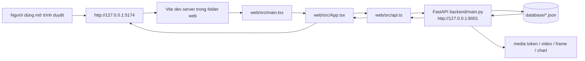
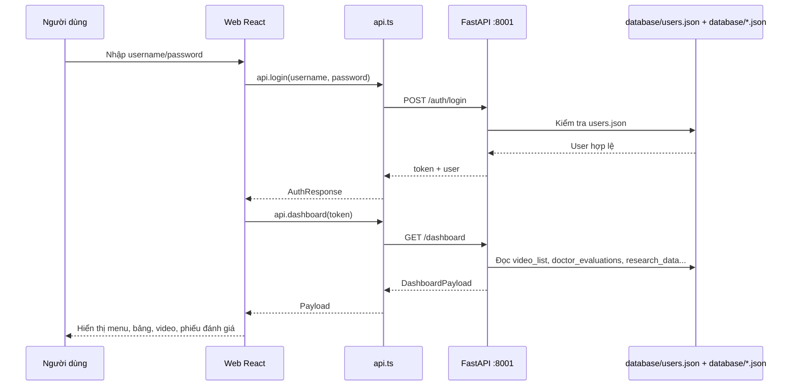
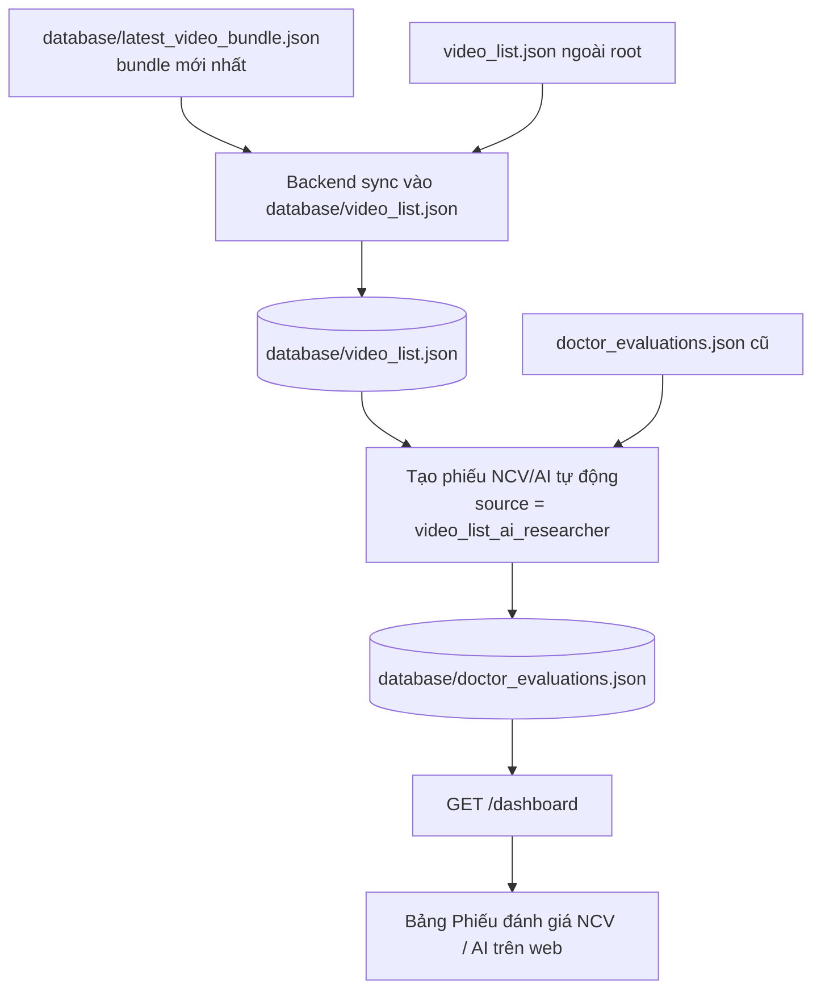
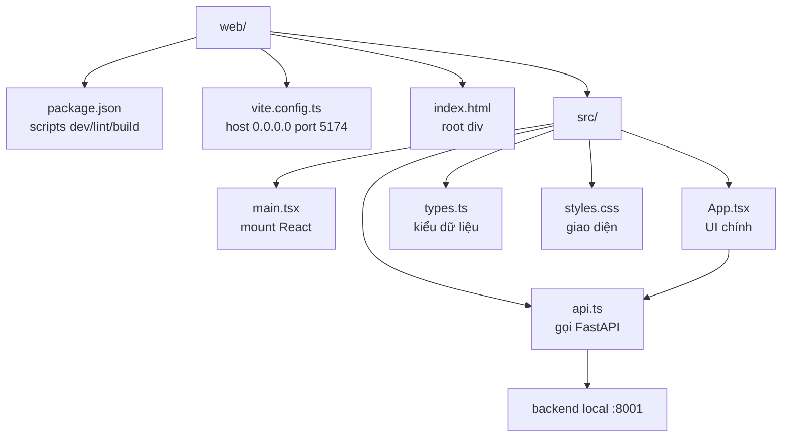

# Rehab AI Monitor Web

Tài liệu này mô tả phần web local trong thư mục `web` và cách chạy cùng backend/API local của hệ thống Rehab AI Monitor.

## Tổng Quan

Web là frontend React/Vite. Backend là FastAPI trong `backend/main.py`.

Luồng chạy local:

```text
Trình duyệt
  -> web/src/App.tsx
  -> web/src/api.ts
  -> http://127.0.0.1:8001
  -> backend/main.py
  -> database/*.json
```

Frontend không đọc JSON trực tiếp. Frontend gọi API, backend đọc và đồng bộ dữ liệu từ các file JSON trong `database`.

## Sơ Đồ Vận Hành

### Luồng Chạy Web Local



### Luồng Login Và Tải Dashboard



### Luồng Cập Nhật Kết Quả NCV/AI Mới Nhất



### Folder `web` Đóng Vai Trò Gì



## Cấu Trúc Web

```text
web/
  index.html              Entry HTML của Vite
  package.json            Scripts và dependencies frontend
  vite.config.ts          Cấu hình Vite, mặc định host 0.0.0.0 port 5174
  src/
    main.tsx              Mount React vào DOM
    App.tsx               Toàn bộ UI chính: login, dashboard, tabs, bảng, video, phiếu
    api.ts                Client gọi FastAPI, mặc định API base là http://127.0.0.1:8001
    types.ts              Kiểu dữ liệu frontend
    styles.css            CSS toàn bộ giao diện
```

Dependencies chính:

- React `19`
- Vite `6`
- TypeScript `5`
- `lucide-react` cho icon

## Chạy Backend/API Local

Mở PowerShell terminal số 1:

```powershell
cd D:\Downloads\Rehab-AI-Monitor-UI-new
D:\miniconda3\python.exe -m uvicorn backend.main:app --host 127.0.0.1 --port 8001
```

Giữ terminal này mở.

URL backend/API:

```text
Health:      http://127.0.0.1:8001/health
API docs:    http://127.0.0.1:8001/docs
Login:       http://127.0.0.1:8001/auth/login
Dashboard:   http://127.0.0.1:8001/dashboard
```

Test backend:

```powershell
Invoke-RestMethod http://127.0.0.1:8001/health
```

Test login và dashboard:

```powershell
$login = Invoke-RestMethod `
  -Method Post `
  -Uri "http://127.0.0.1:8001/auth/login" `
  -ContentType "application/json" `
  -Body (@{ username = "2211090031"; password = "ncv123@" } | ConvertTo-Json)

Invoke-RestMethod `
  -Uri "http://127.0.0.1:8001/dashboard" `
  -Headers @{ Authorization = "Bearer $($login.token)" }
```

## Chạy Frontend/Web Local

Mở PowerShell terminal số 2:

```powershell
cd D:\Downloads\Rehab-AI-Monitor-UI-new\web
npm install
npm run dev
```

Mở:

```text
http://127.0.0.1:5174
```

Port mặc định trong `vite.config.ts` là `5174`.

## Chạy Bằng Docker

Từ thư mục gốc dự án:

```powershell
cd D:\Downloads\Rehab-AI-Monitor-UI-new
docker compose up --build
```

Mở:

```text
Frontend: http://127.0.0.1:5174
Backend:  http://127.0.0.1:8001
API docs: http://127.0.0.1:8001/docs
```

`docker-compose.yml` dùng bind mount nên dữ liệu local được giữ nguyên:

```text
./database            -> /app/database
./patient_uploads     -> /app/patient_uploads
./processed_results   -> /app/processed_results
./video_list.json     -> /app/video_list.json
./doctor_evaluations.json -> /app/doctor_evaluations.json
```

## Thứ Tự Vận Hành

1. Chạy backend trước ở port `8001`.
2. Chạy frontend sau ở port `5174`.
3. Mở web trong trình duyệt.
4. Đăng nhập.
5. Vào tab cần xem: `Kết quả đánh giá`, `Phiếu đánh giá`, `Phân tích & trích xuất`, hoặc `Dữ liệu NCKH`.

Tài khoản đang dùng để kiểm thử:

```text
Username: 2211090031
Password: ncv123@
Role: Nghiên cứu viên
```

## API Frontend Đang Gọi

Frontend gọi API qua `web/src/api.ts`. API base mặc định:

```ts
http://127.0.0.1:8001
```

Các endpoint chính trong `backend/main.py`:

| Endpoint | Mục đích |
| --- | --- |
| `GET /health` | Kiểm tra backend sống |
| `GET /auth/login-options` | Lấy danh sách tài khoản gợi ý ở màn login |
| `POST /auth/login` | Đăng nhập |
| `POST /auth/register` | Đăng ký bệnh nhân |
| `POST /auth/reset-password` | Đặt lại mật khẩu |
| `POST /auth/logout` | Đăng xuất |
| `GET /auth/me` | Lấy user hiện tại |
| `GET /dashboard` | Payload chính cho toàn bộ dashboard |
| `GET /videos/{identifier}/detail` | Chi tiết video, frame, chart, evaluation |
| `POST /videos/latest-bundle` | Lưu bundle video mới nhất |
| `POST /videos/upload` | Upload video bệnh nhân |
| `POST /videos/{identifier}/evaluations` | Lưu phiếu đánh giá |
| `GET /videos/{identifier}/analysis-jobs/latest` | Job phân tích mới nhất |
| `GET /videos/{identifier}/analysis-jobs/history` | Lịch sử job phân tích |
| `POST /videos/{identifier}/analysis-jobs` | Chạy phân tích AI |
| `POST /videos/{identifier}/analysis-jobs/rerun` | Chạy lại phân tích |
| `POST /videos/{identifier}/analysis-jobs/retry` | Retry job lỗi |
| `POST /videos/{identifier}/analysis-jobs/cancel` | Hủy job |
| `POST /videos/{identifier}/exports` | Export video/frames |
| `POST /videos/{identifier}/chart-exports` | Lưu biểu đồ |
| `GET /media/{token}` | Serve video/frame/chart bằng token |
| `GET /admin/users` | Danh sách user admin |
| `POST /admin/users` | Tạo user |
| `PATCH /admin/users/{username}/active` | Bật/tắt user |
| `POST /symptoms` | Bệnh nhân khai báo triệu chứng |
| `POST /schedules` | Tạo lịch nhắc |

## Tabs Và Vai Trò Trên Web

Web đổi menu theo role đăng nhập.

Admin:

- `TRANG CHỦ`
- `QUẢN TRỊ VIÊN`
- `PHIẾU ĐÁNH GIÁ`
- `DỮ LIỆU NCKH`
- `THÔNG TIN TỔNG HỢP`
- `HỒ SƠ ĐỀ TÀI`
- `PHẢN HỒI`

Bác sĩ/KTV:

- `TRANG CHỦ`
- `PHIẾU ĐÁNH GIÁ`
- `LỊCH NHẮC NHỞ`
- `THÔNG TIN TỔNG HỢP`
- `HỒ SƠ ĐỀ TÀI`
- `LIÊN HỆ`
- `PHẢN HỒI`

Bệnh nhân:

- `TRANG CHỦ`
- `KẾT QUẢ ĐÁNH GIÁ`
- `LỊCH NHẮC NHỞ`
- `THÔNG TIN TỔNG HỢP`
- `LIÊN HỆ`
- `PHẢN HỒI`

Nghiên cứu viên:

- `TRANG CHỦ`
- `KẾT QUẢ ĐÁNH GIÁ`
- `PHIẾU ĐÁNH GIÁ`
- `PHÂN TÍCH & TRÍCH XUẤT`
- `DỮ LIỆU NCKH`
- `THÔNG TIN TỔNG HỢP`
- `HỒ SƠ ĐỀ TÀI`
- `PHẢN HỒI`

## Nguồn Dữ Liệu Local

Backend đọc các file chính:

| File | Số bản ghi hiện tại | Vai trò |
| --- | ---: | --- |
| `database/video_list.json` | 14 | Danh sách video và kết quả AI |
| `database/doctor_evaluations.json` | 77 | Phiếu PHCN, NCV, AI |
| `database/latest_video_bundle.json` | 8 video | Bundle kết quả mới nhất |
| `database/users.json` | 24 user | Tài khoản đăng nhập |
| `database/research_data.json` | 8 | Dữ liệu NCKH |
| `database/patient_symptoms.json` | 8 | Triệu chứng bệnh nhân |
| `database/schedules.json` | 0 | Lịch nhắc |
| `database/lich_su_tap_luyen.json` | 73 | Lịch sử tập luyện |

Backend có logic tự sync:

- `latest_video_bundle.json` -> `database/video_list.json`
- `video_list.json` ngoài root -> `database/video_list.json`
- `doctor_evaluations.json` ngoài root -> `database/doctor_evaluations.json`
- Tạo phiếu NCV/AI tự động với `source = video_list_ai_researcher`

## Quy Ước Trường Trong `video_list.json`

- `time`: thời điểm kết quả AI/NCV mới nhất dùng để hiển thị trên web.
- `video_time`: thời điểm quay/upload video gốc.
- `latest_bundle_updated_at`: timestamp ISO của bundle mới nhất.
- `accuracy`: độ chính xác tổng quan.
- `metrics.frame_dung`: số frame đúng.
- `metrics.frame_gan_dung`: số frame gần đúng.
- `metrics.frame_sai`: số frame sai.
- `metrics.frame_khong_nhan_dang`: số frame unknown/không nhận dạng.
- `metrics.tong_frame_da_cham`: tổng frame đã chấm.

## Kết Quả NCV/AI Mới Nhất

Cập nhật local ngày 22/06/2026:

- Tổng video trong `video_list.json`: 14
- Video từ bundle mới nhất: 8
- Tổng phiếu đánh giá: 77
- Phiếu NCV/AI tự động từ `video_list`: 14
- Phiếu cũ/nhập tay được giữ lại: 63

| Bệnh nhân | Video | Kết quả | Độ chính xác | Frames | Unknown | Thời gian kết quả |
| --- | --- | --- | ---: | --- | ---: | --- |
| Vũ Thị Hòa | `165504_Vũ Thị Hoà - Codman.mp4` | Đúng | 100.00% | Đúng 2740, Gần đúng 0, Sai 0, Tổng 2740 | 0 | 11:34 - 22/06/2026 |
| Nguyễn Thị Nga | `162458_Nguyễn Thị Nga - Codman.mp4` | Đúng | 96.65% | Đúng 2540, Gần đúng 53, Sai 35, Tổng 2628 | 0 | 11:34 - 22/06/2026 |
| Cao Thị Thường | `042916_Cao Thị Thường - Bài tập với gậy_ftmp.mp4` | Gần đúng | 53.30% | Đúng 1914, Gần đúng 815, Sai 862, Tổng 3591 | 0 | 11:34 - 22/06/2026 |
| Hoàng Hạnh Nguyên | `160754_Hoàng Hạnh Nguyên - Codman.mp4` | Đúng | 95.31% | Đúng 3048, Gần đúng 27, Sai 123, Tổng 3208 | 10 | 11:34 - 22/06/2026 |
| Cao Thị Thường | `042541_Cao Thị Thường -  Codman.mp4` | Đúng | 84.00% | Đúng 2321, Gần đúng 186, Sai 256, Tổng 2763 | 0 | 11:34 - 22/06/2026 |
| Hoàng Hạnh Nguyên | `Hoàng Hạnh Nguyên - Bài tập với gậy.mp4` | Gần đúng | 54.00% | Đúng 5951, Gần đúng 1947, Sai 3112, Tổng 11774 | 764 | 10:05 - 22/06/2026 |
| Vũ Thị Hòa | `Vũ Thị Hoà - Bài tập với gậy.mp4` | Sai | 48.60% | Đúng 2644, Gần đúng 766, Sai 2025, Tổng 9533 | 4098 | 10:05 - 22/06/2026 |
| Nguyễn Thị Nga | `Nguyễn Thị Nga - Bài tập với gậy.mp4` | Gần đúng | 55.90% | Đúng 5071, Gần đúng 2382, Sai 1616, Tổng 9069 | 0 | 10:05 - 22/06/2026 |

## Khi Cập Nhật JSON Mới

1. Thay hoặc cập nhật `database/latest_video_bundle.json`, `video_list.json`, hoặc `database/video_list.json`.
2. Restart backend để nạp sync mới.
3. Refresh web.
4. Kiểm tra tab `Phiếu đánh giá`.
5. Bảng `Phiếu đánh giá NCV / AI` phải có dòng `NCV/AI: Tự động từ video_list`.

Nếu thấy dữ liệu chưa đổi:

- Kiểm tra backend đang chạy đúng port `8001`.
- Bấm refresh trên web hoặc `Ctrl + F5`.
- Kiểm tra `database/video_list.json` và `video_list.json` có cùng dữ liệu.
- Gọi thử `GET /dashboard` bằng PowerShell để xác nhận API đã trả dữ liệu mới.

## Build Và Verify

Backend/test nhanh:

```powershell
cd D:\Downloads\Rehab-AI-Monitor-UI-new
python -m py_compile backend\main.py
python -m pytest tests\unit\test_backend_main_api.py::test_video_ai_evaluation_summaries_fill_missing_results_and_sort_recent_first -q
```

Frontend:

```powershell
cd D:\Downloads\Rehab-AI-Monitor-UI-new\web
npm run lint
npm run build
```
